# 并发调度模型

对于Go语言而言, 一提到并发，可能想到它内建的并发支持, 这也是Go语言最吸引人的地方。 

Go采用的并发编程思想是CSP(Communicating Sequential Process，通讯顺序进程), CSP有着精确的数学模型, 其思想的核心是同步通讯, 易于理解。CSP是Go语言推荐的并发模型,

但是除了CSP,并发模型其实还有很多, 但在讨论并发模型之前首先要明确一组概念：并发与并行

## 并发与并行

并发不是并行

并发程序含有多个逻辑上的独立执行块，它们可以独立的并行执行，也可以串行执行。并行程序解决问题的速度往往比串行程序快的多，因为其可以同时执行整个任务的多个部分。并行程序可能有多个独立执行体，也可能仅有一个。

并行一般是简单的大量重复，例如GPU中对图像处理都会有大量的并行运算。几种并行架构：
+ 位级(bit-level)并行，比如寄存器从32位升级到64位。
+ 指令级(instruction-level)并行，比如CPU指令流水线，乱序执行和猜测执行。
+ 数据级(data-level)并行，比如CPU的SIMD指令以及GPU向量计算指令。
+ 任务级(task-level)并行，比如多处理器架构以及分布式系统架构。

我们还可以从另一种角度来看待并发和并行之间的差异。并发是问题域中的概念，程序需要被设计成能够处理多个同时（或者几乎同时）发生的事情，而并行则是方法域中的概念，通过将问题中的多个部分并行执行来加速解决问题。


总结下并发与并行:
+ 并发是同一时间应对(dealing with)多件事情的能力, 并发更关注的是程序的设计层面。
+ 并行是同一时间动手(doing)做多件事情的能力, 并行更关注的是程序的运行层面。

## 基于CPU的并行

在早期，CPU都是以单核的形式顺序执行机器指令, Go语言的祖先C语言正是这种顺序编程语言的代表，顺序编程语言中的顺序是指：所有的指令都是以串行的方式执行，在相同的时刻有且仅有一个CPU在顺序执行程序的指令

随着处理器技术的发展,单核时代以提升处理器频率来提高运行效率的方式遇到了瓶颈,单核CPU的发展的停滞,多核CPU的发展迎来春天, 这个时候我们的代码就可以真正的被并行处理

单核到多核的区别下图:

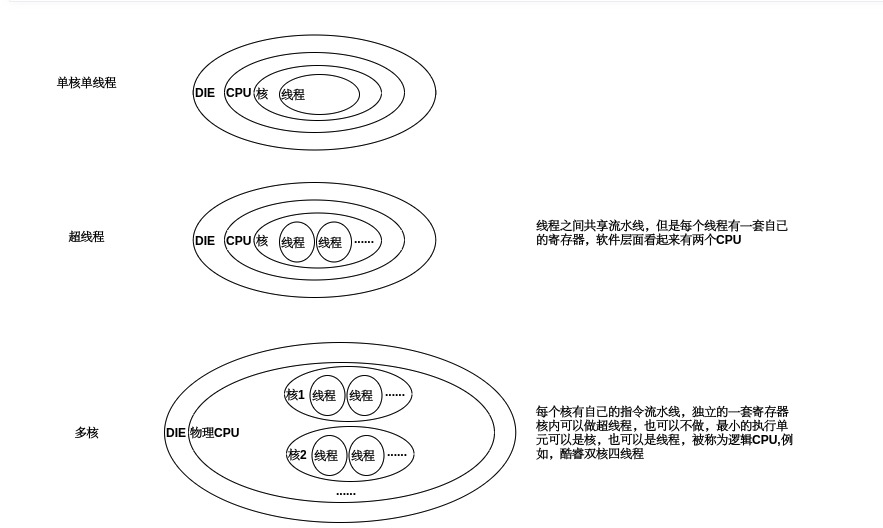

但是哪怕是单核CPU，我们也可以跑多个程序, 这是为什么喃?

## 进程与线程

进程和线程是操作系统级别的概念, 不要和硬件层(比如CPU的线程混淆了), 单个逻辑核心为啥能同时执行多个程序, 有2个部分原因:
+ CPU是支持分时调度的, 以时间片的形式来跑指令集
+ OS层面操作系统会轮换调度进程(运行中的程序)的一部分指令集给CPU运行

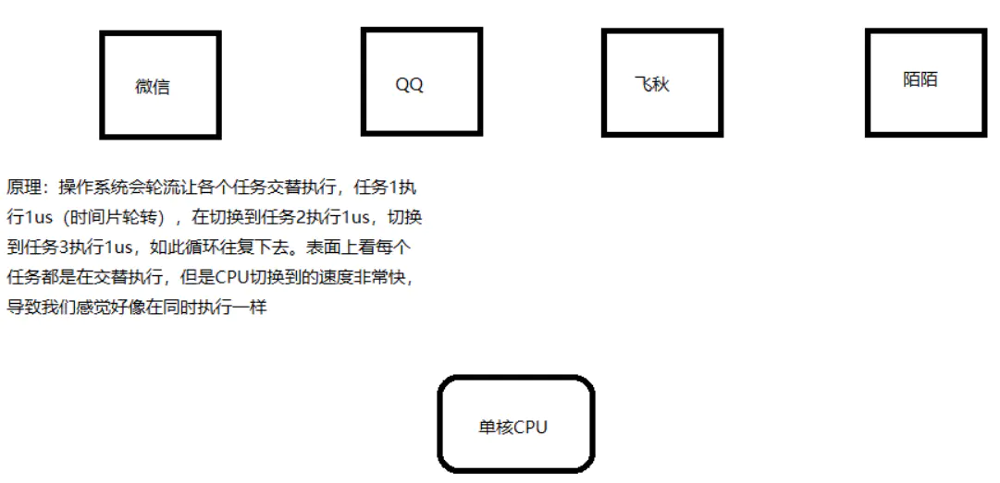


到次可以看出，我们的硬件(CPU)是串行进行处理的, 但是进程在OS层面是并发的, 所以多进程是在操作系统层面的并发模型, 我们如果想要让自己开发的程序也支持并发，可以利用操作系统进程并发的特性, 比如常见的Master/Worker模型: 

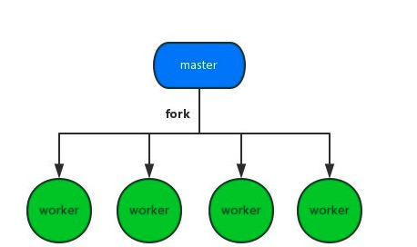

进程是操作系统资源分配的最小单元。因为所有的进程都是有操作系统的内核管理的。所以每个进程之间是独立的，每一个进程都会有自己单独的内存空间以及上下文信息，一个进程挂了不会影响其他进程的运行。这个也是多进程最大的优点，但是它的缺点也很明显, 因为独立，所以进程的结构都需要复制一遍(Fork), 开销很大, 因此我们看到使用多进程来实现并发的案例也不多

那有没有开销更小的方案喃? 

有, 多线程是目前最流行的并发场景的解决方案，由于线程更加轻量级，创建和销毁的成本都很低。并且线程之间通信以及共享内存非常方便，和多进程相比开销要小得多

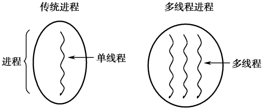

但是多线程也有缺点，一个缺点也是开销。虽然线程的开销要比进程小得多，但是如果创建和销毁频繁的话仍然是不小的负担。

针对这个问题诞生了线程池这种设计。

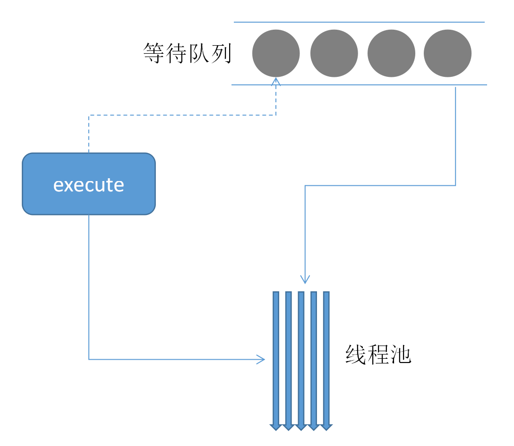

创建一大批线程放入线程池当中，需要用的时候拿出来使用，用完了再放回

+ 优点: 复用线程, 回收和领用代替了创建和销毁两个操作，大大提升了性能
+ 缺点: 资源的共享，由于线程之间资源共享更加频繁，所以在一些场景当中我们需要加上锁等设计，避免并发带来的数据紊乱。

所以在很长一段时间里, 基于线程池来实现并发是最常用的一种手段, 下面是一段基于线程池的python代码:

```python
# coding: utf-8
from concurrent.futures import ThreadPoolExecutor
import time


def spider(page):
    time.sleep(page)
    print(f"crawl task{page} finished")
    return page

with ThreadPoolExecutor(max_workers=5) as t:  # 创建一个最大容纳数量为5的线程池
    task1 = t.submit(spider, 1)
    task2 = t.submit(spider, 2)  # 通过submit提交执行的函数到线程池中
    task3 = t.submit(spider, 3)

    print(f"task1: {task1.done()}")  # 通过done来判断线程是否完成
    print(f"task2: {task2.done()}")
    print(f"task3: {task3.done()}")

    time.sleep(2.5)
    print(f"task1: {task1.done()}")
    print(f"task2: {task2.done()}")
    print(f"task3: {task3.done()}")
    print(task1.result())  # 通过result来获取返回值
```

## 协程(coroutine)

协程也叫做轻量级线程，和多线程最大的区别在于，协程的调度不是基于操作系统的而是基于用户空间的程序的, 一般由库或者程序的运行时提供调度

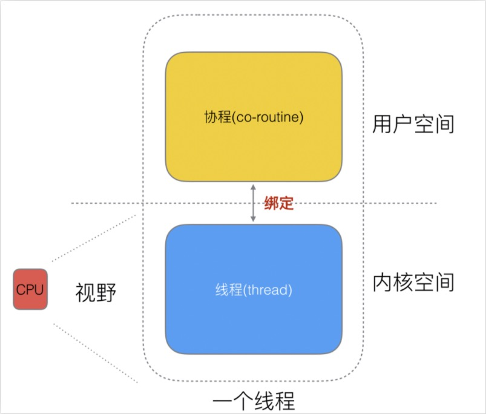

也就是说协程更像是程序里的函数，但是在执行的过程当中可以随时挂起、随时继续:


协程1和协程2的关系是完全对等的，协程1执行过程中可以中断挂起执行另外一个协程2，反之也是可以的，直到最终两个协程都执行完以后再返回回到主程序中，即协程1和协程2相互协作完成了整个任务

```go
func A() {
    fmt.Print("1")
    fmt.Print("2")
    fmt.Print("3")
}

func B() {
    fmt.Print("A")
    fmt.Print("B")
    fmt.Print("C")
}
```

如果我们在一个线程内执行A和B这两个函数，要么先执行A再执行B要么先执行B再执行A。输出的结果是确定的，但如果我们用写成来执行A和B，有可能A函数执行了一半刚输出了一条语句的时候就转而去执行B，B输出了一条又再回到A继续执行。不管执行的过程当中发生了几次中断和继续，在操作系统当中执行的线程都没有发生变化。也就是说这是程序级的调度

那么和多线程相比，我们创建、销毁线程的开销就完全没有了，整个过程变得非常灵活。但是缺点是由于是程序级别的调度，所以需要编程语言自身的支持，如果语言本身不支持，就很难使用了。目前原生就支持协程的语言并不多，显然golang就是其中一个

那Go是如何实现协程的喃? 协程又是如何交给线程去运行的喃?


## Go GPM模型

Go的Runtime实现了一个调度器, 我们叫他协程调度器, 由他将协程调度给操作系统的线程运行，比如:

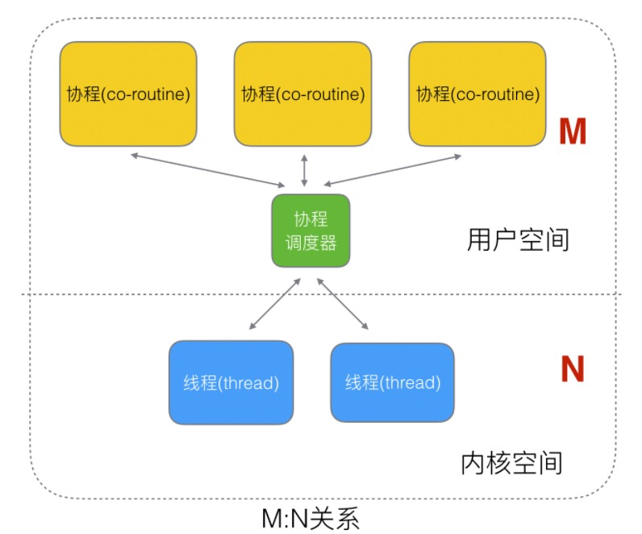

图中为啥是 M 个协程绑定 N 个线程, 为啥不是N:1 或者 1:1喃:
+ N:1 的缺点: 一旦某协程阻塞，造成线程阻塞
+ 1:1 的缺点: 那我还不如直接使用线程

在Go语言里面，协程叫做Goroutine, 就是Go coroutine的一个合写, 后面我们叫Go里的协程叫: Goroutine

我们来看看这个协程调度器调度器是如何设计的

我们现在使用的调度器是go1.1 (released 2013/05/13),中实现的, 其实在Go刚诞生时 还有1个简单版本的调度器

### Go1.1之前的调度器设计

这个版本的调度器因为性能存在问题, 仅存在很短一短时间

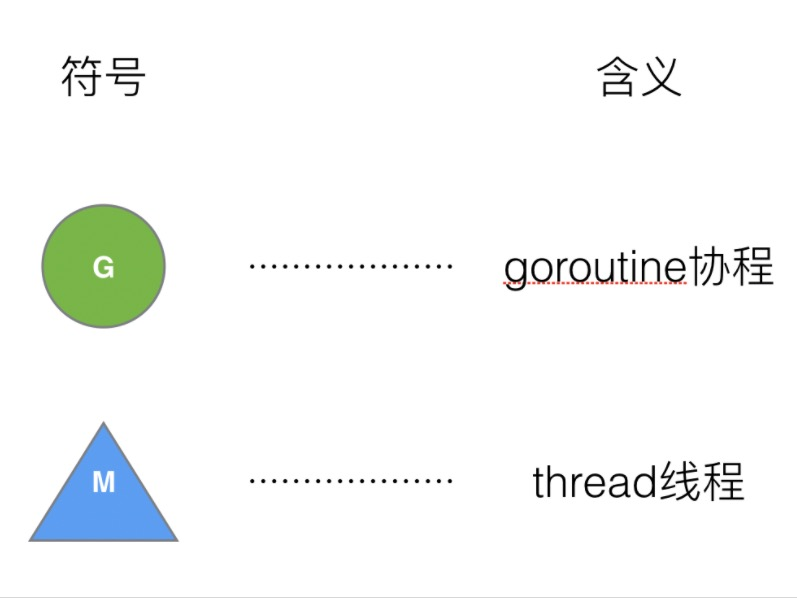

调度过程:

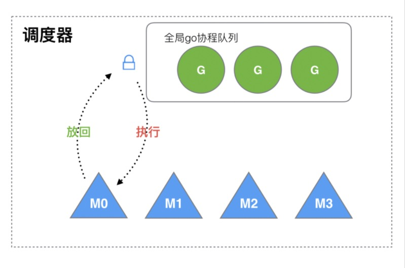

M 想要执行、放回 G 都必须访问全局 G 队列，并且 M 有多个，即多线程访问同一资源需要加锁进行保证互斥 / 同步，所以全局 G 队列是有互斥锁进行保护的

这样调度存在2个缺陷:

+ 创建、销毁、调度 G 都需要每个 M 获取锁，这就形成了激烈的锁竞争 
+ 系统调用 (CPU 在 M 之间的切换) 导致频繁的线程阻塞和取消阻塞操作增加了系统开销

那新版本是如何改进这2个问题的喃?

### Go1.1的新版调度器设计

面对之前调度器的问题，Go 设计了新的调度器。


在新调度器中，除了 M (thread) 和 G (goroutine)，又引进了 P (Processor)

1个P绑定一个1个线程, 这样线程M就不需要频繁的切换了, 只需要消费P中的协程即可, 由于P包含一个本地队列，这样也避免了直接使用全局队列带来的加锁问题

Processor，它包含了运行 goroutine 的资源，如果线程想运行 goroutine，必须先获取 P，P 中还包含了可运行的 G 队列
```go
struct P
{
Lock;
G *gfree; // freelist, moved from sched
G *ghead; // runnable, moved from sched
G *gtail;
MCache *mcache; // moved from M
FixAlloc *stackalloc; // moved from M
uint64 ncgocall;
GCStats gcstats;
// etc
...
};

P *allp; // [GOMAXPROCS]

There is also a lock-free list of idle P’s:

P *idlep; // lock-free list
```

加入了P和P的本地队列后，新的调度流程如下:


+ 全局队列（Global Queue）：存放等待运行的 G。
+ P 的本地队列：同全局队列类似，存放的也是等待运行的 G，存的数量有限，不超过 256 个。新建 G’时，G’优先加入到 P 的本地队列，如果队列满了，则会把本地队列中一半的 G 移动到全局队列。
+ P 列表：所有的 P 都在程序启动时创建，并保存在数组中，最多有 GOMAXPROCS(可配置) 个。
+ M：线程想运行任务就得获取 P，从 P 的本地队列获取 G，P 队列为空时，M 也会尝试从全局队列拿一批 G 放到 P 的本地队列，或从其他 P 的本地队列偷一半放到自己 P 的本地队列。M 运行 G，G 执行之后，M 会从 P 获取下一个 G，不断重复下去

详细细节可以看: [Scalable Go Scheduler Design Doc](https://docs.google.com/document/d/1TTj4T2JO42uD5ID9e89oa0sLKhJYD0Y_kqxDv3I3XMw/edit#heading=h.mmq8lm48qfcw)


## Goroutine

讲了那么多，我该如何创建一个G喃?, 很简单使用go关键字, 比如
```go
// 这样我们就把doSomething变成了一个G协程，交由调度器去运行
go doSomething()
```

当我们执行 go func() 时, Go按照上面的GPM模型, 流程应该是什么样的:

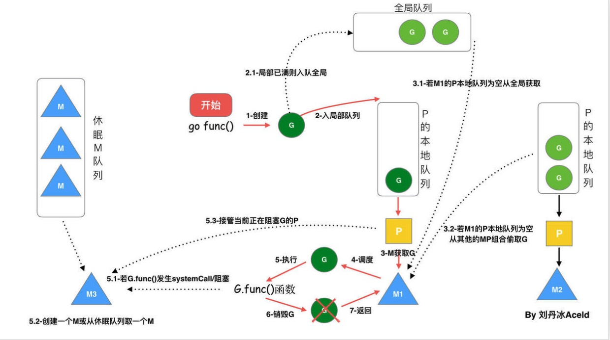

+ 创建Goroutine
+ 调度器将Goroutine调度入队(本地队列或者全局队列)
+ M获取G执行(绑定的P的队列, 全局队列, 其他P的队列)
+ M 循环的调度 G 执行
+ 如果M阻塞, 创建一个M或者从休眠的M队列中挑选一个M来服务于该P
+ G执行完成, 销毁G, 返回, 此时M空闲, 放入休眠中的M队列

下面通过一个具体的案例来跟踪整个过程

###  具体案例

比如我们要执行一个任务, 该任务执行一次好似2s, 如下:
```go
func runTask(id int) {
	time.Sleep(2 * time.Second)
	fmt.Printf("task %d complete\n", id)
}
```

如果我们要顺序执行10次，那么跑一轮下来就得耗时 20秒:
```go
func syncRun() {
	for i := 0; i < 10; i++ {
		runTask(i + 1)
	}
}

func main() {
	syncRun()
}
```

```
task 1 complete
task 2 complete
task 3 complete
task 4 complete
task 5 complete
task 6 complete
task 7 complete
task 8 complete
task 9 complete
task 10 complete
```

我如果想让他们并发运行怎么办? 这个时候就可以使用Goroutine了
```go
func asyncRun() {
	for i := 0; i < 10; i++ {
		go runTask(i + 1)
	}
}

func main() {
	asyncRun()
}
```

这样你会发现, 并没有按照我们预期的进行, 为什么? 再看下，下面这张图:


我们启动了10个协程, 协程启动过后，还没来得急执行，我们的主程序就退出了，所以没有打印任何结果

那我们如何知道协程已经退出? 有过其他语言编程经验的同学应该可以想到，基于共享内存:

因为协程是基于线程运行的，线程又是共享内存的，因此我们可以定义一个遍历, 没启动一个我们就加1, 退出1个我们就减1:

```go
package main

import (
	"fmt"
	"time"
)

var (
	// 状态计数器
	goroutineCount = 0
)

func Add() {
	goroutineCount++
}

func Exit() {
	goroutineCount--
}

func runTask(id int) {
	// 推出一个减去1
	defer Exit()

	fmt.Printf("task %d start..\n", id)
	time.Sleep(2 * time.Second)
	fmt.Printf("task %d complete\n", id)
}

func asyncRun() {
	for i := 0; i < 10; i++ {
		go runTask(i + 1)
		// 没启动一个go routine 就+1
		Add()
	}
}

func main() {
	asyncRun()
	for goroutineCount > 0 {
		time.Sleep(100 * time.Millisecond)
	}
}
```

这样我们的程序运行Task就时并行的了

```
task 6 start..
task 2 start..
task 1 start..
task 4 start..
task 8 start..
task 9 start..
task 10 start..
task 3 start..
task 7 start..
task 5 start..
task 5 complete
task 8 complete
task 7 complete
task 3 complete
task 1 complete
task 9 complete
task 6 complete
task 10 complete
task 2 complete
task 4 complete
```

> 上面还有个问题，就是由于多个goroutine 同时访问共享变量时, 可能导致变量的不准确修改, 最好还是加锁

```go
var (
	// 状态计数器
	goroutineCount = 0
	mu             sync.Mutex
)

// 并不是Gorouine进行访问的不需要加锁
func Add() {
	goroutineCount++
}

// Goroutine 并发访问的变量，需要加锁
func Exit() {
	mu.Lock()
	defer mu.Unlock()
	goroutineCount--
}
```

对于这种要等待N个线程完成后再进行下一步的同步操作有一个简单的做法，就是使用sync.WaitGroup来等待一组事件, 其实现逻辑也好我们的方式差不多,
但是由于是使用的原子锁，比我们使用的互斥锁效率高很多

```go
package main

import (
	"fmt"
	"sync"
	"time"
)

var wg sync.WaitGroup

func runTask(id int) {
	// 推出一个减去1
	defer wg.Done()

	fmt.Printf("task %d start..\n", id)
	time.Sleep(2 * time.Second)
	fmt.Printf("task %d complete\n", id)
}

func asyncRun() {
	for i := 0; i < 10; i++ {
		go runTask(i + 1)
		// 没启动一个go routine 就+1
		wg.Add(1)
	}
}

func main() {
	asyncRun()
	wg.Wait()
}
```

### 过程分析

如何跟踪程序的运行过程？

go提供了一个不错的工具: go tool trace, 用于分析程序的运行过程, 但是在使用这个工具之前，我们需要采集运行过程的数据

改造下我们的main, 加入采集trace过程的库
```go
func main() {
	//创建trace文件
	f, err := os.Create("trace.out")
	if err != nil {
		panic(err)
	}

	defer f.Close()

	//启动trace goroutine
	err = trace.Start(f)
	if err != nil {
		panic(err)
	}
	defer trace.Stop()

	asyncRun()
	wg.Wait()
}
```

执行完成后，会生成一个trace.out的文件我们基于这个文件就可以使用 to的trace工具了进行分析了:
```
go tool trace trace.out                     
2021/08/05 20:43:45 Parsing trace...
2021/08/05 20:43:45 Splitting trace...
2021/08/05 20:43:45 Opening browser. Trace viewer is listening on http://127.0.0.1:53603
```

我们可以通过浏览器打开 http://127.0.0.1:53603 网址，点击 view trace 能够看见可视化的调度流程


可以看到G7 ～ G16 就是我们刚才运行Task的10个goroutine


## 总结

+ 进程、线程、协程的关系

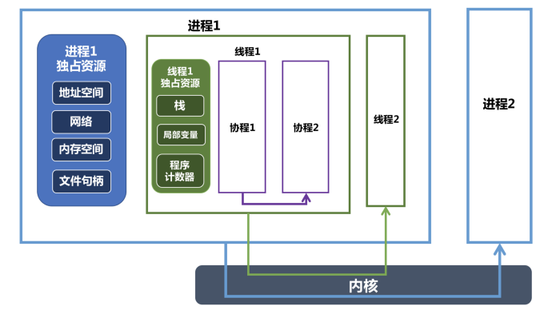

+ Go的GPM模型
+ 运行过程trace
