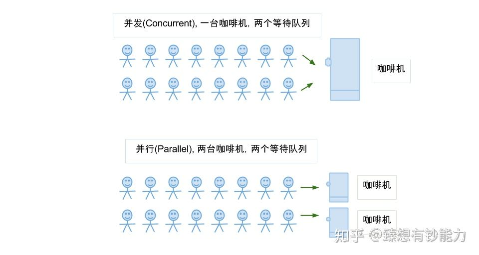

# 并发模型

对于Go语言而言, 一提到并发，可能很多人想到CSP(Communicating Sequential Process，通讯顺序进程), 
这也是Go语言最吸引人的地方。

CSP只是其中一种Go语言推荐的做法, 我们实现并发的方式其实有很多种, 我们把这种实现并发的方式称之为并发模型,
但在讨论并发模型之前首先要明确一组概念：并发与并行

## 并发与并行

并发不是并行

并发程序含有多个逻辑上的独立执行块，它们可以独立的并行执行，也可以串行执行。并行程序解决问题的速度往往比串行程序快的多，因为其可以同时执行整个任务的多个部分。并行程序可能有多个独立执行体，也可能仅有一个。

并行一般是简单的大量重复，例如GPU中对图像处理都会有大量的并行运算。几种并行架构：
+ 位级(bit-level)并行，比如寄存器从32位升级到64位。
+ 指令级(instruction-level)并行，比如CPU指令流水线，乱序执行和猜测执行。
+ 数据级(data-level)并行，比如CPU的SIMD指令以及GPU向量计算指令。
+ 任务级(task-level)并行，比如多处理器架构以及分布式系统架构。

我们还可以从另一种角度来看待并发和并行之间的差异。并发是问题域中的概念，程序需要被设计成能够处理多个同时（或者几乎同时）发生的事情，而并行则是方法域中的概念，通过将问题中的多个部分并行执行来加速解决问题。

总结下并发与并行:
+ 并发是同一时间应对(dealing with)多件事情的能力, 并发更关注的是程序的设计层面。
+ 并行是同一时间动手(doing)做多件事情的能力, 并行更关注的是程序的运行层面。

## 

## 参考

+ [CSP并发模型与Goroutine的基本使用](https://zhuanlan.zhihu.com/p/191038432)

