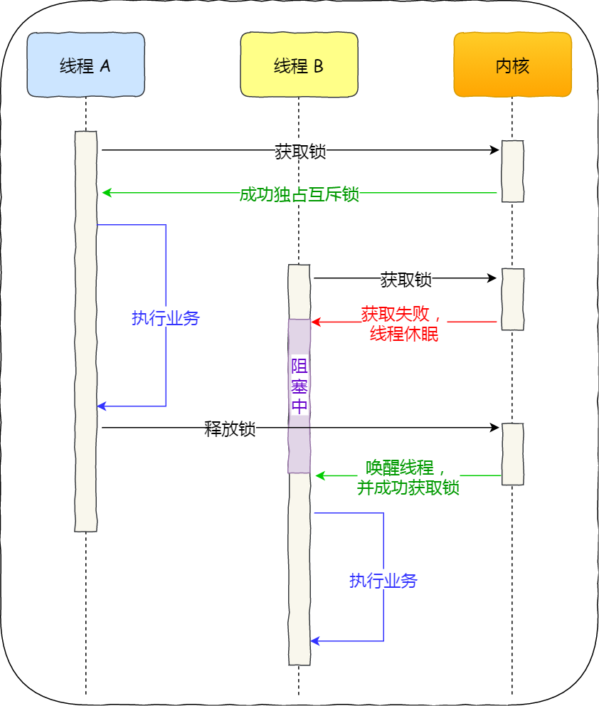
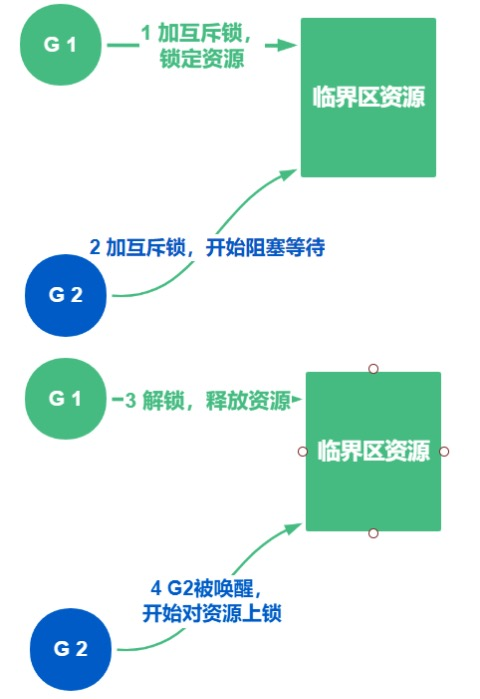
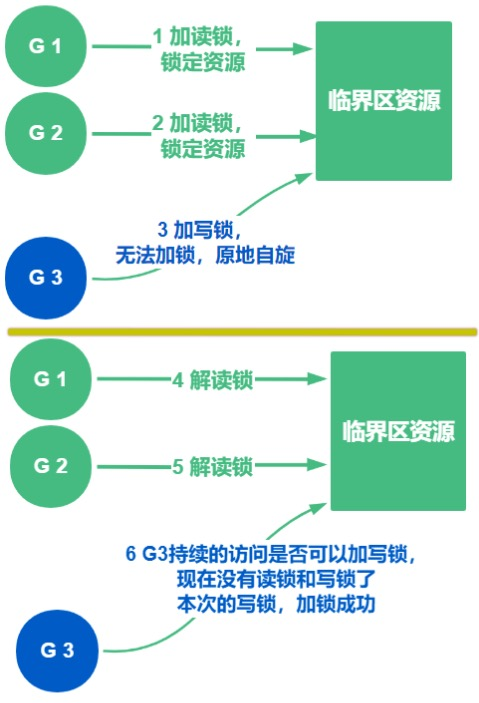

# 锁和原子操作

我们先从一个场景问题说起:

比如我们有10个协程, 每个协程对变量+1， 加1000次, 最终结果是 10 * 1000吗？
```go
import (
	"fmt"
	"sync"
)

var sumCount = 0

func Problem() {
	// 使用WaitGroup等待10个goroutine完成
	var wg sync.WaitGroup
	wg.Add(10)
	for i := 0; i < 10; i++ {
		go func() {
			defer wg.Done()
			// 对变量count执行10次加1
			for j := 0; j < 1000; j++ {
				sumCount++
			}
		}()
	}
	// 等待10个goroutine完成
	wg.Wait()

	// 结果出错，而且不稳定。
	fmt.Println(sumCount)
}
```

因为sumCount++不是原子操作，需要通过几个步骤完成：
+ 读取因为sumCount
+ 当前因为sumCount+1
+ 结果保存到因为sumCount中

为什么会变少? 简单而言就是并发读的时候, 可能大家读到的加数为一样的，无法保证顺序，比如当两个goroutine同时读到了count的值为100，都+1，再存到count中，应该+2，但只加了1，很多数都被覆盖了，导致结果异常

像这种多个Goroutine会同时操作的资源(sumCount), 就可以认为是一个临界区

## 临界区

如果一部分程序会被并发访问或修改，那么，为了避免并发访问导致的意向不到的结果，这部分程序需要被保护起来，这部分程序就是临界区。

如果多个线程同时访问或操作临界区，会造成访问错误，

这个时候我们就需要限定临界区同一时间只能有1个线程持有，保证操作的顺序:
```
当临界区由一个线程持有的时候，其它线程如果想进入这个临界区，就会返回失败，或者是等待。
直到持有的线程退出临界区，这些等待线程中的某一个才有机会接着持有这个临界区。
```

如何限定临界区同一时间只能有1个线程进入喃? 对那就锁

## 什么是锁

锁 是用于解决隔离性的一种机制

某个协程（线程）在访问某个资源时先锁住，防止其它协程的访问，等访问完毕解锁后其他协程再来加锁进行访问

锁的种类更是多种多样，每种锁的加锁开销以及应用场景也不尽相同，如果选择了错误的锁，那么在一些高并发的场景下，可能会降低系统的性能，这样用户体验就会非常差了

GO 中的锁有哪些？
+ 互斥锁
+ 自旋锁
+ 读写锁

## 互斥锁与自旋锁

互斥锁和自旋锁是比较底层的锁, 有很多高级的锁都是基于它们实现的, 他们有什么区别喃?

当已经有一个线程加锁后，其他线程加锁则就会失败，互斥锁和自旋锁对于加锁失败后的处理方式是不一样的：
+ 互斥锁加锁失败后，线程会释放 CPU ，给其他线程
+ 自旋锁加锁失败后，线程会忙等待，直到它拿到锁

互斥锁是一种「独占锁」，比如当线程 A 加锁成功后，此时互斥锁已经被线程 A 独占了，只要线程 A 没有释放手中的锁，线程 B 加锁就会失败，于是就会释放 CPU 让给其他线程，既然线程 B 释放掉了 CPU，自然线程 B 加锁的代码就会被阻塞

但是我们在使用Go的互斥锁的时候，却不是这样的, 而是像自旋锁一样，直到拿到锁，为什么喃？
```go
p.m.Lock()
defer p.m.Unlock()
```

对于互斥锁加锁失败而阻塞的现象，是由操作系统内核实现的。当加锁失败时，内核会将线程置为「睡眠」状态，等到锁被释放后，内核会在合适的时机唤醒线程，当这个线程成功获取到锁后，于是就可以继续执行。如下图



所以，互斥锁加锁失败时，会从用户态陷入到内核态，让内核帮我们切换线程，虽然简化了使用锁的难度，但是存在一定的性能开销成本

互斥锁加锁的过程如下:



+ 操作临界区的时候加锁， 锁定资源, 加锁成功后, 此时其他尝试获取锁的协程将阻塞，直到释放可用
+ 操作资源
+ 释放锁, 其他协程需要加锁的协程，被唤醒，再次争抢锁

可是，如何知道哪一个协程是先被唤醒呢？互斥锁这里的唤醒的策略是随机的，并不知道到底是先唤醒谁

Go里面的sync包 提供了所有同步操作的原语, 其中就包含我们所说的互斥锁, 我们看看如何使用:
```go
// 该结构体就是一个锁, 默认为未加锁状态(UnLock)
var lock sync.Mutex

// 加锁
lock.Lock()

// 释放锁
defer lock.Unlock()
```

我们使用互斥锁修复下我们的刚才的问题:
```go
go func() {
    defer wg.Done()
    // 对变量count执行10次加1
    for j := 0; j < 1000; j++ {
        lock.Lock()
        sumCount++
        lock.Unlock()
    }
}()
```

## 读写锁

为什么有了互斥锁 ，还要读写锁呢？

很明显就是互斥锁不能满足所有的应用场景，就催生出了读写锁，我们细细道来

互斥锁是完全互斥的，不管协程是读临界区资源还是写临界区资源，都必须要拿到锁，否则就无法操作（这个限制太粗暴了对吗？）

可是在我们实际的应用场景下有可能是读多写少

若我们并发的去读取一个资源，且不对资源做任何修改的时候如果也要加锁才能读取数据，是不是就很没有必要呢

这种场景下读写锁就发挥作用了，他就相对灵活了，也很好的解决了读多写少的场景问题

那读写锁是如何解决这个问题的喃?

读写锁，就入其名, 把之前的一把锁，换成了2个锁:
+ 读锁
+ 写锁

当一个 goroutine 协程获取读锁之后，其他的 goroutine 协程如果是获取读锁会继续获得锁, 可如果是获取写锁就必须等待,当一个 goroutine 协程获取写锁之后，其他的 goroutine 协程无论是获取读锁还是写锁都会等待

简单总结就是, 允许多人获取读锁, 但是写锁只有一把, 我们看下流程:



sync 包 的 RWMutex 类型 来实现读写锁:

```go
// 写锁
func (rw *RWMutex) Lock() {...}
func (rw *RWMutex) Unlock() {}

// 读锁
func (rw *RWMutex) RLock() {}
func (rw *RWMutex) RUnlock() {}
```

比如:  5 个协程用于写，开 1000 个协程用于读，使用读写锁加锁

```go
import (
	"fmt"
	"sync"
	"time"
)

var (
	num    int64
	wg     sync.WaitGroup
	rwlock sync.RWMutex
)

func write() {
	// 加写锁
	rwlock.Lock()

	num = num + 1
	// 模拟真实写数据消耗的时间
	time.Sleep(10 * time.Millisecond)

	// 解写锁
	rwlock.Unlock()
	wg.Done()
}

func read() {
	// 加读锁
	rwlock.RLock()

	// 模拟真实读取数据消耗的时间
	time.Sleep(time.Millisecond)

	// 解读锁
	rwlock.RUnlock()

	// 退出协程前 记录 -1
	wg.Done()
}

func RWLock() {
	// 用于计算时间 消耗
	start := time.Now()

	// 开5个协程用作 写
	for i := 0; i < 5; i++ {
		wg.Add(1)
		go write()
	}

	// 开500 个协程，用作读
	for i := 0; i < 1000; i++ {
		wg.Add(1)
		go read()
	}

	// 等待子协程退出
	wg.Wait()

	// 打印程序消耗的时间
	fmt.Println(time.Since(start))
}
```

其实写锁 就是一把 互斥锁, 因为写是互斥的, 我们修改下Read也使用写锁来模拟 如写锁和互斥锁的新能对比

```
读写锁: 57.639903ms
互斥锁: 1.399233327s
```

是不是结果相差很大呢，对于不同的场景应用不同的锁，对于我们的程序性能影响也是很大，当然上述结果，若读协程，和写协程的个数差距越大，结果就会越悬殊

## CAS原子操作

CPU 提供的 CAS 函数（Compare And Swap）, 他把这两个步骤合并成一条硬件级指令，形成原子指令(也就是我们说的原子操作, atomic operation)，这样就保证了这两个步骤是不可分割的，要么一次性执行完两个步骤，要么两个步骤都不执行

我们看看互斥锁加锁的过程：
+ 第一步，查看锁的状态，如果锁是空闲的，则执行第二步；
+ 第二步，将锁设置为当前线程持有

可见这个操作不稳定，就是应该不是原子造成的, 那我们能不能利用原子操作，避开加锁，实现无锁

答案是可以的, 我们把修改变量值的步骤使用原子操作来实现，就实现了无锁

GO 也提供了原子操作的包，供我们来使用 sync/atomic

其中有对加法运算的原子操作:
```go
// AddInt32 atomically adds delta to *addr and returns the new value.
func AddInt32(addr *int32, delta int32) (new int32)

// AddUint32 atomically adds delta to *addr and returns the new value.
// To subtract a signed positive constant value c from x, do AddUint32(&x, ^uint32(c-1)).
// In particular, to decrement x, do AddUint32(&x, ^uint32(0)).
func AddUint32(addr *uint32, delta uint32) (new uint32)

// AddInt64 atomically adds delta to *addr and returns the new value.
func AddInt64(addr *int64, delta int64) (new int64)

// AddUint64 atomically adds delta to *addr and returns the new value.
// To subtract a signed positive constant value c from x, do AddUint64(&x, ^uint64(c-1)).
// In particular, to decrement x, do AddUint64(&x, ^uint64(0)).
func AddUint64(addr *uint64, delta uint64) (new uint64)

// AddUintptr atomically adds delta to *addr and returns the new value.
func AddUintptr(addr *uintptr, delta uintptr) (new uintptr)
```

我们使用原子操作来完成这个加法, 可以这样写
```go
// 原子操作版本
func atomicAdd() {
	atomic.AddInt64(&num, 1)
	wg.Done()
}

// 互斥锁版加函数
func mutexAdd() {
	lock.Lock()
	num = num + 1
	lock.Unlock()
	wg.Done()
}

```

完整代码:
```go
import (
	"fmt"
	"sync"
	"sync/atomic"
	"time"
)

var (
	sumCount int64
	lock     sync.Mutex
)

// 普通版加函数
func add() {
	sumCount = sumCount + 1
	wg.Done()
}

// 互斥锁版加函数
func mutexAdd() {
	lock.Lock()
	sumCount = sumCount + 1
	lock.Unlock()
	wg.Done()
}

// 原子操作版加函数
func atomicAdd() {
	atomic.AddInt64(&sumCount, 1)
	wg.Done()
}

func Problem() {
	// 目的是 记录程序消耗时间
	start := time.Now()
	defer func() {
		fmt.Println(time.Since(start))
	}()

	for i := 0; i < 1000000; i++ {
		wg.Add(1)
		go mutexAdd() // 互斥锁的 add函数 是并发安全的，因为拿不到互斥锁会阻塞，所以加锁性能开销大
		// go atomicAdd() // 原子操作的 add函数 是并发安全，性能优于加锁的
	}
	// 等待10个goroutine完成
	wg.Wait()
	fmt.Println(sumCount)
}
```

100w 协程操作性能:
+ 互斥锁: 336.607554ms
+ 原子锁: 321.87546ms


## 总结

+ 锁
+ 互斥锁，读写锁， 以及其区别和应用场景
+ 原子操作