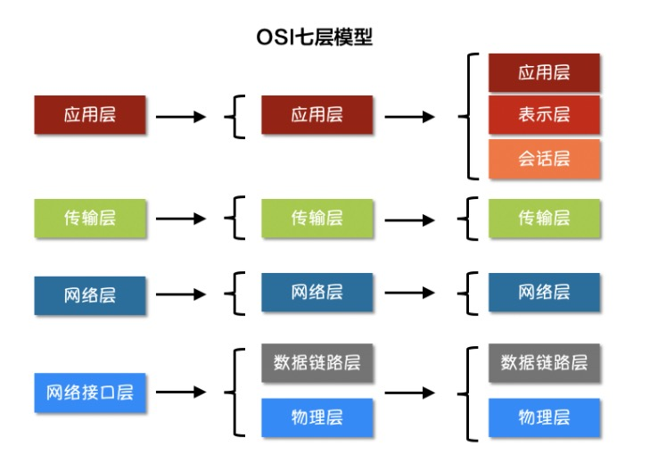
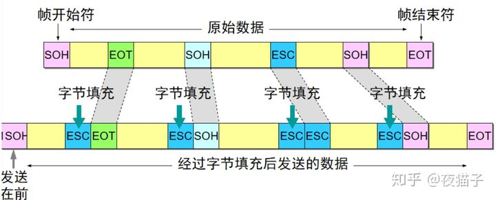

# 互联网协议介绍


+ 流媒体直播: RMTP(TCP), HLS(HTTP), HTTP-FLV
+ 邮件服务: SMTP, POP3, IMAP
+ 微信,QQ: 自定义协议(基于TCP)
+ 物联网设备: 自定义协议(基于TCP)
+ 浏览器: HTTP/WebSocket
+ 其他应用(TCP上自定义, HTTP上自定义)

## 应用与协议

我们以熟悉的直播App的开发为例:

+ 直播原理：把主播录制的视频，推送到服务器，在由服务器分发给观众观看。
+ 直播环节：
    + 推流端: 采集、美颜处理、编码、推流
    + 服务端处理: 转码、录制、截图、鉴黄
    + 播放器: 拉流、解码、渲染
    + 互动系统: 聊天室、礼物系统、赞


其中有很多是业务逻辑, 涉及到网络通信的部分有几处:
+ 客户端推流(主播端) --> 服务端
+ 客户端拉流(观众端) <-- 服务器

那我们的数据是如何在他们之间相互传输的喃? 如何把数据传输出去？这就需要先讲讲互联网分层模型

## 互联网分层模型

互联网的逻辑实现被分为好几层。每一层都有自己的功能，就像建筑物一样，每一层都靠下一层支持。用户接触到的只是最上面的那一层，根本不会感觉到下面的几层。要理解互联网就需要自下而上理解每一层的实现的功能



### 物理层

我们的电脑要与外界互联网通信，需要先把电脑连接网络，我们可以用双绞线、光纤、无线电波等方式。这就叫做”实物理层”，它就是把电脑连接起来的物理手段。它主要规定了网络的一些电气特性，作用是负责传送0和1的电信号


### 数据链路层

单纯的0和1没有任何意义，所以我们使用者会为其赋予一些特定的含义，规定解读电信号的方式：例如：多少个电信号算一组？每个信号位有何意义？这就是”数据链接层”的功能，它在”物理层”的上方，确定了物理层传输的0和1的分组方式及代表的意义。早期的时候，每家公司都有自己的电信号分组方式。逐渐地，一种叫做”以太网”（Ethernet）的协议，占据了主导地位


#### 帧的定义

以太网规定，一组电信号构成一个数据包，叫做”帧”（Frame）。每一帧分成两个部分:
+ 标头（Head）: 一些说明项，比如发送者、接受者、数据类型等等, ”标头”的长度，固定为18字节, 他们的一个重要作用就是帧定界
+ 数据（Data）: 数据包的具体内容, ”数据”的长度，最短为46字节，最长为1500字节(最大传送单元MTU Maximum Transfer Unit)

因此，整个”帧”最短为64字节，最长为1518字节。如果数据很长，就必须分割成多个帧进行发送


首部和尾部都提供很多重要的控制信息，他们的一个重要作用就是帧定界（确定帧的界限)

采用控制字符 标识帧的开始和结束:
+ SOH （Start Of Header）: 十六进制 编码是01 , 表示帧的首部开始
+ EOT （End Of Transmission）: 十六进制 编码是04, 表示帧的结束

如果被传输的数据中也出现了控制字符: 01/04, 这会导致我们在拆解Frame时出现混乱， 怎么办? 

+ ESC （escape)： 十六进制编码是 1B, 用于控制字符转义, 比如1B01 就是数据01, 而不是控制字符01



#### Mac地址

以太网规定，连入网络的所有设备都必须具有”网卡”接口。数据包必须是从一块网卡，传送到另一块网卡。网卡的地址，就是数据包的发送地址和接收地址，这叫做MAC地址


为了能够正确地将数据包发送出去，就必须要求 MAC 地址具有唯一性。因此 MAC 地址都是由生产厂家在生产时固化在网络硬件中，是硬件预留的地址

硬件的 MAC 地址是厂家按照一定的规则，进行设置所产生的，因此，MAC 地址拥有自己的格式

```
一共48位, 分成2段:

前 24 位 + 后 24 位
-------   --------
厂商标识   扩展标识符
```

+ OUI: 组织唯一标识符（Organizationally Unique Identifier，OUI），是由 IEEE 的注册管理机构给不同厂家分配的代码，区分了不同的厂家
+ NIC: 由厂家自己分配的，称为扩展标识符。同一个厂家生产的网卡中 MAC 地址后 24 位是不同的


通过这个网站可以在线查询 [Mac地址厂商在线查询](http://mac.51240.com/)

#### Mac寻址


### 网络层


### 传输层


### 应用层


### 局域网与互联网


## socket编程

Socket是应用层与TCP/IP协议族通信的中间软件抽象层。在设计模式中，Socket其实就是一个门面模式，它把复杂的TCP/IP协议族隐藏在Socket后面，对用户来说只需要调用Socket规定的相关函数，让Socket去组织符合指定的协议数据然后进行通信


## 参考


+ [计算机网络之数据链路层基础详解](https://zhuanlan.zhihu.com/p/225668603)


