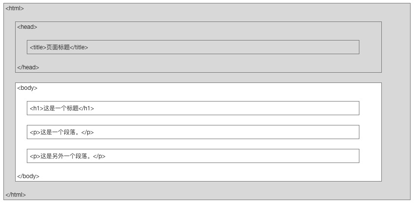

# Web入门基础-HTLM


## HTML 网页结构




## 标签与元素

像上图中的:
+ html
+ head
+ title
+ body
+ h1
+ p

这些都是标签, 像这样的标签有很多: [HTML 参考手册- (HTML5 标准)](https://www.runoob.com/tags/ref-byfunc.html)

而HTML元素是指一个具体的标签实例, 比如下面有2个HTML元素，都是h标签
```html
<h1>这是一个标题</h1>
<h1>这是另一个标题</h1>
```

而整个网页也就是是由这些标签组成的HTML元素构成

## 元素语法

```html
<tag att1=v1 attr2=v2>内容</tag>
```

每种标签都有自己的一组属性, 属性分为2类:
+ 全局属性: 所有标签都有的属性
    + id	定义元素的唯一id
    + class	为html元素定义一个或多个类名（classname）(类名从样式文件引入)
    + style	规定元素的行内样式（inline style）
    + title	描述了元素的额外信息 (作为工具条使用)
    + 更多属性请参考: [HTML 全局属性](https://www.runoob.com/tags/ref-standardattributes.html)
+ 标签属性: 每种标签肯能还有一些该标签才特有的一些属性
    + href 需要有引用的属性的标签才有这个属性, 比如 链接(a标签) 和 图片(img标签)

## 常用标签

基础标签:
```
<h1> to <h6>  定义 HTML 标题
<p>	          定义一个段落
<br>	      定义简单的折行。
<hr>	      定义水平线。
<!--...-->	  定义一个注释
```

文本标签:
```
del 定义被删除文本。
i   定义斜体文本
ins 定义被插入文本
sub 下标文字
sup 上标文字
u   下划线文本
```

表单标签:
```
form
input
...
```

常见元素:
```
iframe 嵌套外部网页
img    展示图像
area   标签定义图像映射内部的区域: https://www.runoob.com/try/try.php?filename=tryhtml_areamap
a      链接标签

ul     定义一个无序列表
ol     定义一个有序列表
li   定义一个列表项
```

表格:
```
<table> 标签定义 HTML 表格
一个 HTML 表格包括 <table> 元素，一个或多个 <tr>、<th> 以及 <td> 元素。
<tr> 元素定义表格行，
<th> 元素定义表头，
<td> 元素定义表格单元
```


容器元素
```
div    标签定义 HTML 文档中的一个分隔区块或者一个区域部分, 标签常用于组合块级元素，以便通过 CSS 来对这些元素进行格式化
span   用于对文档中的行内元素进行组合 标签提供了一种将文本的一部分或者文档的一部分独立出来的方式
```

## 元素的样式


## 脚本

