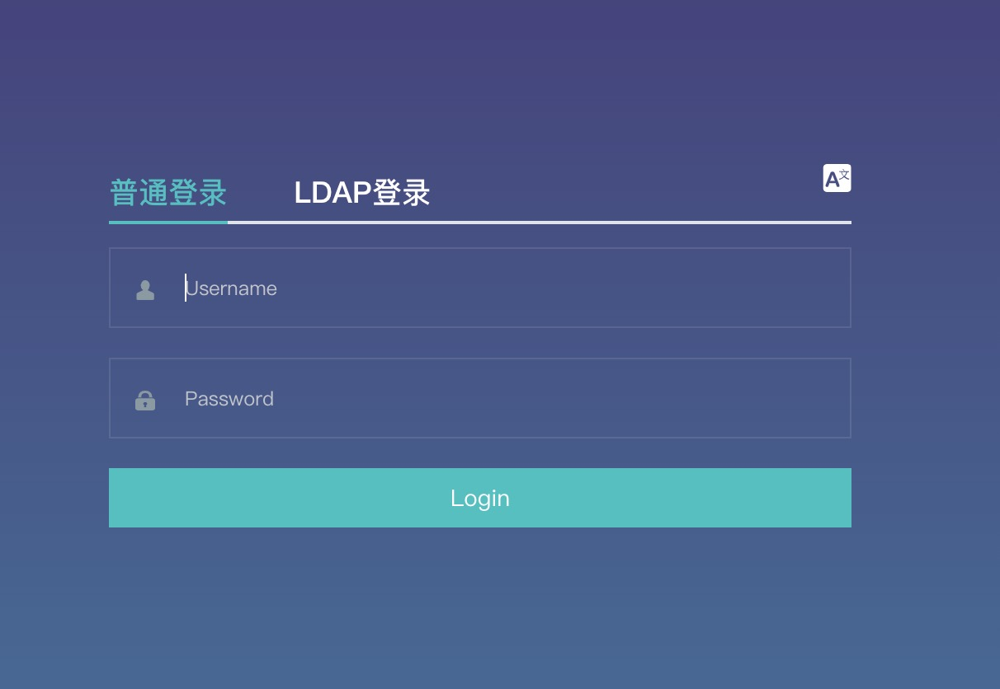
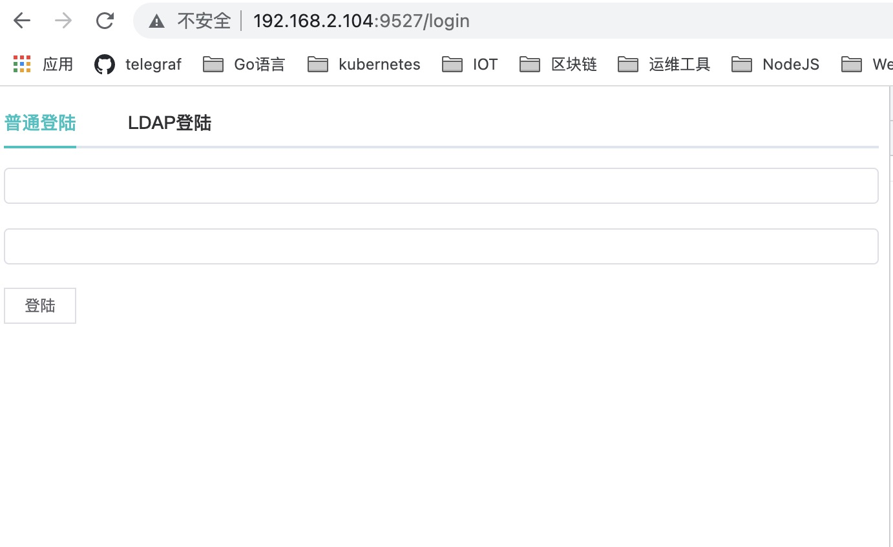
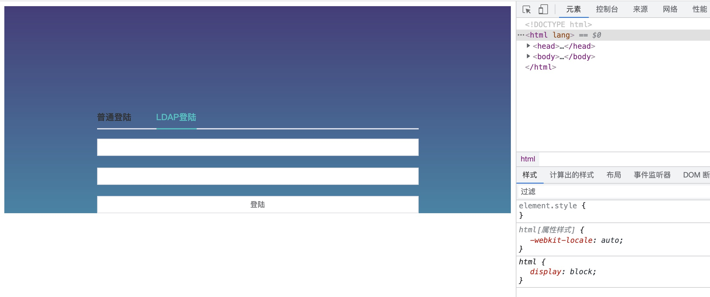
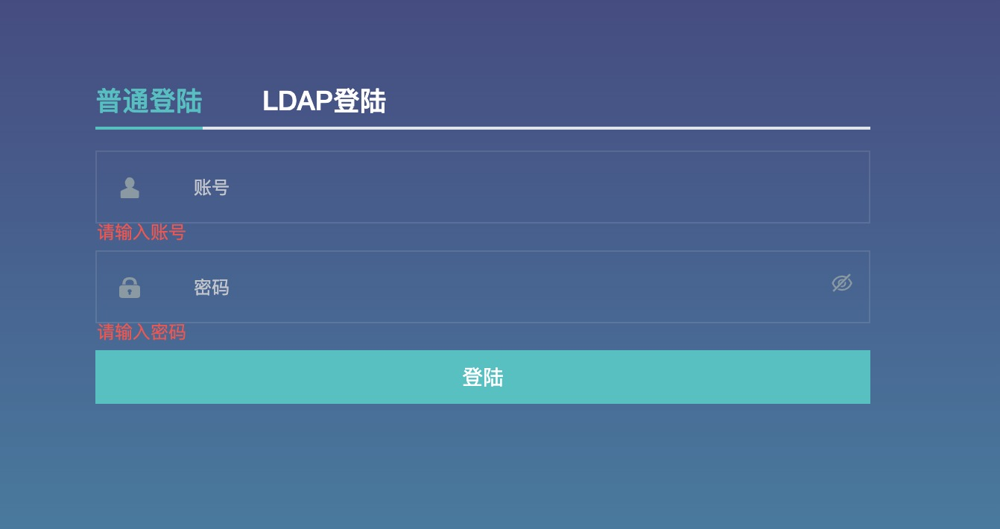

# 登陆页面



## Login组件

由于后期登陆功能是由keyauth服务实现的, 因此我们把登陆页面的视图放到keyauth目录下: views/keyauth/login/index.vue

我们使用一个elemnt 的From组件来实现这个登陆表单, 用法参考: [element form文档](https://element.eleme.cn/#/zh-CN/component/form)
```html
<template>
  <div>
      <el-form>
        <!-- 切换 -->
        <div>
            <el-tabs>
            <el-tab-pane label="普通登陆">

            </el-tab-pane>
            <el-tab-pane label="LDAP登陆">

            </el-tab-pane>
            </el-tabs>
        </div>

        <!-- 账号输入框 -->
        <el-form-item>
        <el-input>

        </el-input>
        </el-form-item>

        <!-- 密码输入框 -->
        <el-form-item>
        <el-input>

        </el-input>
        </el-form-item>

        <!-- 登陆按钮 -->
        <el-button>
            登陆
        </el-button>
      </el-form>
  </div>
</template>

<script>
export default {
  name: 'Login',
  data() {
    return {
      loginForm: {
        grant_type:'',
        username: '',
        password: ''
      },
    }
  }
}
</script>
```

## 配置路由

```js
const routes = [
  {
    path: '/login',
    name: "Login",
    component: () => import('../views/keyauth/login/index'),
  }
];
```

然后访问login路径



## 页面样式

我们为这2个元素添加样式:

+ div: login-container
+ form: login-form

```html
<template>
  <div class="login-container">
      <el-form class="login-form">
        ...
      </el-form>
  </div>
</template>
<style lang="scss" scoped>
.login-container {
  height: 100%;
  width: 100%;
  background-image: linear-gradient(to top, #3584A7 0%, #473B7B 100%);
  .login-form {
    width: 520px;
    padding: 160px 35px 0;
    margin: 0 auto;
    .login-btn {
        width:100%;
    }
  }
}
</style>
```

调整下全局输入框的样式, 取消输入框的圆角
```css
.el-input__inner {
    border-radius: 0px;
}
```



## 全局样式调整

上面可以看到高度不对，原因是 html的样式，我们没有设置100%的高度, 仅显示的元素本身的高度
 
因此我们调整下 整体样式: styles/index.scss
```css
html {
    height: 100%;
    box-sizing: border-box;
}

body {
    height: 100%;
    margin: 0;
    font-family: Helvetica Neue, Helvetica, PingFang SC, Hiragino Sans GB, Microsoft YaHei, Arial, sans-serif;
}

#app {
    height: 100%;
}
```

## 调整输入框样式

调整输入框样式

```scss
/* reset element-ui css */
.login-container ::v-deep .el-input {
    display: inline-block;
    height: 47px;
    width: 85%;
    input {
      background: transparent;
      border: 0px;
      -webkit-appearance: none;
      border-radius: 0px;
      padding: 12px 5px 12px 15px;
      height: 47px;
      caret-color: #fff;
      color: #fff;
    }
  }

.login-container ::v-deep .el-form-item {
    border: 1px solid rgba(255, 255, 255, 0.1);
    color: #454545;
}

.login-container ::v-deep .el-tabs__item {
  color: white;
  font-size: 18px;
}

.login-container ::v-deep .is-active {
  color:#13C2C2;
}
```

## 添加svg icon

我们去iconfont找2个icon过来: 

```html
<!-- 账号输入框 -->
<el-form-item>
<span class="svg-container">
  <svg-icon icon-class="user" />
</span>
<el-input>

</el-input>
</el-form-item>

<!-- 密码输入框 -->
<el-form-item>
<span class="svg-container">
  <svg-icon icon-class="password" />
</span>
<el-input>

</el-input>
</el-form-item>
```

调整样式
```scss
.login-container {
  ...
  .svg-container {
    padding: 6px 5px 6px 15px;
    color: #889aa4;
    vertical-align: middle;
    width: 30px;
    display: inline-block;
  }
}
```

## 绑定数据

1. form绑定数据
```html
<el-form class="login-form" ref="loginForm" :model="loginForm">
```

关于ref: 元素的引用, 可以通过vm.$refs找到这些元素，方便后面操作他们, 比如后面需要操作form，就可以通过这样:
```js
$vm.$refs["loginForm"]
```

2. tabs绑定数据

```html
<el-tabs v-model="loginForm.grant_type">
  <el-tab-pane label="普通登录" name="password" />
  <el-tab-pane label="LDAP登录" name="ldap" />
</el-tabs>
```

3. input绑定数据
```html
<el-input key="username" placeholder="账号" ref="username" v-model="loginForm.username" name="username" type="text" tabindex="1" autocomplete="on" />
<el-input key="password" placeholder="密码" ref="password" v-model="loginForm.password" name="password" type="password" tabindex="2" autocomplete="on" />
```

+ key: 元素的key, vue做数据绑定时，更新数据的标识符, vm实例内需要唯一
+ ref: 添加引用, 通过vm.$refs中 ref名字可以找到该元素
+ name/autocomplete: 一起使用, 自动填充功能
+ type: 输入框类型,  text 文本框, password 密码框
+ tabindex: 使用tab按键进行切换时的顺序控制

4. 登陆绑定方法
```html
<!-- 登陆按钮 -->
<el-button class="login-btn" size="medium" type="primary" tabindex="3" @click="handleLogin">
    登录
</el-button>
<script>
export default {
  name: 'Login',
  data() {
    return {
      loginForm: {
        grant_type:'password',
        username: '',
        password: ''
      },
    }
  },
  methods: {
    handleLogin() {
      alert(`submit: ${this.loginForm.username},${this.loginForm.password}`)
    }
  }
}
</script>
```

## 修复自动填充背景颜色

我们需要修复input输入框的背景填充色, 因为需要全局修复, 直接修改全局样式: styles/index.js: 
```scss
input:-internal-autofill-previewed,
input:-internal-autofill-selected {
    // 自动填充时的字体颜色
    -webkit-text-fill-color: #fff;
    // 采用过度的办法吃掉背景色, 网上都是这个办法
    transition: background-color 5000s ease-out 0.5s;
}
```

关于-webkit/ms: 表示对应浏览器内核私有属性:
+ -moz：匹配Firefox浏览器私有属性
+ -webkit：匹配Webkit枘核浏览器私有属性，如chrome and safari
+ -moz代表firefox浏览器私有属性
+ -ms代表ie浏览器私有属性

关于动画过度: [CSS transition 属性](https://www.w3school.com.cn/cssref/pr_transition.asp)
```
transition: property duration timing-function delay;

transition-property	规定设置过渡效果的 CSS 属性的名称。
transition-duration	规定完成过渡效果需要多少秒或毫秒。
transition-timing-function	规定速度效果的速度曲线。
transition-delay	定义过渡效果何时开始。
```

## 补充查看密码

为了让用户看到自己输入的秘密是多少, 允许用户看到自己密码, 我们添加一个eye
找2个图标:
+ eye-close
+ eye-open

```html
<!-- 密码输入框 -->
<el-form-item>
<span class="svg-container">
  <svg-icon icon-class="password" />
</span>
<el-input key="password" placeholder="密码" ref="password" v-model="loginForm.password" name="password" type="password" tabindex="2" autocomplete="on" />
<span class="show-pwd">
  <svg-icon icon-class="eye-close" />
</span>
</el-form-item>
```

对应的css
```css
.show-pwd {
  position: absolute;
  right: 10px;
  top: 7px;
  font-size: 16px;
  color: #889aa4;
  cursor: pointer;
  user-select: none;
}
```

+ position/right/top: 采用绝对布局
+ font-size: 控制大小
+ color: 控制颜色
+ cursor: 控制光标, 显示成可点击的
+ user-select: 如果您在文本上双击，文本会被选取或高亮显示。此属性用于阻止这种行为

我们通过一个函数控制: input的type属性, 就能完成 开眼与闭眼

```html
<!-- 密码输入框 -->
<el-form-item>
<span class="svg-container">
  <svg-icon icon-class="password" />
</span>
<el-input key="password" placeholder="密码" ref="password" v-model="loginForm.password" name="password" :type="passwordType" tabindex="2" autocomplete="on" />
<span class="show-pwd" @click="showPwd">
  <svg-icon :icon-class="passwordType === 'password' ? 'eye-close' : 'eye-open'" />
</span>
</el-form-item>

<script>
export default {
  name: 'Login',
  data() {
    return {
      passwordType: 'password',
      loginForm: {
        grant_type:'password',
        username: '',
        password: ''
      },
    }
  },
  methods: {
    handleLogin() {
      alert(`submit: ${this.loginForm.username},${this.loginForm.password}`)
    },
    showPwd() {
      if (this.passwordType === 'password') {
        this.passwordType = ''
      } else {
        this.passwordType = 'password'
      }
      this.$nextTick(() => {
        this.$refs.password.focus()
      })
    }
  }
}
</script>
```

## 默认聚焦于输入框

用户进入登陆页面, 光标默认于输入框

```js
mounted() {
  this.$refs.username.focus()
},
```

## 登陆表单校验

在数据提交给后端之前, 我们需要在前端校验参数的合法性

表单验证，通过为el-form提交一个rules参数进行验证
```html
<el-form class="login-form" ref="loginForm" :model="loginForm" :rules="loginRules">
```

然后我们定义校验规则
```js
data() {
  return {
    passwordType: 'password',
    loginForm: {
      grant_type:'password',
      username: '',
      password: ''
    },
    loginRules: {
      // required 是否必填
      // trigger  合适触发校验， change/blur
      // message  校验失败信息
      username: [{ required: true, trigger: 'change', message: '请输入账号' }],
      password: [{ required: true, trigger: 'change', message: '请输入密码'}]
    }
  }
},
```

表单在提交前，调用表单的校验函数
```js
handleLogin() {
  this.$refs.loginForm.validate(valid => {
    console.log(valid)
  })
},
```

恭喜你 没有任何效果！, 因为我们没有为form item添加 label, 不过没关系，我们可以自定义验证逻辑:

先定义2个验证函数
```js
<script>
const validateUsername = (rule, value, callback) => {
  if (value === '') {
    callback(new Error('请输入账号'))
  } else {
    callback()
  }
}
const validatePassword = (rule, value, callback) => {
  if (value === '') {
    callback(new Error('请输入密码'))
  } else {
    callback()
  }
}
```

修改下我们的验证规则: 
```js
loginRules: {
  username: [{ trigger: 'blur', validator: validateUsername }],
  password: [{ trigger: 'blur', validator: validatePassword }]
}
```

我们看下效果: 




## 登陆逻辑

+ 表达校验
+ 通过后端验证登陆凭证, 如果正确 后端返回token, 前端保存
+ 验证成功后, 跳转到Home页面或者用户指定的URL页面

为了防止用户手抖，点击了多次登陆按钮, 为登陆按钮添加一个loadding状态
```js
  data() {
    return {
      loading: false,
      ...
    }
```

然后等了按钮绑定这个状态
```html
<!-- 登陆按钮 -->
<el-button class="login-btn" :loading="loading" size="medium" type="primary" tabindex="3" @click="handleLogin">
    登录
</el-button>
```

接下来就是具体登陆逻辑: 
```js
handleLogin() {
  this.$refs.loginForm.validate(async valid => {
    if (valid) {
      this.loading = true
      try {
        // 调用后端接口进行登录, 状态保存到vuex中
        await this.$store.dispatch('user/login', this.loginForm)

        // 调用后端接口获取用户profile, 状态保存到vuex中
        const user = await this.$store.dispatch('user/getInfo')
        console.log(user)
      } catch (err) {
        // 如果登陆异常, 中断登陆逻辑
        console.log(err)
        return
      } finally {
        this.loading = false
      }

      // 登陆成功, 重定向到Home或者用户指定的URL
      this.$router.push({ path: this.redirect || '/', query: this.otherQuery })
    }
  })
}
```

## 登陆状态

登陆过程是全局的, 所有我们上面都是用的状态插件:vuex 来进行管理, 接下来我们就实现上面的3个状态管理

我们的状态在src/store里面管理, 在上次课[Vue Router与Vuex](../day16/vue-all.md)已经讲了vuex的基础用法, 有不清楚的可以回过头去再看看

### mock接口

因为还没开始写Keyauth后端服务, 这里直接mock后端数据: src/api/keyauth/token.js
```js
export function LOGIN(data) {
  return {
      code: 0,
      data: {
        access_token: 'mock ak',
        namespace: 'mock namespace'
      }
  }
}

export function GET_PROFILE() {
    return {
        code: 0,
        data: {
            account: 'mock account',
            type: 'mock type',
            profile: {real_name: 'real name', avatar: 'mock avatar'}
        }
    }
}
```

### user状态模块
我们先开发一个vuex的 user模块: src/store/modules/user.js
```js
import { LOGIN, GET_PROFILE } from '@/api/keyauth/token'

const state = {
    tokenToken: '',
    namespace: '',
    account: '',
    type: '',
    name: '',
    avatar: '',
}

const mutations = {
    SET_TOKEN: (state, token) => {
        state.tokenToken = token.access_token
        state.namespace = token.namespace
    },
    SET_PROFILE: (state, user) => {
        state.type = user.type
        state.account = user.account
        state.name = user.profile.real_name
        state.avatar = user.profile.avatar
    },
}

const actions = {
    // 用户登陆接口
    login({ commit }, loginForm) {
        return new Promise((resolve, reject) => {
            const resp = LOGIN(loginForm)
            commit('SET_TOKEN', resp.data)
            resolve(resp)
        })
    },

    // 获取用户Profile
    getInfo({ commit }) {
        return new Promise((resolve, reject) => {
            const resp = GET_PROFILE()
            commit('SET_PROFILE', resp.data)
            resolve(resp)
        })
    }
}

export default {
    // 这个是独立模块, 每个模块独立为一个namespace
    namespaced: true,
    state,
    mutations,
    actions
}
```

### 配置user模块

现在我们的user模块还没有加载给vuex, 接下来我们完成这个配置, 如何把user作为模块配置到vuex中喃?
```js
modules = {
  user: <我们刚才的模块>
}

const store = new Vuex.Store({
  modules
})
```

更多请参考: [vuex 模块](https://vuex.vuejs.org/zh/guide/modules.html)

修改 src/store/index.js
```js
import Vue from "vue";
import Vuex from "vuex";
import user from './modules/user'

Vue.use(Vuex);

export default new Vuex.Store({
  modules: {user: user},
});
```

我们再补充一个getter, 用于访问vuex所有模块属性: src/store/getters.js
```js
const getters = {
    accessToken: state => state.user.accessToken,
    namespace: state => state.user.namespace,
    account: state => state.user.account,
    username: state => state.user.name,
    userType: state => state.user.type,
    userAvatar: state => state.user.avatar,
  }
  export default getters
```

我们能让vuex真的持久化, 我们需要为vuex安装vuex-persist插件
```js
// vuex-persist@3.1.3
npm install --save vuex-persist
```

最终我们vuex index.js 就是这样:
```js
import Vue from "vue";
import Vuex from "vuex";
import VuexPersistence from 'vuex-persist'
import user from './modules/user'
import getters from './getters'

const vuexLocal = new VuexPersistence({
  storage: window.localStorage
})

Vue.use(Vuex);

export default new Vuex.Store({
  modules: {user: user},
  getters,
  plugins: [vuexLocal.plugin]
});
```

### 验证状态

登陆后，会调整到Home页面, 也能在localstorage查看到我们存储的信息:


## 登陆守卫

经过上面的逻辑我们可以登陆后 跳转到我们的Home页面, 但是现在我们登陆页面 依然形同虚设, 为啥?

用户如果直接访问Home也是可以的, 所以我们需要做个守卫, 判断当用户没有登陆的时候，跳转到等了页面

怎么做这个守卫, 答案就是vue router为我们提供的钩子, 在路由前我们做个判断: 我们在router下面创建一个permission.js模块, 用于定义钩子函数

```js
// 路由前钩子, 权限检查
export function beforeEach(to, from, next) {
    console.log(to, from)
    next()
}

// 路由后构造
export function afterEach() {
    console.log("after")
}
```

然后我们在router上配置上: router/index.js
```js
...
import {beforeEach, afterEach} from './permission'

...
router.beforeEach(beforeEach)
router.afterEach(afterEach)

export default router;
```

### 权限判断

```js
import store from '@/store'

// 不需认证的页面
const whiteList = ['/login']

// 路由前钩子, 权限检查
export function beforeEach(to, from, next) {
    // 取出token
    const hasToken = store.getters.accessToken

    // 判断用户是否登陆
    if (hasToken) {
        // 已经登陆得用户, 再次访问登陆页面, 直接跳转到Home页面
        if (to.path === '/login') {
            next({ path: '/' })
        } else {
            next()
        }
    } else {
        // 如果是不需要登录的页面直接放行
        if (whiteList.indexOf(to.path) !== -1) {
            // in the free login whitelist, go directly
            next()
        } else {
          // 需要登录的页面, 如果未验证, 重定向到登录页面登录
          next(`/login?redirect=${to.path}`)
        }
    }
}
```

清空localstorage里面vuex对应的值, 进行测试:
+ Homoe页面测试
+ 其他页面测试(空页面, 无路由页面)

### Progress Bar

```js
// nprogress@0.2.0
npm install --save nprogress
```

然后补充上相应配置, 需要注意的时，如果有跳转到其他访问的也代表这个页面加载结束, 需要NProgress.done()
```js
import NProgress from 'nprogress' // progress bar
import 'nprogress/nprogress.css' // progress bar style

NProgress.configure({ showSpinner: false }) // NProgress Configuration
...

// 路由前钩子, 权限检查
export function beforeEach(to, from, next) {
    // 路由开始
    NProgress.start()

    // 省略其他代码
    next({ path: '/' })
    NProgress.done()

    // 省略其他代码
    next(`/login?redirect=${to.path}`)
    NProgress.done()
}

// 路由后构造
export function afterEach() {
    // 路由完成
    NProgress.done()
}
```

为了和主题颜色一致, 全局修改progress bar颜色: styles/index.js
```css
#nprogress .bar {
    background:#13C2C2;
  }
```


现在如果我们访问都其他不存在的页面，是一个空白页面，显然这样很有友好, 接下来我们添加一个404页面

