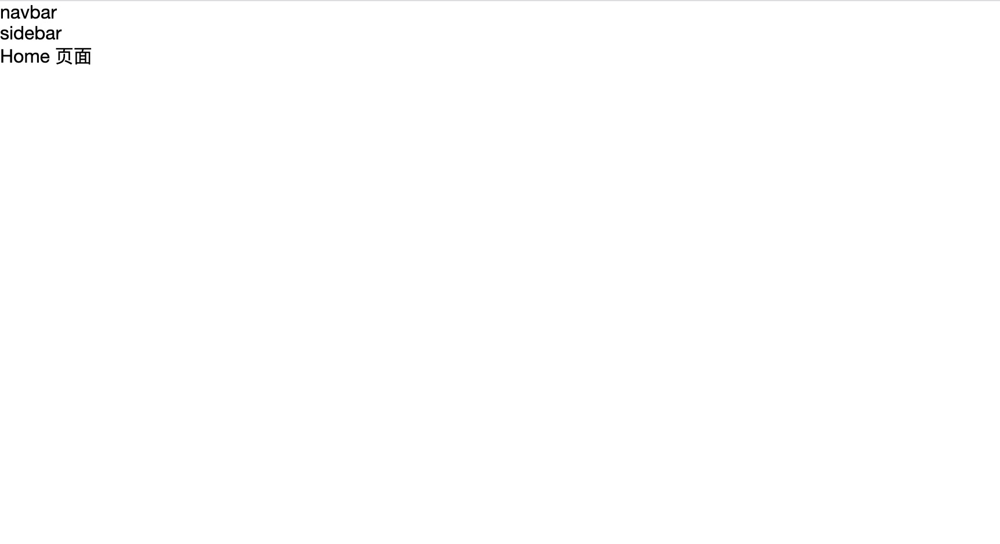
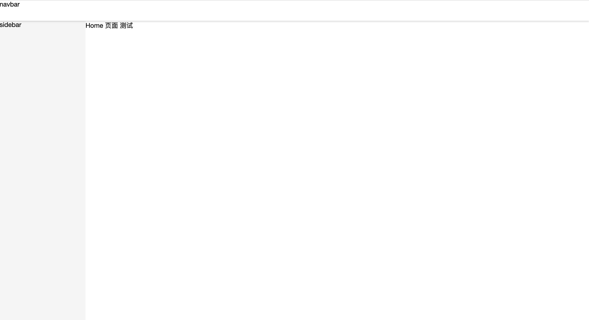
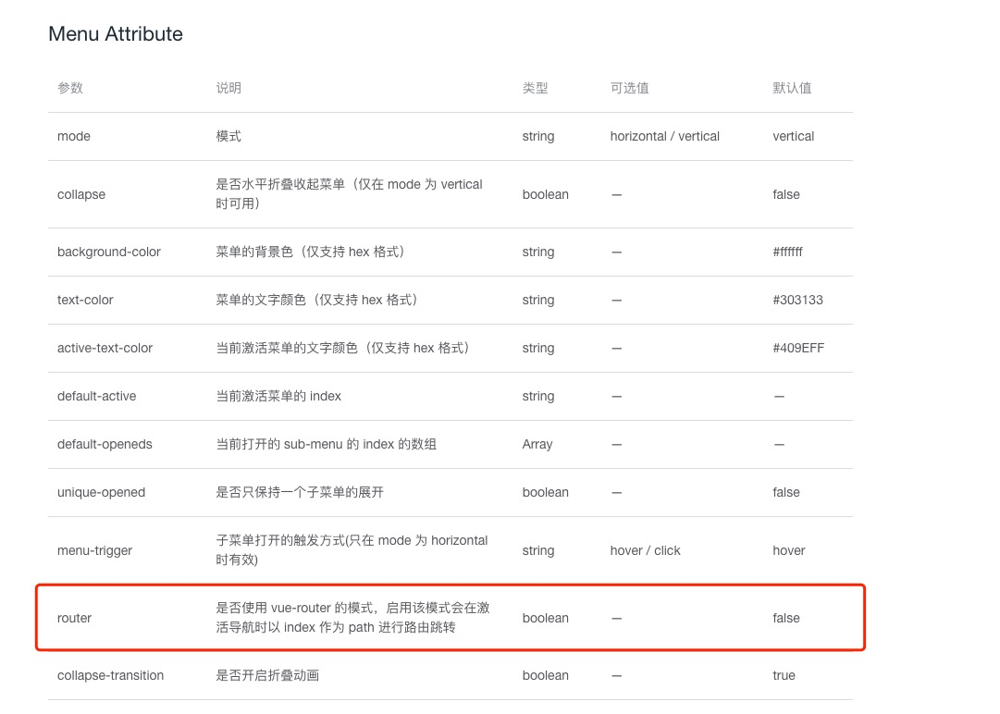

# 导航页面

我们登录后的主页面 就是一张白纸, 显然这不是我们想要的, 现在就来完善我们的主页面, 大致效果如下:


## Layout布局

我们整体采用上-左-右的布局, 具体构成:
+ 最上边: 顶部导航
+ 左边: 侧边栏导航
+ 右边: 内容页面

按照这个划分, 我们把这些部分独立成一个一个的Layout组件, 创建目录:layout/components

+ Navbar.vue
+ Sidebar.vue
+ AppMain.vue

先写框架, 留空页面

Navbar.vue 组件:
```html
<template>
  <div class="navbar">
      navbar
  </div>
</template>

<script>
export default {
  name: 'Navbar',
}
</script>
```

Sidebar.vue 组件:
```html
<template>
  <div class="sidebar">
      sidebar
  </div>
</template>

<script>
export default {
  name: 'Sidebar',
}
</script>
```


AppMain.vue 组件:
```html
<template>
  <section class="app-main">
    <transition name="fade-transform" mode="out-in">
      <router-view :key="key" />
    </transition>
  </section>
</template>

<script>
export default {
  name: 'AppMain',
  computed: {
    key() {
      return this.$route.path
    }
  }
}
</script>
```

为了方便使用components内的组件, 我们创建一个index.js 把这些组件导出来: layout/components/index.js
```js
export { default as AppMain } from './AppMain'
export { default as Navbar } from './Navbar'
export { default as Sidebar } from './Sidebar'
```

最后我们把这些组件组合起来, 就是我们的Layout组件了: layout/index.vue

```html
<template>
  <div>
    <!-- 顶部导航栏 -->
    <div class="navbar-container">
        <navbar />
    </div>

    <!-- 主内容区 -->
    <div class="app-wrapper">
        <!-- 侧边栏导航 -->
        <div class="sidebar-container">
            <sidebar />
        </div>
        <!-- 内容页面区 -->
        <div class="main-container">
            <app-main />
        </div>
    </div>
  </div>
</template>

<script>
import { AppMain, Navbar, Sidebar } from './components'

export default {
  name: 'Layout',
  components: {
    AppMain,
    Navbar,
    Sidebar
  },
}
</script>
```

最后修改我们的Home路由, 采用Layout布局: router/index.js
```js
{
  path: '/',
  component: Layout,
  redirect: '/dashboard',
  children: [
    {
      path: 'dashboard',
      component: () => import('@/views/dashboard/index'),
      name: 'Dashboard',
    }
  ]
},
```

最终我们的Home页面就是这样的:


> 试着修改Home页面的内容, 看看页面是否正常显示

由于现在没有任何样式, 显得很Low B, 接下里就为其填充样式

## Layout样式

由于layout是全局样式, 我们新增一个全局样式css文件: styles/layout.scss
```scss
#app {}
```

然后通过styles下index.js 导入, 加载到全局
```js
@import './element-ui.scss';
@import './layout.scss';

...
```

我们使用scss, 可以定义变量, 我们把一些通用的变量定义在: styles/variables.scss
```scss
// 侧边栏宽度
$sideBarWidth: 210px;
```

然后我们来为这3个组件补充基础样式
```scss
$navbarHeight: 50px;

#app {
    .navbar-container {
        width:100vw;
        height:$navbarHeight;
        background-color: var(--cb-color-bg-primary,#fff);
        box-shadow: 0 2px 4px 0 var(--cb-color-shadow,rgba(0,0,0,0.16));
        position: fixed;
    }
    
    .app-wrapper {
        padding-top: $navbarHeight;
    }

    .sidebar-container {
        transition: width 0.28s;
        width: $sideBarWidth !important;
        height: calc(100vh - #{$navbarHeight});
        float: left;
        background-color: #f5f5f5;
    }

    .main-container {
        min-height: 100%;
        transition: margin-left .28s;
        margin-left: $sideBarWidth;
        position: relative;
    }
}
```
有了基本的样式, 骨架终于显示出来了:



## 顶部导航

我们使用elemntui提供的导航: [NavMenu 导航菜单](https://element.eleme.cn/#/zh-CN/component/menu)

现在我们开始填充顶部导航的内容: layout/components/Navbar.vue
```html
<template>
  <div class="navbar">
    <!-- logo -->
    <div class="logo-container">
      <span>极乐研发云</span>
    </div>
    <!-- 主导航栏 -->
    <div class="navbar-main">
      <el-menu :default-active="activeIndex" mode="horizontal" menu-trigger="click">
        <el-menu-item index="dashboard">首页</el-menu-item>
        <el-menu-item index="product">产品运营</el-menu-item>
        <el-menu-item index="resource">资源管理</el-menu-item>
        <el-menu-item index="develop">研发交付</el-menu-item>
        <el-menu-item index="eventbox">监控告警</el-menu-item>
      </el-menu>
    </div>
    <!-- 用户信息区 -->
    <div class="navbar-user">
      <el-dropdown>
        <el-button type="text">
          <span>老喻</span>
          <i class="el-icon-arrow-down el-icon--right dropdown-color" />
        </el-button>
        <el-dropdown-menu slot="dropdown">
          <!-- 个人信息 -->
          <el-dropdown-item>
            <svg-icon icon-class="person" />
            <span class="dropdown-item-text">基本信息</span>
          </el-dropdown-item>
          <!-- 项目地址 -->
          <el-dropdown-item>
            <svg-icon icon-class="github" />
            <span class="dropdown-item-text">Github地址</span>
          </el-dropdown-item>
          <!-- 退出系统 -->
          <el-dropdown-item divided>
            <span style="display:block;">退出登录</span>
          </el-dropdown-item>
        </el-dropdown-menu>
      </el-dropdown>
    </div>
  </div>
</template>

<script>
export default {
  name: 'Navbar',
  data() {
    return {
      activeIndex: 'dashboard'
    }
  }
}
</script>
```

## 顶部导航样式

添加样式:
```html
<style lang="scss" scoped>
.navbar {
  display: flex;
  align-content: center;
  justify-content: flex-start;
  align-items: center;
}

.logo-container {
  box-sizing: border-box;
  width: 210px;
  padding-left: 28px;
  color: #909398;
}

.navbar ::v-deep .el-menu-item {
  height: 50px;
  line-height: 50px;
}

.navbar-user {
  margin-left: auto;
  padding-right: 12px;
}

.dropdown-item-text {
  margin-left: 12px;
  margin-right: 12px;
}
</style>
```

最终我们顶部导航栏:


## 侧边栏导航

我们先去element copy一个样例过来
```html
<template>
  <div class="sidebar">
    <el-radio-group v-model="isCollapse" style="margin-bottom: 20px;">
      <el-radio-button :label="false">展开</el-radio-button>
      <el-radio-button :label="true">收起</el-radio-button>
    </el-radio-group>
    <el-menu default-active="1-4-1" class="el-menu-vertical-demo" :collapse="isCollapse">
      <el-submenu index="1">
          <template slot="title">
            <i class="el-icon-location"></i>
            <span slot="title">导航一</span>
          </template>
          <el-menu-item-group>
            <span slot="title">分组一</span>
            <el-menu-item index="1-1">选项1</el-menu-item>
            <el-menu-item index="1-2">选项2</el-menu-item>
          </el-menu-item-group>
          <el-menu-item-group title="分组2">
            <el-menu-item index="1-3">选项3</el-menu-item>
          </el-menu-item-group>
          <el-submenu index="1-4">
            <span slot="title">选项4</span>
            <el-menu-item index="1-4-1">选项1</el-menu-item>
          </el-submenu>
        </el-submenu>
        <el-menu-item index="2">
          <i class="el-icon-menu"></i>
          <span slot="title">导航二</span>
        </el-menu-item>
        <el-menu-item index="3" disabled>
          <i class="el-icon-document"></i>
          <span slot="title">导航三</span>
        </el-menu-item>
        <el-menu-item index="4">
          <i class="el-icon-setting"></i>
          <span slot="title">导航四</span>
        </el-menu-item>
    </el-menu>
  </div>
</template>

<script>
export default {
  name: 'Sidebar',
  data() {
    return {
      isCollapse: true
    }
  }
}
</script>
```

### 侧边栏的展开状态处理

我们先处理下sidebar的展开和收起, 我们把这个状态保存在vuex中, 新建一个app模块 用于保存应用的前端状态: store/modules/app.js
```js
const state = {
  sidebar: {
    opened: true,
  },
  size: 'medium'
}

const mutations = {
  TOGGLE_SIDEBAR: state => {
    state.sidebar.opened = !state.sidebar.opened
  },
  CLOSE_SIDEBAR: (state) => {
    state.sidebar.opened = false
  },
  SET_SIZE: (state, size) => {
    state.size = size
  }
}

const actions = {
  toggleSideBar({ commit }) {
    commit('TOGGLE_SIDEBAR')
  },
  closeSideBar({ commit }, { withoutAnimation }) {
    commit('CLOSE_SIDEBAR', withoutAnimation)
  },
  setSize({ commit }, size) {
    commit('SET_SIZE', size)
  }
}

export default {
  namespaced: true,
  state,
  mutations,
  actions
}
```

添加全局的getters方法: store/getters.js
```js
const getters = {
    //省略之前的代码
    sidebar: state => state.app.sidebar,
    size: state => state.app.size,
  }
  export default getters
```

当然不要忘记加载到vuex中: store/index.js
```js
import Vue from "vue";
import Vuex from "vuex";
import VuexPersistence from 'vuex-persist'
import user from './modules/user'
import app from './modules/app'
import getters from './getters'

const vuexLocal = new VuexPersistence({
  storage: window.localStorage
})

Vue.use(Vuex);

export default new Vuex.Store({
  modules: {user, app},
  getters,
  plugins: [vuexLocal.plugin]
});
```

### 编写Hamburger

```html
<template>
  <div style="padding: 0 15px;" @click="toggleClick">
    <svg
      :class="{'is-active':isActive}"
      class="hamburger"
      viewBox="0 0 1024 1024"
      xmlns="http://www.w3.org/2000/svg"
      width="64"
      height="64"
    >
      <path fill="#EEEEEE" d="M408 442h480c4.4 0 8-3.6 8-8v-56c0-4.4-3.6-8-8-8H408c-4.4 0-8 3.6-8 8v56c0 4.4 3.6 8 8 8zm-8 204c0 4.4 3.6 8 8 8h480c4.4 0 8-3.6 8-8v-56c0-4.4-3.6-8-8-8H408c-4.4 0-8 3.6-8 8v56zm504-486H120c-4.4 0-8 3.6-8 8v56c0 4.4 3.6 8 8 8h784c4.4 0 8-3.6 8-8v-56c0-4.4-3.6-8-8-8zm0 632H120c-4.4 0-8 3.6-8 8v56c0 4.4 3.6 8 8 8h784c4.4 0 8-3.6 8-8v-56c0-4.4-3.6-8-8-8zM142.4 642.1L298.7 519a8.84 8.84 0 0 0 0-13.9L142.4 381.9c-5.8-4.6-14.4-.5-14.4 6.9v246.3a8.9 8.9 0 0 0 14.4 7z" />
    </svg>
  </div>
</template>

<script>
export default {
  name: 'Hamburger',
  props: {
    isActive: {
      type: Boolean,
      default: false
    }
  },
  methods: {
    toggleClick() {
      this.$emit('toggleClick')
    }
  }
}
</script>

<style scoped>
.hamburger {
  display: inline-block;
  vertical-align: middle;
  width: 20px;
  height: 20px;
  cursor: pointer;
}
.hamburger.is-active {
  transform: rotate(180deg);
}
</style>
```

### sidebar 引入Hamburger

这里我们采用mapGetters辅助函数仅仅是将 store 中的 getter 映射到局部计算属性

更多详情请参考: [mapGetters 辅助函数](https://vuex.vuejs.org/zh/guide/getters.html#mapgetters-%E8%BE%85%E5%8A%A9%E5%87%BD%E6%95%B0)


在layout/components/Sidebar.vue中使用
```html
<script>
import { mapGetters } from 'vuex'
import Hamburger from '@/components/Hamburger'

export default {
  name: 'Sidebar',
  components: { Hamburger },
  computed: {
    // 使用对象展开运算符将 getter 混入 computed 对象中
    ...mapGetters([
      'sidebar'
    ])
  },
  data() {
    return {
      isCollapse: true
    }
  }
}
</script>
```

然后我们把这个状态绑定给Hamburger
```html
<hamburger id="hamburger-container" :is-active="sidebar.opened" class="hamburger-container" @toggleClick="toggleSideBar" />
```

添加toggleSideBar, 触发状态变更:
```js
methods: {
  toggleSideBar() {
    this.$store.dispatch('app/toggleSideBar')
  },
}
```

测试下 sidebar的展开和收起, 测试刷新后是否正常.

### 布局问题处理

1. 解决sidebar折叠动画卡顿问题

测试sidebar的展开和收起, 会发现动画有点卡,我们重新设置下展开和收起的动画: styles/layout.scss
```scss
#app {
  // 省略了无关代码
  .sidebar-container {
      transition: width 0.28s;
      height: calc(100vh - #{$navbarHeight});
      float: left;
      background-color: #f5f5f5;

      // reset element-ui css
      .horizontal-collapse-transition {
          transition: 0s width ease-in-out, 0s padding-left ease-in-out, 0s padding-right ease-in-out;
      }
  }
}
```

2. 导航栏滚动异常问题

当我们侧边栏 条目超出页面长度时, 上下滚动有问题，需要修复, 我们计算出menu的高度: 窗口高度 - (navbar高度 + Hamburger 高度), layout/compoents/Sidebar.vue
```html
<style lang="scss" scoped>
.sidebar-el-menu {
  height: calc(100vh - 70px);
}
</style>
```

然后我们使用一个滚动条来显示多出的内容, 原生的html滚动条为:
```css
overflow:scroll
```

但是不好看, 我们直接使用elment 为我们提供的滚动条组件: el-scrollbar, 修改layout/compoents/Sidebar.vue
```html
<template>
  <div class="sidebar" :style="{'--sidebar-width': sidebarWidth}">
    <hamburger id="hamburger-container" :is-active="sidebar.opened" class="hamburger-container" @toggleClick="toggleSideBar" />
    <el-scrollbar wrap-class="scrollbar-wrapper">
      <el-menu default-active="1-4-1" class="sidebar-el-menu" :collapse="isCollapse">
        ...
      </el-menu>
    </el-scrollbar>

  </div>
</template>
```

这样我们menu长度就正常了


3. 解决折叠main页面不动弹调整宽度问题

调整我们 测导航和主页面的布局, 使用flex布局: styles/layout.scss
```scss
.app-wrapper {
    padding-top: $navbarHeight;
    display: flex;
}
```

我们之前给侧边栏设置的宽度是210px, 当我们折叠侧边栏的时候, 大概宽度是65px, 只要我们能动态调整这个宽带 就可以解决这个问题,

如何动态调整样式, 需要理解2个知识点:

+ css 变量语法: 
```css
color: var(--primary, #7F583F);
/* css选择器: var(变量名称, 默认值), 变量命名--<name> */
```

然后我们可以通过js直接修改变量的值
```js
// 设置变量
el.style.setProperty('--primary', '#FFF');
```

当然我们也可以通过vue直接绑定一个变量

+ vue 样式绑定: [Class 与 Style 绑定](https://cn.vuejs.org/v2/guide/class-and-style.html)
```html
<div v-bind:style="{ color: activeColor, fontSize: fontSize + 'px' }"></div>
```

基于上面的方法, 我们先设置一个sidebar宽度的变量: layout/componets/Sidebar.vue
```scss
.sidebar{
  width: var(--sidebar-width);
}
```

然后我们在模版上直接绑定改变量:
```scss
<div class="sidebar" :style="{'--sidebar-width': sidebarWidth}">
```

最后我们通过js操作修改变量的值:
```js
data() {
  return {
    sidebarWidth: '210px',
  }
},
mounted() {
  if (!this.sidebar.opened) {
    this.sidebarWidth='65px'
  } else {
    this.sidebarWidth='210px'
  }
},
methods: {
  toggleSideBar() {
    if (!this.isCollapse) {
      this.sidebarWidth='65px'
    } else {
      this.sidebarWidth='210px'
    }
    this.$store.dispatch('app/toggleSideBar')
  },
}
```

到此我们侧边栏的样式基本正常了


### 侧边栏结合路由

我们先不忙动态生成导航路由,  先来看看如何手动写侧边栏条目

裁截掉刚才的测试数据, 添加一个 基础资源的导航条目: 
```html
<template>
  <div class="sidebar" :style="{'--sidebar-width': sidebarWidth}">
    <hamburger id="hamburger-container" :is-active="sidebar.opened" class="hamburger-container" @toggleClick="toggleSideBar" />
    <el-scrollbar wrap-class="scrollbar-wrapper">
      <el-menu default-active="1-4-1" class="sidebar-el-menu" :collapse="isCollapse">
        <el-submenu index="host">
          <!-- 添加个title -->
          <template slot="title">
            <i class="el-icon-location"></i>
            <span slot="title">基础资源</span>
          </template>
          <!-- 导航条目 -->
          <el-menu-item index="1-1">资源检索</el-menu-item>
          <el-menu-item index="1-2">主机</el-menu-item>
        </el-submenu>
      </el-menu>
    </el-scrollbar>
  </div>
</template>
```

参考element的文档: [NavMenu 导航菜单](https://element.eleme.cn/#/zh-CN/component/menu)

官方给了一个很快捷的办法:



因此我们直接使用router模式, 配置index就可以:

```html
<el-submenu index="/host">
  <!-- 添加个title -->
  <template slot="title">
    <i class="el-icon-location"></i>
    <span slot="title">基础资源</span>
  </template>
  <!-- 导航条目 -->
  <el-menu-item index="/cmdb/search">资源检索</el-menu-item>
  <el-menu-item index="/cmdb/host" >主机</el-menu-item>
</el-submenu>
```

接下来我们来补充路由和页面:

views/cmdb/host/index.vue:
```html
<template>
  <div class="cmdb-host-container">
    CMDB HOST
  </div>
</template>

<script>
export default {
  name: 'Host',
  data() {
    return {}
  }
}
</script>
```

views/cmdb/search/index.vue:
```html
<template>
  <div class="cmdb-search-container">
    CMDB Search页面
  </div>
</template>

<script>
export default {
  name: 'Search',
  data() {
    return {}
  }
}
</script>
```

添加路由: router/index.js
```js
{
  path: '/cmdb',
  component: Layout,
  redirect: '/cmdb/search',
  children: [
    {
      path: 'search',
      component: () => import('@/views/cmdb/search/index'),
      name: 'ResourceSearch',
    },
    {
      path: 'host',
      component: () => import('@/views/cmdb/host/index'),
      name: 'ResourceHost',
    }
  ]
},
```

测试下试试

可以发现main页面的排版并有好友, 简单调整下样式

## 调整main页面样式 

添加全局样式: styles/index.scss
```scss
//main-container全局样式
.main-container {
    padding: 10px;
}
```

然后页面引入
```html
<template>
  <div class="main-container">
    CMDB HOST
  </div>
</template>
```

基本像个样子了:


## 主见列表页面

我们可以把之前demo的页面搬过来了


## 参考

+ [CSS 变量教程](https://www.ruanyifeng.com/blog/2017/05/css-variables.html)
