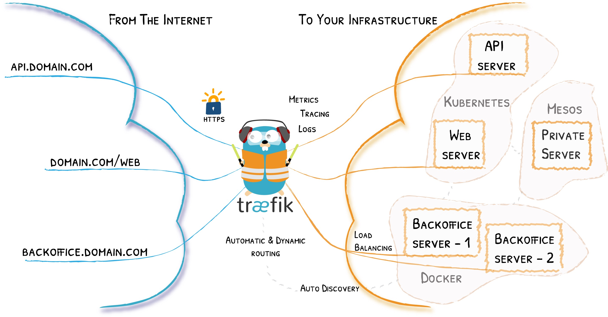
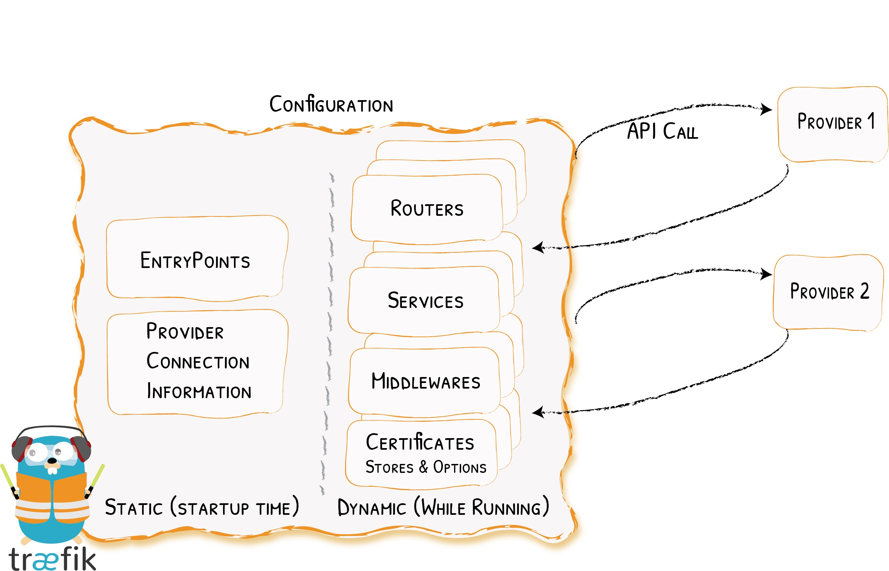

# 微服务网关

传统的网关比如Nginx, 服务的发现都需要手动配置, 并不支持自动发现, 因此我们需要选择一个微服务网关, 让我们的服务可以自动注册

常见的微服务网关有:
+ Kong(openresty), 基于Lua脚本进行扩展
+ APISix(openresty), 基于Lua脚本进行扩展
+ Traefik, Go 云原生网关

## Traefik 介绍

### 基本概念

网关对性能和可靠性要求比较高, 这里选用Traefik做完我们微服务的网关, 也方便我们二次开发

下面是Traefik的流程示意图:




traefik通过路由规则(Routes) 来配置 Endpint和service进行流量的分发


在路由里面我们通过配置路由规则进行流量转发, 比如Host规则就是匹配Host进行调度


最后把 流量路由到我们的 服务组内


下面是一个服务组的定义

```yaml
## Dynamic configuration
http:
  services:
    my-service:
      loadBalancer:
        servers:
        - url: "http://<private-ip-server-1>:<private-port-server-1>/"
        - url: "http://<private-ip-server-2>:<private-port-server-2>/"
```

### 配置介绍

Traefik里面的配置由2部分组成:
+ 静态配置: EntryPoints 和 Provider 需要在启动时配置好, [详细说明](https://doc.traefik.io/traefik/reference/static-configuration/overview/)
+ 动态配置: 路由规则和服务注册 可以动态发现, [详细说明](https://doc.traefik.io/traefik/reference/dynamic-configuration/file/)



Traefik和其他网关不同之处，在于其灵活的服务配置(服务发现)


其中最灵活的是Etcd, 我们将由程序自己实现服务的注册, 这样我们对外通过Traefik暴露我们的服务, 对内通过Etcd作为服务注册中心, 直接调用


#### 配置EntryPoint

下面是Yaml文件的配置:
```yaml
## Static configuration
entryPoints:
  web:
    address: ":80"

  websecure:
    address: ":443"

  grpc:
    address: ":18080"
```

下面是基于环境变量的配置:
```
TRAEFIK_ENTRYPOINTS_<NAME>:
Entry points definition. (Default: false)

TRAEFIK_ENTRYPOINTS_<NAME>_ADDRESS:
Entry point address.
```

#### 配置 Etcd Provider

下面是Etcd相关配置: [Traefik & Etcd](https://doc.traefik.io/traefik/providers/etcd/)

```yaml
providers:
  etcd:
    endpoints:
      - "127.0.0.1:2379"
    rootKey: "traefik"
    username: "foo"
    password: "bar"
    tls:
      ca: path/to/ca.crt
      caOptional: true
      cert: path/to/foo.cert
      key: path/to/foo.key
      insecureSkipVerify: true
```

如果要采用环境变量设置需要查阅: traefik支持的[配置变量](https://doc.traefik.io/traefik/reference/static-configuration/env/) 
该配置的参数都是 TRAEFIK_PROVIDERS_ETCD 打头的: 
```
TRAEFIK_PROVIDERS_ETCD:
Enable Etcd backend with default settings. (Default: false)

TRAEFIK_PROVIDERS_ETCD_ENDPOINTS:
KV store endpoints (Default: 127.0.0.1:2379)

TRAEFIK_PROVIDERS_ETCD_PASSWORD:
KV Password

TRAEFIK_PROVIDERS_ETCD_ROOTKEY:
Root key used for KV store (Default: traefik)

TRAEFIK_PROVIDERS_ETCD_USERNAME:
KV Username
```

#### API配置

```yaml
api:
  insecure: true
  dashboard: true
  debug: true
```

```
TRAEFIK_API:
Enable api/dashboard. (Default: false)

TRAEFIK_API_DASHBOARD:
Activate dashboard. (Default: true)

TRAEFIK_API_DEBUG:
Enable additional endpoints for debugging and profiling. (Default: false)

TRAEFIK_API_INSECURE:
Activate API directly on the entryPoint named traefik. (Default: false)
```

## 网关设计

那基于Traefik如何实现服务的自动发现喃?

traefik支持以etcd做完配置中心, 因此我们自己基于Traefik的格式 开发一套注册中心 可以对接Traefik了


## 安装Traefik

etcd的安装参考上节, 下面介绍Traefik的搭建

安装Traefik
```go
docker pull traefik
```

准备好配置文件: traefik.yaml:
```yaml
api:
  insecure: true
  dashboard: true
  debug: true

entryPoints:
  web:
    address: ":80"

  websecure:
    address: ":443"

  grpc:
    address: ":18080"

providers:
  etcd:
    endpoints:
      - "127.0.0.1:2379"
    rootKey: "traefik"
```

启动
```
# 其中 8080 是 traefik dashboard的地址
# 80 是web,  18080 是grpc, 443不测试 故不暴露
docker run -d -p 8080:8080 -p 80:80 -p 18080:18080 \
    -v $PWD/traefik.yml:/etc/traefik/traefik.yml traefik:latest
```

然后访问: http://localhost:8080/dashboard 就可以看到Traefik dashboard了


更详细的安装文档请求参考: [Install Traefik](https://doc.traefik.io/traefik/getting-started/install-traefik/)


