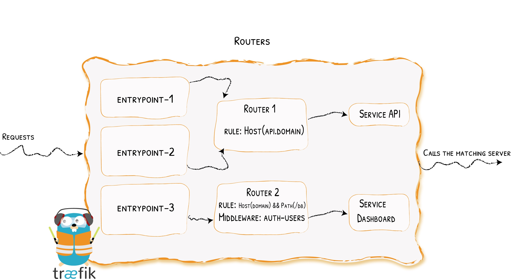
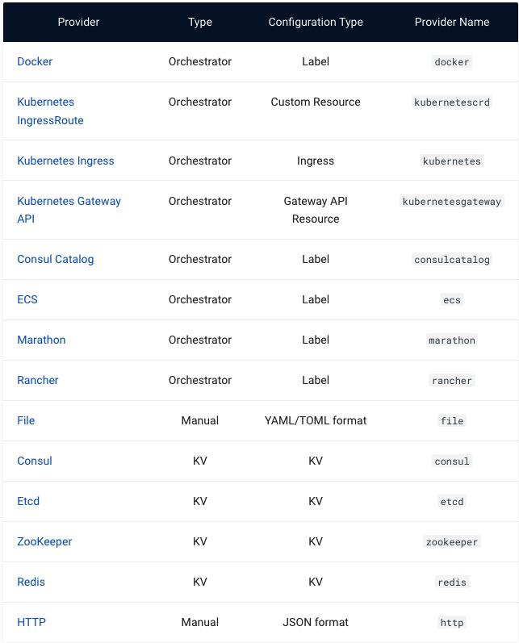

# 微服务网关

传统的网关比如Nginx, 服务的发现都需要手动配置, 并不支持自动发现, 因此我们需要选择一个微服务网关, 让我们的服务可以自动注册

常见的微服务网关有:
+ Kong(openresty), 基于Lua脚本进行扩展
+ APISix(openresty), 基于Lua脚本进行扩展
+ Traefik, Go 云原生网关


## Traefik 介绍

### 基本概念

网关对性能和可靠性要求比较高, 这里选用Traefik做完我们微服务的网关, 也方便我们二次开发

下面是Traefik的流程示意图:


traefik通过路由规则(Routes) 来配置 Endpint和service进行流量的分发


在路由里面我们通过配置路由规则进行流量转发, 比如Host规则就是匹配Host进行调度



最后把 流量路由到我们的 服务组内


下面是一个服务组的定义

```yaml
## Dynamic configuration
http:
  services:
    my-service:
      loadBalancer:
        servers:
        - url: "http://<private-ip-server-1>:<private-port-server-1>/"
        - url: "http://<private-ip-server-2>:<private-port-server-2>/"
```

### 配置介绍

Traefik里面的配置由2部分组成:
+ 静态配置: EntryPoints 和 Provider 需要在启动时配置好
+ 动态配置: 路由规则和服务注册 可以动态发现


Traefik和其他网关不同之处，在于其灵活的服务配置(服务发现)



其中最灵活的是Etcd, 我们将由程序自己实现服务的注册, 这样我们对外通过Traefik暴露我们的服务, 对内通过Etcd作为服务注册中心, 直接调用


## 网关设计

那基于Traefik如何实现服务的自动发现喃?

traefik支持以etcd做完配置中心, 因此我们自己基于Traefik的格式 开发一套注册中心 可以对接Traefik了


## 安装Traefik

etcd的安装参考上节, 下面介绍Traefik的搭建

安装Traefik
```go
docker pull traefik
```

启动Traefik是我们需要把2个静态配置配置好, traefik支持的[配置变量](https://doc.traefik.io/traefik/reference/static-configuration/env/) 

下面是 使用etcd作为配置中心的可用选项, 该配置的参数都是 TRAEFIK_PROVIDERS_ETCD 打头的: 
```
TRAEFIK_PROVIDERS_ETCD:
Enable Etcd backend with default settings. (Default: false)

TRAEFIK_PROVIDERS_ETCD_ENDPOINTS:
KV store endpoints (Default: 127.0.0.1:2379)

TRAEFIK_PROVIDERS_ETCD_PASSWORD:
KV Password

TRAEFIK_PROVIDERS_ETCD_ROOTKEY:
Root key used for KV store (Default: traefik)

TRAEFIK_PROVIDERS_ETCD_USERNAME:
KV Username
```


traefik作为一个网关自己需要监控端口:
```
TRAEFIK_ENTRYPOINTS_<NAME>:
Entry points definition. (Default: false)

TRAEFIK_ENTRYPOINTS_<NAME>_ADDRESS:
Entry point address.

TRAEFIK_ENTRYPOINTS_<NAME>_ENABLEHTTP3:
Enable HTTP3. (Default: false)

TRAEFIK_ENTRYPOINTS_<NAME>_FORWARDEDHEADERS_INSECURE:
Trust all forwarded headers. (Default: false)

TRAEFIK_ENTRYPOINTS_<NAME>_FORWARDEDHEADERS_TRUSTEDIPS:
Trust only forwarded headers from selected IPs.

TRAEFIK_ENTRYPOINTS_<NAME>_HTTP:
HTTP configuration.

TRAEFIK_ENTRYPOINTS_<NAME>_HTTP_MIDDLEWARES:
Default middlewares for the routers linked to the entry point.

TRAEFIK_ENTRYPOINTS_<NAME>_HTTP_REDIRECTIONS_ENTRYPOINT_PERMANENT:
Applies a permanent redirection. (Default: true)

TRAEFIK_ENTRYPOINTS_<NAME>_HTTP_REDIRECTIONS_ENTRYPOINT_PRIORITY:
Priority of the generated router. (Default: 2147483646)

TRAEFIK_ENTRYPOINTS_<NAME>_HTTP_REDIRECTIONS_ENTRYPOINT_SCHEME:
Scheme used for the redirection. (Default: https)

TRAEFIK_ENTRYPOINTS_<NAME>_HTTP_REDIRECTIONS_ENTRYPOINT_TO:
Targeted entry point of the redirection.

TRAEFIK_ENTRYPOINTS_<NAME>_HTTP_TLS:
Default TLS configuration for the routers linked to the entry point. (Default: false)

TRAEFIK_ENTRYPOINTS_<NAME>_HTTP_TLS_CERTRESOLVER:
Default certificate resolver for the routers linked to the entry point.

TRAEFIK_ENTRYPOINTS_<NAME>_HTTP_TLS_DOMAINS:
Default TLS domains for the routers linked to the entry point.

TRAEFIK_ENTRYPOINTS_<NAME>_HTTP_TLS_DOMAINS_n_MAIN:
Default subject name.

TRAEFIK_ENTRYPOINTS_<NAME>_HTTP_TLS_DOMAINS_n_SANS:
Subject alternative names.

TRAEFIK_ENTRYPOINTS_<NAME>_HTTP_TLS_OPTIONS:
Default TLS options for the routers linked to the entry point.

TRAEFIK_ENTRYPOINTS_<NAME>_PROXYPROTOCOL:
Proxy-Protocol configuration. (Default: false)

TRAEFIK_ENTRYPOINTS_<NAME>_PROXYPROTOCOL_INSECURE:
Trust all. (Default: false)

TRAEFIK_ENTRYPOINTS_<NAME>_PROXYPROTOCOL_TRUSTEDIPS:
Trust only selected IPs.

TRAEFIK_ENTRYPOINTS_<NAME>_TRANSPORT_LIFECYCLE_GRACETIMEOUT:
Duration to give active requests a chance to finish before Traefik stops. (Default: 10)

TRAEFIK_ENTRYPOINTS_<NAME>_TRANSPORT_LIFECYCLE_REQUESTACCEPTGRACETIMEOUT:
Duration to keep accepting requests before Traefik initiates the graceful shutdown procedure. (Default: 0)

TRAEFIK_ENTRYPOINTS_<NAME>_TRANSPORT_RESPONDINGTIMEOUTS_IDLETIMEOUT:
IdleTimeout is the maximum amount duration an idle (keep-alive) connection will remain idle before closing itself. If zero, no timeout is set. (Default: 180)

TRAEFIK_ENTRYPOINTS_<NAME>_TRANSPORT_RESPONDINGTIMEOUTS_READTIMEOUT:
ReadTimeout is the maximum duration for reading the entire request, including the body. If zero, no timeout is set. (Default: 0)

TRAEFIK_ENTRYPOINTS_<NAME>_TRANSPORT_RESPONDINGTIMEOUTS_WRITETIMEOUT:
WriteTimeout is the maximum duration before timing out writes of the response. If zero, no timeout is set. (Default: 0)

TRAEFIK_ENTRYPOINTS_<NAME>_UDP_TIMEOUT:
Timeout defines how long to wait on an idle session before releasing the related resources. (Default: 3)
```


