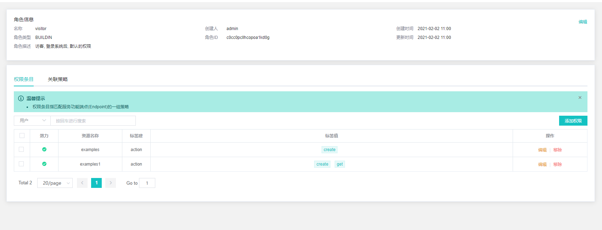
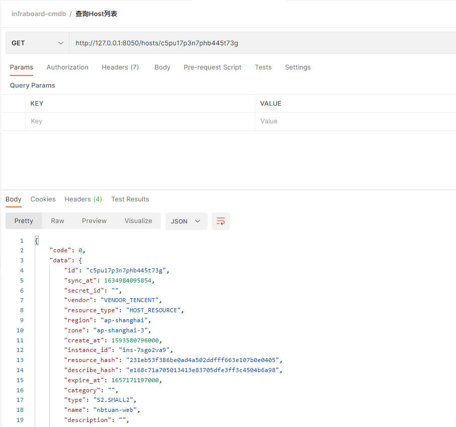

# CMDB主机页面

## 调整script

之前我们使用 npm run serve, 是因为package.json配置的脚手架如下:
```json
"scripts": {
"serve": "vue-cli-service serve",
"build": "vue-cli-service build",
"lint": "vue-cli-service lint",
"svgo": "svgo -f src/icons/svg --config=src/icons/svgo.yml"
}
```

一般我们习惯调整成为: npm run dev
```json
"scripts": {
"dev": "vue-cli-service serve",
"build": "vue-cli-service build",
"lint": "vue-cli-service lint",
"svgo": "svgo -f src/icons/svg --config=src/icons/svgo.yml"
}
```

## 主机列表

根据我们的数据结构:
```json
{
    "code":0,
    "data":{
        "items":[
            {
                "id":"c5pu17p3n7phb445t73g",
                "sync_at":1634984095854,
                "secret_id":"",
                "vendor":"VENDOR_TENCENT",
                "resource_type":"HOST_RESOURCE",
                "region":"ap-shanghai",
                "zone":"ap-shanghai-3",
                "create_at":1593580796000,
                "instance_id":"ins-7sgo2va9",
                "resource_hash":"231eb53f386be0ad4a502ddfff663e107b0e0405",
                "describe_hash":"e168c71a705013413e83705dfe3ff3c4504b6a98",
                "expire_at":1657171197000,
                "category":"",
                "type":"S2.SMALL2",
                "name":"nbtuan-web",
                "description":"",
                "status":"RUNNING",
                "tags":null,
                "update_at":0,
                "sync_accout":"",
                "public_ip":[
                    "49.234.114.127"
                ],
                "private_ip":[
                    "172.17.0.7"
                ],
                "pay_type":"PREPAID",
                "resource_id":"c5pu17p3n7phb445t73g",
                "cpu":1,
                "memory":2,
                "gpu_amount":0,
                "gpu_spec":"",
                "os_type":"",
                "os_name":"CentOS 7.6 64bit",
                "serial_number":"f191197c-c009-4a08-9a52-e6f08bacebbf",
                "image_id":"img-9qabwvbn",
                "internet_max_bandwidth_out":1,
                "internet_max_bandwidth_in":0,
                "security_groups":[
                    "sg-05url5pe"
                ]
            }
        ],
        "total":1
    }
}
```

在列表页做对应的展示:

```html
<el-table :data="hosts" style="width: 100%">
    <el-table-column prop="name" label="名称">
        <template slot-scope="{ row }">
        {{ row.resource_id }} <br />
        {{ row.name }}
        </template>
    </el-table-column>
    <el-table-column prop="name" label="资产来源">
        <template slot-scope="{ row }">
        {{ row.vendor }} <br />
        {{ row.region }}
        </template>
    </el-table-column>
    <el-table-column prop="name" label="内网IP/外网IP">
        <template slot-scope="{ row }">
        {{ row.private_ip }} <br />
        {{ row.public_ip }}
        </template>
    </el-table-column>
    <el-table-column prop="name" label="系统类型">
        <template slot-scope="{ row }">
        {{ row.os_name }}
        </template>
    </el-table-column>
    <el-table-column prop="sync_at" label="创建时间">
        <template slot-scope="scope">
        {{ scope.row.create_at | parseTime }}
        </template>
    </el-table-column>
    <el-table-column prop="expire_at" label="过期时间">
        <template slot-scope="scope">
        {{ scope.row.expire_at | parseTime }}
        </template>
    </el-table-column>
    <el-table-column prop="name" label="规格">
        <template slot-scope="{ row }">
        {{ row.cpu }} / {{ row.memory }}
        </template>
    </el-table-column>
    <el-table-column prop="name" label="状态">
        <template slot-scope="{ row }">
        {{ row.status }}
        </template>
    </el-table-column>
    <el-table-column prop="操作" align="center" label="状态">
        <template slot-scope="{ row }">
        <el-button type="text" disabled>归档</el-button>
        <el-button type="text" disabled>监控</el-button>
        </template>
    </el-table-column>
</el-table>
```

## 主机搜索框

我们使用一个关键字输入框进行搜索支持:
+ instance_id
+ name
+ public_ip
+ pravite_ip

调整后端API, 关键字支持这些字段
```go
if req.Keywords != "" {
    query.Where("r.name LIKE ? OR r.id = ? OR r.instance_id = ? OR r.private_ip LIKE ? OR r.public_ip LIKE ?",
        "%"+req.Keywords+"%",
        req.Keywords,
        req.Keywords,
        req.Keywords+"%",
        req.Keywords+"%",
    )
}
```

使用Postman测试关键字搜索是否正常

添加前端搜索框，对接关键字搜索
```html
<div class="search">
    <el-input
        v-model="query.keywords"
        placeholder="请输入实例ID|名称|IP 敲回车进行搜索"
        @keyup.enter.native="get_hosts"
    ></el-input>
</div>
```

测试关键字搜索是否都能正常

## 添加Loading

加载数据的时候, 可能由于网络原因, 加载缓慢, 为了对用户友好显示, 会提示用户加载中, 让用户等待

这里采用Element的Loading方案: [Loading 加载](https://element.eleme.cn/#/zh-CN/component/loading)

```html
<el-table :data="hosts" v-loading="fetchHostLoading" style="width: 100%">
...
<script>
  data() {
    return {
      fetchHostLoading: false,
      ...
    };
  },
</script>
```

改造get_hosts函数:
+ 请求之前先 修改Table状态为Loading
+ 请求结束, 无论成功或者失败 关闭Loading状态
+ 如果请求中出现异常, 友好的提示用户 [Notification 通知](https://element.eleme.cn/#/zh-CN/component/notification)

```js
async get_hosts() {
    this.fetchHostLoading = true;
    try {
    const resp = await LIST_HOST(this.query);
    this.hosts = resp.data.items;
    this.total = resp.data.total;
    } catch (error) {
    this.$notify.error({
        title: "获取主机异常",
        message: error,
    });
    } finally {
    this.fetchHostLoading = false;
    }
},
```

为了能调试出Loading效果，我们修改下后端API, 在返回数据前Sleep 4秒
```go
func (h *handler) QueryHost(w http.ResponseWriter, r *http.Request, _ httprouter.Params) {
	time.Sleep(4 * time.Second)
    ...
}
```

最后调整下API, 测试当API请求异常时，是否能正常提示

## CMDB详情页面

首先我们添加一个空的详情页面, 页面访问路径: hosts/detail?id=xxxx

添加 host/detail.vue
```html
<template>
  <div>详情页</div>
</template>
<script>
export default {
  name: "HostDetail",
};
</script>
```

添加路由, 
```js
  {
    path: "/cmdb",
    component: Layout,
    redirect: "/cmdb/search",
    children: [
      {
        path: "search",
        component: () => import("@/views/cmdb/search/index"),
        name: "ResourceSearch",
      },
      {
        path: "host",
        component: () => import("@/views/cmdb/host/index"),
        name: "ResourceHost",
      },
      {
        path: "host/detail",
        component: () => import("@/views/cmdb/host/detail"),
        name: "ResourceHost",
      },
    ],
  },
```

通过URL访问页面，查看页面是否正常: http://localhost:9527/cmdb/host/detail

### 修复导航

注意: 为了让路由更有规则, 修改之前的host列表页路由为: host/list

```js
  {
    path: "/cmdb",
    component: Layout,
    redirect: "/cmdb/search",
    children: [
      {
        path: "search",
        component: () => import("@/views/cmdb/search/index"),
        name: "ResourceSearch",
      },
      {
        path: "host/list",
        component: () => import("@/views/cmdb/host/index"),
        name: "ResourceHost",
      },
      {
        path: "host/detail",
        component: () => import("@/views/cmdb/host/detail"),
        name: "ResourceHost",
      },
    ],
  },
```

调整sidebar的host列表页path
```html
<!-- 导航条目 -->
<el-menu-item index="/cmdb/search">资源检索</el-menu-item>
<el-menu-item index="/cmdb/host/list">主机</el-menu-item>
```

每次刷新，为了让基础资源展开，我们添加 default-openeds 属性进行控制
```html
<el-menu
    default-active="/host"
    :default-openeds="['/host']"
    class="sidebar-el-menu"
    :collapse="isCollapse"
    router
>
```

### 添加跳转

这里使用vue router的 route-link 进行跳转: [Vue Router](https://router.vuejs.org/zh/guide/#javascript)

route-link的to参数 就是: router.push()的参数, 可以灵活使用
```html
<!-- 字符串 -->
<router-link to="home">Home</router-link>
<!-- 渲染结果 -->
<a href="home">Home</a>

<!-- 使用 v-bind 的 JS 表达式 -->
<router-link v-bind:to="'home'">Home</router-link>

<!-- 不写 v-bind 也可以，就像绑定别的属性一样 -->
<router-link :to="'home'">Home</router-link>

<!-- 同上 -->
<router-link :to="{ path: 'home' }">Home</router-link>

<!-- 命名的路由 -->
<router-link :to="{ name: 'user', params: { userId: 123 }}">User</router-link>

<!-- 带查询参数，下面的结果为 /register?plan=private -->
<router-link :to="{ path: 'register', query: { plan: 'private' }}">Register</router-link>
```

这里采用最后一种带查询参数的to, 使用instance_id作为跳转
```html
<el-table-column prop="name" label="名称">
    <template slot-scope="{ row }">
    <router-link
        :to="{ path: '/cmdb/host/detail', query: { id: row.id } }"
    >
        {{ row.resource_id }}
    </router-link>
    <br />
    {{ row.name }}
    </template>
</el-table-column>
```

去掉A标签的下划线:
```css
a {
    text-decoration: none;
}
```

### 详情页布局

详情页布局大概如下:



+ 上面是个基础信息的box
+ 下面是关系系统的Tab标签页

```html
<template>
  <div>
    <!-- 基础信息 -->
    <div class="box-shadow basic-info">详情页</div>
    <!-- 关联信息 -->
  </div>
</template>
```

具体的信息的展示我们采用：[Descriptions 描述列表](https://element.eleme.cn/#/zh-CN/component/descriptions)

我们复制一个样例过来修改:
```html
<!-- 基础信息 -->
<div class="box-shadow basic-info">
    <el-descriptions title="用户信息">
    <el-descriptions-item label="用户名">kooriookami</el-descriptions-item>
    <el-descriptions-item label="手机号">18100000000</el-descriptions-item>
    <el-descriptions-item label="居住地">苏州市</el-descriptions-item>
    <el-descriptions-item label="备注">
        <el-tag size="small">学校</el-tag>
    </el-descriptions-item>
    <el-descriptions-item label="联系地址"
        >江苏省苏州市吴中区吴中大道 1188 号</el-descriptions-item
    >
    </el-descriptions>
</div>
```

我们调整下基础信息的样式:
```css
<style scoped>
.basic-info {
  padding: 8px;
  background-color: white;
}
</style>
```
调整下title的字体: 
```css
.el-descriptions__title {
    font-size: 14px;
}
```

### 详情页数据

我们通过API 获取详情页的数据

之前API publicIPList, privateIPList keyPairNameList, securityGroupsList 的这些字段调整为了[]string, 需要修复下:

修复详细API查询问题:
```go
func (s *service) DescribeHost(ctx context.Context, req *host.DescribeHostRequest) (
	*host.Host, error) {
	query := sqlbuilder.NewQuery(queryHostSQL)
	querySQL, args := query.Where("id = ?", req.Id).BuildQuery()
	s.log.Debugf("sql: %s", querySQL)

	queryStmt, err := s.db.Prepare(querySQL)
	if err != nil {
		return nil, exception.NewInternalServerError("prepare query host error, %s", err.Error())
	}
	defer queryStmt.Close()

	ins := host.NewDefaultHost()
	var (
		publicIPList, privateIPList, keyPairNameList, securityGroupsList string
	)
	err = queryStmt.QueryRow(args...).Scan(
		&ins.Id, &ins.Vendor, &ins.Region, &ins.Zone, &ins.CreateAt, &ins.ExpireAt,
		&ins.Category, &ins.Type, &ins.InstanceId, &ins.Name, &ins.Description,
		&ins.Status, &ins.UpdateAt, &ins.SyncAt, &ins.SyncAccount,
		&publicIPList, &privateIPList, &ins.PayType, &ins.DescribeHash, &ins.ResourceHash, &ins.ResourceId,
		&ins.CPU, &ins.Memory, &ins.GPUAmount, &ins.GPUSpec, &ins.OSType, &ins.OSName,
		&ins.SerialNumber, &ins.ImageID, &ins.InternetMaxBandwidthOut, &ins.InternetMaxBandwidthIn,
		&keyPairNameList, &securityGroupsList,
	)

	if err != nil {
		if err == sql.ErrNoRows {
			return nil, exception.NewNotFound("%#v not found", req)
		}
		return nil, exception.NewInternalServerError("describe host error, %s", err.Error())
	}

	ins.LoadPrivateIPString(privateIPList)
	ins.LoadPublicIPString(publicIPList)
	ins.LoadKeyPairNameString(keyPairNameList)
	ins.LoadSecurityGroupsString(securityGroupsList)

	return ins, nil
}
```

最终测试API接口:



前端封装API请求: host模块添加GET_HOST
```js
export function GET_HOST(id, params) {
  return request({
    url: `/hosts/${id}`,
    method: "get",
    params: params,
  });
}
```

### 展示数据

引入API, 我们通过当前route参数, 获取到URL当前参数, 先看看route对象
```html
<script>
import { GET_HOST } from '@/api/cmdb/host'

export default {
  name: "HostDetail",
  mounted() {
      console.log(this.$route)
      GET_HOST()
  }
};
</script>
```

完善API请求, 把请求回来的数据绑定到host对象上, 并处理异常
```js
async mounted() {
    try {
        let resp = await GET_HOST(this.$route.query.id);
        this.host = resp.data;
    } catch (error) {
        this.$notify.error({
        title: "获取主机异常",
        message: error,
        });
    }
},
```

展示数据:
```html
<!-- 基础信息 -->
<div class="box-shadow basic-info">
    <el-descriptions title="主机信息">
    <el-descriptions-item label="名称">
        {{ host.name }}
    </el-descriptions-item>
    <el-descriptions-item label="实例ID">
        {{ host.instance_id }}
    </el-descriptions-item>
    <el-descriptions-item label="状态">
        {{ host.status }}
    </el-descriptions-item>
    <el-descriptions-item label="规格">
        {{ host.cpu }} / {{ host.memory }}
    </el-descriptions-item>
    <el-descriptions-item label="厂商">
        {{ host.vendor }}
    </el-descriptions-item>
    <el-descriptions-item label="系统">
        {{ host.os_name }}
    </el-descriptions-item>
    <el-descriptions-item label="地域">
        {{ host.region }}
    </el-descriptions-item>
    <el-descriptions-item label="创建时间">
        {{ host.create_at | parseTime }}
    </el-descriptions-item>
    <el-descriptions-item label="序列号">
        {{ host.serial_number }}
    </el-descriptions-item>
    <el-descriptions-item label="过期时间">
        {{ host.expire_at | parseTime }}
    </el-descriptions-item>
    <el-descriptions-item label="同步时间">
        {{ host.sync_at | parseTime }}
    </el-descriptions-item>
    <el-descriptions-item label="同步账号">
        {{ host.sync_account }}
    </el-descriptions-item>
    <el-descriptions-item label="内网IP">
        {{ host.private_ip.join(",") }}
    </el-descriptions-item>
    <el-descriptions-item label="公网IP">
        {{ host.public_ip.join(",") }}
    </el-descriptions-item>
    </el-descriptions>
</div>
```

### 关联信息

采用: [Tabs 标签页](https://element.eleme.cn/#/zh-CN/component/tabs) 来展示关联信息

```html
<!-- 关联信息 -->
<el-card class="box-shadow associate-info">
    <el-tabs v-model="activeName">
    <el-tab-pane label="主机事件" name="event"> 主机事件 </el-tab-pane>
    </el-tabs>
</el-card>
```

补充默认显示的标签页
```js
data() {
    return {
        host: {},
        activeName: "event",
    };
},
```

具体事件后面补充


## CMDB搜索页面
