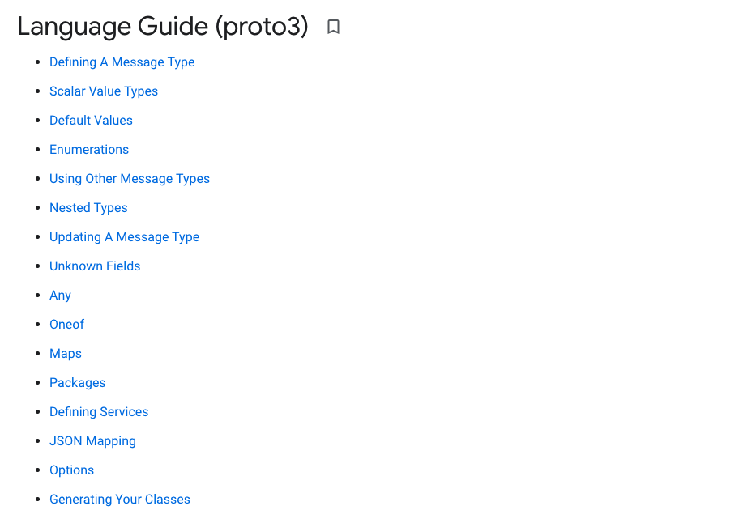
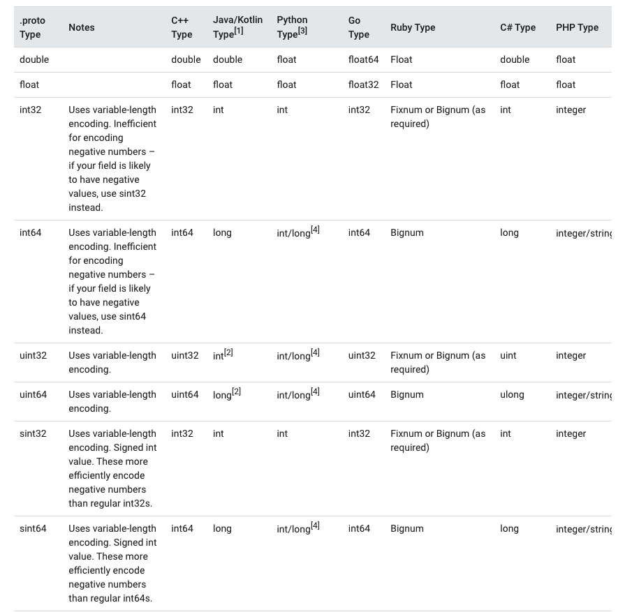
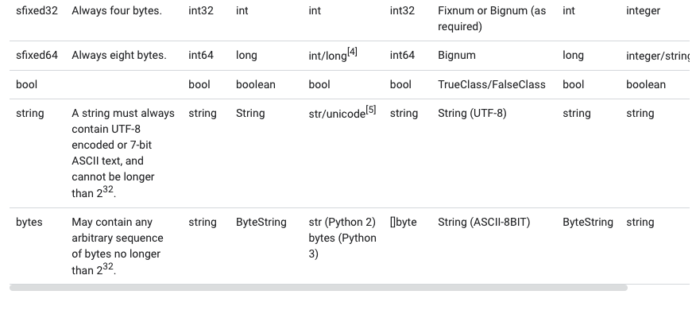

# proto3语法入门



[Language Guide (proto3) ](https://developers.google.com/protocol-buffers/docs/proto3)


## 定义消息类型

```protobuf
syntax = "proto3";

/* SearchRequest represents a search query, with pagination options to
 * indicate which results to include in the response. */

message SearchRequest {
  string query = 1;
  int32 page_number = 2; // Which page number do we want?
  int32 result_per_page = 3;
}
```

第一行是protobuf的版本, 我们主要讲下 message 的定义语法:
```
<comment>

message  <message_name> {
  <filed_rule>  <filed_type> <filed_name> = <field_number> 
        类型         名称             编号  
}
```

+ comment: 注射 /* */或者 //
+ message_name: 同一个pkg内，必须唯一
+ filed_rule: 可以没有, 常用的有repeated, oneof
+ filed_type: 数据类型, protobuf定义的数据类型, 生产代码的会映射成对应语言的数据类型
+ filed_name: 字段名称, 同一个message 内必须唯一
+ field_number: 字段的编号, 序列化成二进制数据时的字段编号, 同一个message 内必须唯一, 1 ~ 15 使用1个Byte表示, 16 ～ 2047 使用2个Byte表示


如果你想保留一个编号，以备后来使用可以使用 reserved 关键字声明

```protobuf
message Foo {
  reserved 2, 15, 9 to 11;
  reserved "foo", "bar";
}
```


## Value(Filed) Types

```protobuf
message String {
    string value = 1;
}
```

protobuf 定义了很多Value Types, 他和其他语言的映射关系如下:




上面就是所有的protobuf基础类型, 光有这些基础类型是不够的, 下面是protobuf为我们提供的一些复合类型

## 枚举类型

使用enum来声明枚举类型: 
```protobuf
enum Corpus {
    UNIVERSAL = 0;
    WEB = 1;
    IMAGES = 2;
    LOCAL = 3;
    NEWS = 4;
    PRODUCTS = 5;
    VIDEO = 6;
}
```

枚举声明语法:
```
enum <enum_name> {
    <element_name> = <element_number>
}
```

+ enum_name: 枚举名称
+ element_name: pkg内全局唯一,  很重要
+ element_name: 必须从0开始, 0表示类型的默认值, 32-bit integer

### 别名

如果你的确有2个同名的枚举需求: 比如 TaskStatus 和 PipelineStatus 都需要Running，就可以添加一个: option allow_alias = true;
```protobuf
message MyMessage1 {
  enum EnumAllowingAlias {
    option allow_alias = true;
    UNKNOWN = 0;
    STARTED = 1;
    RUNNING = 1;
  }
}
message MyMessage2 {
  enum EnumNotAllowingAlias {
    UNKNOWN = 0;
    STARTED = 1;
    // RUNNING = 1;  // Uncommenting this line will cause a compile error inside Google and a warning message outside.
  }
}
```


### 预留值

同理枚举也支持预留值
```protobuf
enum Foo {
  reserved 2, 15, 9 to 11, 40 to max;
  reserved "FOO", "BAR";
}
```


## 数组类型

如果我们想声明: []string, []Item 这在数组类型怎么办? filed_rule: repeated 可以胜任


```protobuf
message SearchResponse {
  repeated Result results = 1;
}

// 会编译为:
// type SearchResponse SearchResponse {
//    results []*Result
// }
```


## Map

如果我们想声明一个map, 可以如下进行:

```protobuf
map<string, Project> projects = 3;
// projects map[string, Project]
```

protobuf 声明map的语法:
```
map<key_type, value_type> map_field = N;
```


## Oneof

很像范型 比如 test_oneof 字段的类型 必须是 string name 和 SubMessage sub_message 其中之一:

```protobuf
message Sub1 {
    string name = 1;
}

message Sub2 {
    string name = 1;
}

message SampleMessage {
    oneof test_oneof {
        Sub1 sub1 = 1;
        Sub2 sub2 = 2;
    }
}
```

```sh
protoc -I=. --go_out=./pb --go_opt=module="gitee.com/infraboard/go-course/day21/pb" pb/oneof.proto
```

编译过后结构体
```go
type SampleMessage struct {
	state         protoimpl.MessageState
	sizeCache     protoimpl.SizeCache
	unknownFields protoimpl.UnknownFields

	// Types that are assignable to TestOneof:
	//	*SampleMessage_Sub1
	//	*SampleMessage_Sub2
	TestOneof isSampleMessage_TestOneof `protobuf_oneof:"test_oneof"`
}

```

那我们如何使用喃:

```go
of := &pb.SampleMessage{}
of.GetSub1()
of.GetSub2()
```

## Any

当我们无法明确定义数据类型的时候， 可以使用Any表示, 

```protobuf
// 这里是应用其他的proto文件, 后面会讲 ipmort用法
import "google/protobuf/any.proto";

message ErrorStatus {
  string message = 1;
  repeated google.protobuf.Any details = 2;
}
```


## 类型嵌套


```protobuf
message SearchResponse {
  message Result {
    string url = 1;
    string title = 2;
    repeated string snippets = 3;
  }
  repeated Result results = 1;
}
```


## 引用包


## 更新规范

+ Don't change the field numbers for any existing fields.

更多请参考 [Updating A Message Type](https://developers.google.com/protocol-buffers/docs/proto3#updating)


## 参考

+ [Language Guide (proto3) ](https://developers.google.com/protocol-buffers/docs/proto3)