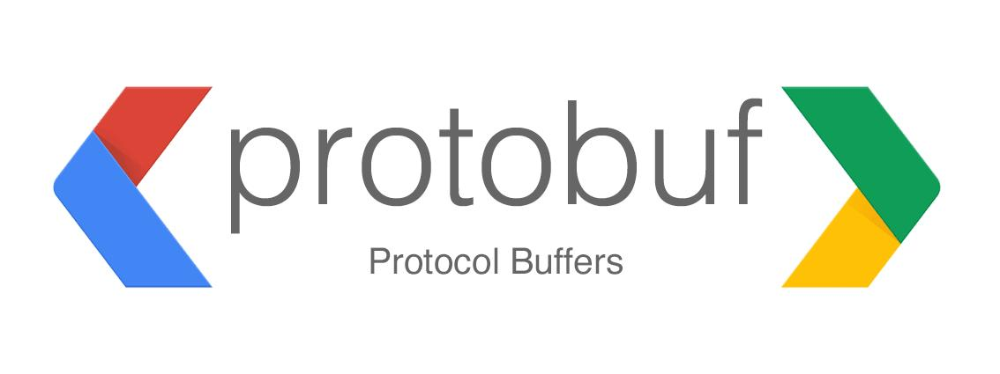

# Protobuf编解码



Protobuf是Protocol Buffers的简称，它是Google公司开发的一种数据描述语言，并于2008年对外开源。Protobuf刚开源时的定位类似于XML、JSON等数据描述语言，通过附带工具生成代码并实现将结构化数据序列化的功能。但是我们更关注的是Protobuf作为接口规范的描述语言，可以作为设计安全的跨语言PRC接口的基础工具

## 为什么选择Protobuf

一般而言我们需要一种编解码工具会参考:
+ 编解码效率
+ 高压缩比
+ 多语言支持

其中压缩与效率 最被关注的点:


## 使用流程

首先需要定义我们的数据，通过编译器，来生成不同语言的代码


之前我们的RPC要么使用的Gob, 要么使用的json, 接下来我们将使用probuf

首先创建hello.proto文件，其中包装HelloService服务中用到的字符串类型
```protobuf
syntax = "proto3";

package main;

message String {
    string value = 1;
}
```

## 安装编译器

我们需要到这里下载编译器: [Github Protobuf](https://github.com/protocolbuffers/protobuf/releases)

选择对应平台的二进制包下载:


这个压缩包里面有:
+ include, 头文件或者库文件
+ bin, protoc编译器
+ readme.txt, 一定要看，按照这个来进行安装


## 参考

+ [Protocol Buffers Google官网](https://developers.google.com/protocol-buffers)