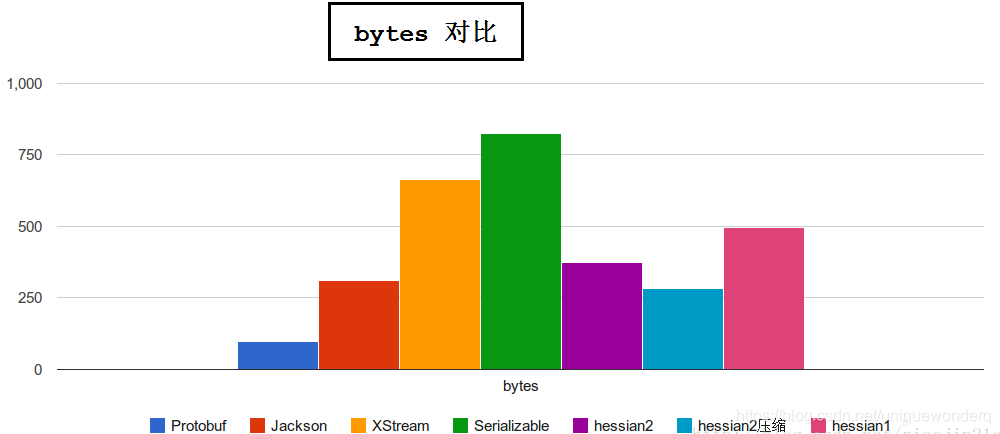
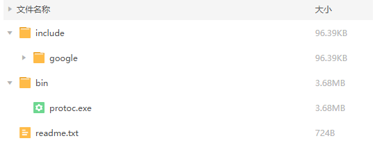

# Protobuf编解码


Protobuf是Protocol Buffers的简称，它是Google公司开发的一种数据描述语言，并于2008年对外开源。Protobuf刚开源时的定位类似于XML、JSON等数据描述语言，通过附带工具生成代码并实现将结构化数据序列化的功能。但是我们更关注的是Protobuf作为接口规范的描述语言，可以作为设计安全的跨语言PRC接口的基础工具

## 为什么选择Protobuf

一般而言我们需要一种编解码工具会参考:
+ 编解码效率
+ 高压缩比
+ 多语言支持

其中压缩与效率 最被关注的点:


## 使用流程

首先需要定义我们的数据，通过编译器，来生成不同语言的代码


之前我们的RPC要么使用的Gob, 要么使用的json, 接下来我们将使用probuf

首先创建hello.proto文件，其中包装HelloService服务中用到的字符串类型
```protobuf
syntax = "proto3";

package hello;
option go_package="gitee.com/infraboard/go-course/day21/pb";

message String {
    string value = 1;
}
```

+ syntax: 表示采用proto3的语法。第三版的Protobuf对语言进行了提炼简化，所有成员均采用类似Go语言中的零值初始化（不再支持自定义默认值），因此消息成员也不再需要支持required特性。
+ package：指明当前是main包（这样可以和Go的包名保持一致，简化例子代码），当然用户也可以针对不同的语言定制对应的包路径和名称。
+ option：protobuf的一些选项参数, 这里指定的是要生成的Go语言package路径, 其他语言参数各不相同
+ message: 关键字定义一个新的String类型，在最终生成的Go语言代码中对应一个String结构体。String类型中只有一个字符串类型的value成员，该成员编码时用1编号代替名字

关于数据编码:
```
在XML或JSON等数据描述语言中，一般通过成员的名字来绑定对应的数据。但是Protobuf编码却是通过成员的唯一编号来绑定对应的数据，因此Protobuf编码后数据的体积会比较小，但是也非常不便于人类查阅。我们目前并不关注Protobuf的编码技术，最终生成的Go结构体可以自由采用JSON或gob等编码格式，因此大家可以暂时忽略Protobuf的成员编码部分
```

但是我们如何把这个定义文件(IDL: 接口描述语言), 编译成不同语言的数据结构喃? 着就需要我们安装protobuf的编译器

## 安装编译器

protobuf的编译器叫: protoc(protobuf compiler), 我们需要到这里下载编译器: [Github Protobuf](https://github.com/protocolbuffers/protobuf/releases)

选择对应平台的二进制包下载:


这个压缩包里面有:
+ include, 头文件或者库文件
+ bin, protoc编译器
+ readme.txt, 一定要看，按照这个来进行安装



### 安装编译器二进制

linux/unix系统直接:
```sh
mv bin/protoc usr/bin
```

windows系统:
```
注意: Windows 上的 git-bash 上默认的 /usr/bin 目录在：C:\Program Files\Git\usr\bin\

因此我们首先将bin下的 protoc 编译器 挪到C:\Program Files\Git\usr\bin\
```

### 安装编译器库

include 下的库文件需要安装到: /usr/local/include/

linux/unix系统直接:
```
mv include/google /usr/local/include
```

windows系统:
```
C:\Program Files\Git\usr\local\include
```

### 验证安装

```
$ protoc --version
libprotoc 3.19.1
```

## 安装Go语言插件

Protobuf核心的工具集是C++语言开发的，在官方的protoc编译器中并不支持Go语言。要想基于上面的hello.proto文件生成相应的Go代码，需要安装相应的插件

```
go install google.golang.org/protobuf/cmd/protoc-gen-go@latest
```

接下来 我们就可以使用protoc 来生成我们对于的Go语言的数据结构

## Hello Protobuf

在day21/pb下创建hello.pb
```protobuf
syntax = "proto3";

package hello;
option go_package="gitee.com/infraboard/go-course/day21/pb";

message String {
    string value = 1;
}
```

编译proto文件
```sh
$ cd day21 ## 以day21作为编译的工作目录
$ protoc -I=. --go_out=./pb --go_opt=module="gitee.com/infraboard/go-course/day21/pb" pb/hello.proto
```

+ -I：-IPATH, --proto_path=PATH, 指定proto文件搜索的路径, 如果有多个路径 可以多次使用-I 来指定, 如果不指定默认为当前目录
+ --go_out: --go指插件的名称, 我们安装的插件为: protoc-gen-go, 而protoc-gen是插件命名规范, go是插件名称, 因此这里是--go, 而--go_out 表示的是 go插件的 out参数, 这里指编译产物的存放目录
+ --go_opt: protoc-gen-go插件opt参数, 这里的module指定了go module, 生成的go pkg 会去除掉module路径，生成对应pkg
+ pb/hello.proto: 我们proto文件路径

这样我们就在当前目录下生成了Go语言对应的pkg, 我们的message String 被生成为了一个Go Struct, 至于Proto3的语法和与Go语言数据结构的对应关系后面将讲到

```go
// Code generated by protoc-gen-go. DO NOT EDIT.
// versions:
// 	protoc-gen-go v1.27.1
// 	protoc        v3.19.1
// source: pb/hello.proto

package pb

import (
	protoreflect "google.golang.org/protobuf/reflect/protoreflect"
	protoimpl "google.golang.org/protobuf/runtime/protoimpl"
	reflect "reflect"
	sync "sync"
)

const (
	// Verify that this generated code is sufficiently up-to-date.
	_ = protoimpl.EnforceVersion(20 - protoimpl.MinVersion)
	// Verify that runtime/protoimpl is sufficiently up-to-date.
	_ = protoimpl.EnforceVersion(protoimpl.MaxVersion - 20)
)

type String struct {
	state         protoimpl.MessageState
	sizeCache     protoimpl.SizeCache
	unknownFields protoimpl.UnknownFields

	Value string `protobuf:"bytes,1,opt,name=value,proto3" json:"value,omitempty"`
}
...
```

然后我们就可以以Go语言的方式使用这个pkg

### 序列化与反序列化

基于上面生成的Go 数据结构, 我们就可以来进行 数据的交互了(序列化与反序列化)

我们使用google.golang.org/protobuf/proto工具提供的API来进行序列化与反序列化:
+ Marshal: 序列化
+ Unmarshal: 反序列化

下来来模拟一个 客户端 ---> 服务端 基于protobuf的数据交互过程
```go
package main

import (
	"fmt"
	"log"

	"google.golang.org/protobuf/proto"

	"gitee.com/infraboard/go-course/day21/pb"
)

func main() {
	clientObj := &pb.String{Value: "hello proto3"}

	// 序列化
	out, err := proto.Marshal(clientObj)
	if err != nil {
		log.Fatalln("Failed to encode obj:", err)
	}

	// 二进制编码
	fmt.Println("encode bytes: ", out)

	// 反序列化
	serverObj := &pb.String{}
	err = proto.Unmarshal(out, serverObj)
	if err != nil {
		log.Fatalln("Failed to decode obj:", err)
	}
	fmt.Println("decode obj: ", serverObj)
}

// encode bytes:  [10 12 104 101 108 108 111 32 112 114 111 116 111 51]
// decode obj:  value:"hello proto3"
```

### 基于protobuf的RPC

接下来我们改造之前的rpc: Protobuf ON TCP

我们新建一个目录: pbrpc

定义protobuf


## Proto3语法


## 数据映射关系
 


## 参考

+ [Protocol Buffers Google官网](https://developers.google.com/protocol-buffers)
+ [Protocol Buffer Basics: Go](https://developers.google.com/protocol-buffers/docs/gotutorial)
+ [Language Guide (proto3) ](https://developers.google.com/protocol-buffers/docs/proto3)