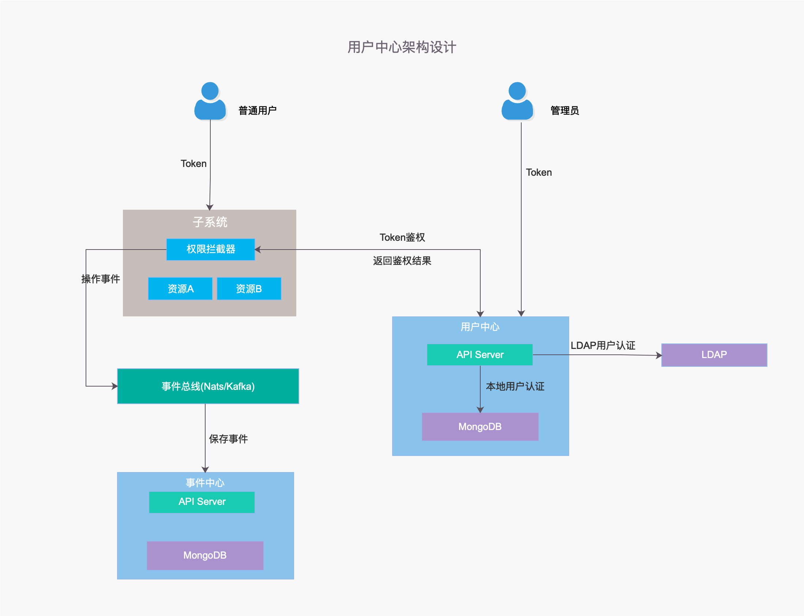

# 认证与授权



## 身份认证

如何知道谁在访问我们系统, 我们需要用户提供一个访问凭证，用来标识用户身份，最简单的方案是Basic Auth, 每次访问都需要带上这个信息，服务端通过他来验证用户的合法性

为什么每次都需要带上喃? 因为HTTP是短链接请求, 本身是无状态的

这种每次访问都携带 用户名和密码的方式，可能会导致 用户的账户泄露, 所以在API 认证方案中，并不太推荐。

最常见的方式是 访问令牌(token):
+ 用户通过用户名和密码 换取一个访问凭证(Token)
+ 使用该token 访问后端的API, 后端向权限中心验证该凭证的一个合法性


### 用户名密码认证

因此我们需要存储用户信息, keyauth选择将用户信息保存在mongodb里面, 下面是mongodb里面的user的collecton
```json
{
    "_id": "admin",
    "department_id": ".23",
    "create_type": NumberInt("0"),
    "create_at": NumberLong("1612234852667"),
    "update_at": NumberLong("1616497711254"),
    "domain": "admin-domain",
    "type": NumberInt("2"),
    "profile": {
        "real_name": "",
        "nick_name": "",
        "phone": "",
        "email": "18108053819@163.com",
        "address": "",
        "gender": NumberInt("0"),
        "avatar": "",
        "language": "",
        "city": "",
        "province": ""
    },
    "expires_days": NumberInt("0"),
    "is_initialized": true,
    "password": {
        "password": "$2a$10$pUFDPYRlxkK5iElDMooQzePVKbEsi7qrzKMZRrZ32oub.l21AIgC.",
        "create_at": NumberLong("1612234852667"),
        "update_at": NumberLong("1635559896263"),
        "need_reset": false,
        "reset_reason": "",
        "history": [
            "$2a$10$q5rtJFV0mPC9OhN18/c7buSv3c3l6jMHfuhT9hq1p829jLrdp.9FO",
            "$2a$10$2Kf1d/bsmgggf7W77qAkROGo7siq2Yw6ONHK9TDPKxFPxFBSDVxFG"
        ]
    },
    "status": {
        "locked": false,
        "locked_time": NumberLong("0"),
        "locked_reson": "",
        "unlock_time": NumberLong("0")
    },
    "description": ""
}
```


### LDAP认证


### Oauth2.0认证方案


### 单点登录


### 异地登录验证


### 前端对接


## 权限判断


### RBAC


### Namespace


### Filter


### 权限对接