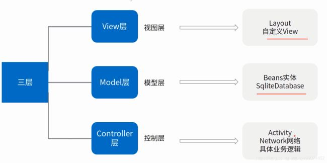
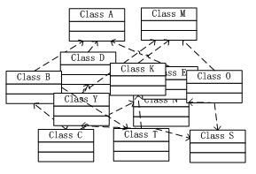

# 框架介绍

经过了cmdb的一系列进步，我们的框架也基本形成, 这里再次介绍下 整个框架的思路, 用户中心keyauth也是基于此架构的


## 架构思想

常见的代码组织方式有类:


### 功能式架构

按照功能分层, MVC就是其中典型, cmdb项目就是采用这种功能架构
+ Dao层: 数据对象转换, 与数据库交互
+ Model层: 模型定义, 主要是结构体定义
+ Controller层: 业务控制层, 一些数据处理的Handler都在该层
+ View: 视图层，前后端分离后, 这层一般有前端MVVM替换




### 分区式架构


按照业务领域进行分区, 需要划分出业务模块的边界, 本项目就是采用这种架构
+ 业务定义层: 定义该业务需要的数据结构和方法
+ 业务实现层: 更加接口定义, 实现具体的业务功能


## App开发

比如我们按照分区架构来开发一个App, 注意 这里说的App就是 app目录下一个具体的包

### 接口定义


下面是Token业务领域提供的接口定义:

```protobuf
syntax = "proto3";

package infraboard.keyauth.token;
option go_package = "github.com/infraboard/keyauth/app/token";

import "app/token/pb/request.proto";
import "app/token/pb/token.proto";

service TokenService {
    rpc IssueToken(IssueTokenRequest) returns (Token) {};
    rpc ValidateToken (ValidateTokenRequest) returns (Token) {};
	rpc DescribeToken(DescribeTokenRequest) returns (Token) {};
    rpc RevolkToken(RevolkTokenRequest) returns (Token) {};
    rpc BlockToken(BlockTokenRequest) returns (Token) {};
    rpc ChangeNamespace(ChangeNamespaceRequest) returns (Token) {};
	rpc QueryToken(QueryTokenRequest) returns (Set) {};
	rpc DeleteToken(DeleteTokenRequest) returns (DeleteTokenResponse) {};
}
```

生成的接口
```go
// TokenServiceServer is the server API for TokenService service.
// All implementations must embed UnimplementedTokenServiceServer
// for forward compatibility
type TokenServiceServer interface {
	IssueToken(context.Context, *IssueTokenRequest) (*Token, error)
	ValidateToken(context.Context, *ValidateTokenRequest) (*Token, error)
	DescribeToken(context.Context, *DescribeTokenRequest) (*Token, error)
	RevolkToken(context.Context, *RevolkTokenRequest) (*Token, error)
	BlockToken(context.Context, *BlockTokenRequest) (*Token, error)
	ChangeNamespace(context.Context, *ChangeNamespaceRequest) (*Token, error)
	QueryToken(context.Context, *QueryTokenRequest) (*Set, error)
	DeleteToken(context.Context, *DeleteTokenRequest) (*DeleteTokenResponse, error)
	mustEmbedUnimplementedTokenServiceServer()
}
```

+ context: context必须是接口的第一个参数
+ 请求参数: 必须把请求封装成一个请求结构体,  比如UpdatePolicy, 就是*UpdatePolicyRequest
+ 响应返回: 返回必须封装为一个响应结构体，具体就是你的业务数据结构


#### 构造函数

尽量不要直接使用结构体, 每个结构体，为其实现一个构造函数, 构造函数命名规范: New+结构体名称

```go
// NewIssueTokenRequest 默认请求
func NewIssueTokenRequest() *IssueTokenRequest {
	return &IssueTokenRequest{}
}
```

#### 面向接口

接口 就是一个标准规范, 我们的业务是按照标准规范建立起来的. 这就很好的把 标准和实现解耦合了

在接口层定义都是抽象的业务能力, 不能对实体有任何依赖, 简而言之 我们就是在 面向接口编程, 基于接口搭建上层建筑

> 这一层的依赖都是接口，不是实体

下面是一个Token办法服务的定义(接口定义)
```go
// Issuer todo
type Issuer interface {
	CheckClient(ctx context.Context, clientID, clientSecret string) (*application.Application, error)
	IssueToken(context.Context, *token.IssueTokenRequest) (*token.Token, error)
}
```

下面是一个token的颁发对象, 他依赖各种接口, 在接口之上定义上次业务, 上层业务也是接口
```go
// NewTokenIssuer todo
func NewTokenIssuer() (Issuer, error) {
	issuer := &issuer{
		user:    app.GetGrpcApp(user.AppName).(user.UserServiceServer),
		domain:  app.GetGrpcApp(domain.AppName).(domain.DomainServiceServer),
		token:   app.GetGrpcApp(token.AppName).(token.TokenServiceServer),
		ldap:    app.GetInternalApp(provider.AppName).(provider.LDAP),
		app:     app.GetGrpcApp(application.AppName).(application.ApplicationServiceServer),
		emailRE: regexp.MustCompile(`([a-zA-Z0-9]+)@([a-zA-Z0-9\.]+)\.([a-zA-Z0-9]+)`),
		log:     zap.L().Named("Token Issuer"),
	}
	return issuer, nil
}

// TokenIssuer 基于该数据进行扩展
type issuer struct {
	app     application.ApplicationServiceServer
	token   token.TokenServiceServer
	user    user.UserServiceServer
	domain  domain.DomainServiceServer
	ldap    provider.LDAP
	emailRE *regexp.Regexp
	log     logger.Logger
}
```

## App实现

在接口定义的当面目录下, 就是接口的具体实现, 实现的包 按照具体实现依赖进行了命名:

+ mysql: 基于MySQL实现
+ etcd: 基于etcd实现
+ impl: 表示这是其中实现


#### App实例

比如下面是一个基于mongo实现的domain服务, 一个domain就是一个组织(Org) 他依赖Mongo的Collection对象和很多其他内部服务

```go
type service struct {
	col           *mongo.Collection
	enableCache   bool
	notifyCachPre string
	domain.UnimplementedDomainServiceServer
}
```


最后依赖mongodb我们实现接口定义的方式，这个服务实力就开发完成了


#### App依赖

上面的domain service是很简单的一个服务，他本身没有其他依赖, 而真实的服务可能需要依赖的很多其他的服务, 比如第三方服务, 内部模块，或者内部系统的其他服务

面向对象: 在面向对象设计的软件系统中，它的底层都是由N个对象构成的，各个对象之间通过相互合作，最终实现系统地业务逻辑

下面直接依赖的结果



为了解决对象之间的耦合度过高的问题，软件专家Michael Mattson 1996年提出了IOC理论，用来实现对象之间的“解耦”，目前这个理论已经被成功地应用到实践当中

IOC理论提出的观点大体是这样的：借助于“第三方”实现具有依赖关系的对象之间的解耦:


IOC是Inversion of Control的缩写，多数书籍翻译成“控制反转”

我们的PKG包就是这个IOC容器, 所有的服务都注册到PKG包下面, 如果需要依赖他，只需要从IOC层取出即可

下面Token依赖的服务

```go
type service struct {
	token.UnimplementedTokenServiceServer
	col           *mongo.Collection
	log           logger.Logger
	enableCache   bool
	notifyCachPre string

	app      application.ApplicationServiceServer
	user     user.UserServiceServer
	domain   domain.DomainServiceServer
	policy   policy.PolicyServiceServer
	issuer   issuer.Issuer
	endpoint endpoint.EndpointServiceServer
	session  session.ServiceServer
	checker  security.Checker
	code     verifycode.VerifyCodeServiceServer
	ns       namespace.NamespaceServiceServer
}
```


#### App注册

下面是token服务的注册

```go
func init() {
	app.RegistryGrpcApp(svr)
}
```

这里的Ioc层已经是一个第三方库了: mcube/app
```go
var (
	grpcApps = map[string]GRPCApp{}
)

// GRPCService GRPC服务的实例
type GRPCApp interface {
	Registry(*grpc.Server)
	Config() error
	Name() string
}

// RegistryService 服务实例注册
func RegistryGrpcApp(app GRPCApp) {
	// 已经注册的服务禁止再次注册
	_, ok := grpcApps[app.Name()]
	if ok {
		panic(fmt.Sprintf("grpc app %s has registed", app.Name()))
	}

	grpcApps[app.Name()] = app
}
```


注册过后这个服务的实例会交给IOC层管理了


### 注册所有App到Ioc

我们通过一个app下的all包 定义需要加载的app, 下面是导入需要加载的grpc app清单

```go
package all

import (
	_ "github.com/infraboard/keyauth/app/application/impl"
	_ "github.com/infraboard/keyauth/app/department/impl"
	_ "github.com/infraboard/keyauth/app/domain/impl"
	_ "github.com/infraboard/keyauth/app/endpoint/impl"
	_ "github.com/infraboard/keyauth/app/mconf/impl"
	_ "github.com/infraboard/keyauth/app/micro/impl"
	_ "github.com/infraboard/keyauth/app/namespace/impl"
	_ "github.com/infraboard/keyauth/app/permission/impl"
	_ "github.com/infraboard/keyauth/app/policy/impl"
	_ "github.com/infraboard/keyauth/app/role/impl"
	_ "github.com/infraboard/keyauth/app/session/impl"
	_ "github.com/infraboard/keyauth/app/tag/impl"
	_ "github.com/infraboard/keyauth/app/token/impl"
	_ "github.com/infraboard/keyauth/app/user/impl"
	_ "github.com/infraboard/keyauth/app/verifycode/impl"
)
```

这样我们导入该包后, 这个服务就通过init导入，完成注册

我们可以在main包，导入后，打印下 当前已经加载的包

## 框架加载Ioc App

服务开发完成后，需要框架加载后才能正常运行

### App初始化

在服务启动的时候，需要初始化所有的App, 这样我们App才能正常工作， IOC提供了服务初始化的方法

```go
// LoadGrpcApp 加载所有的Grpc app
func LoadGrpcApp(server *grpc.Server) error {
	for name, app := range grpcApps {
		err := app.Config()
		if err != nil {
			return fmt.Errorf("config grpc app %s error %s", name, err)
		}

		app.Registry(server)
	}
	return nil
}
```

+ 初始化好服务
+ 加载给Grpc Server暴露


### 运行App

由整个框架负Protocol层责初始化App并运行他们, 在 protocol中 可以知道相关逻辑


#### Grpc 导出

下面是grpc服务在导出的时候，需要提前加载好内部服务和grpc服务
```go
// GRPCService grpc服务
type GRPCService struct {
	svr *grpc.Server
	l   logger.Logger
	c   *conf.Config

	micro micro.MicroServiceServer
}

// Start 启动GRPC服务
func (s *GRPCService) Start() error {
	// 加载内部服务
	if err := app.LoadInternalApp(); err != nil {
		return err
	}

	// 装载所有GRPC服务
	if err := app.LoadGrpcApp(s.svr); err != nil {
		return err
	}

	// 启动HTTP服务
	lis, err := net.Listen("tcp", s.c.App.GRPCAddr())
	if err != nil {
		return err
	}

	s.l.Infof("GRPC 服务监听地址: %s", s.c.App.GRPCAddr())
	if err := s.svr.Serve(lis); err != nil {
		if err == grpc.ErrServerStopped {
			s.l.Info("service is stopped")
		}

		return fmt.Errorf("start service error, %s", err.Error())
	}

	return nil
}
```


#### HTTP导出

如果你的业务模块 需要通过HTTP API 对外暴露, 需要单独编写一个HTTP模块, 用于该服务实例的暴露

```go
var (
	api = &handler{}
)

type handler struct {
	service token.TokenServiceServer
}

// Registry 注册HTTP服务路由
func (h *handler) Registry(router router.SubRouter) {
	r := router.ResourceRouter("token")

	r.BasePath("/oauth2/tokens")
	r.Handle("POST", "/", h.IssueToken).DisableAuth()
	r.Handle("GET", "/", h.ValidateToken)
	r.Handle("DELETE", "/", h.RevolkToken)

	r.BasePath("/self/tokens")
	r.Handle("GET", "/", h.QueryToken)
	r.Handle("POST", "/", h.ChangeNamespace)
	r.Handle("DELETE", "/", h.DeleteToken)
}

func (h *handler) Config() error {
	h.service = app.GetGrpcApp(token.AppName).(token.TokenServiceServer)
	return nil
}

func (h *handler) Name() string {
	return token.AppName
}

func init() {
	app.RegistryHttpApp(api)
}
```

下面是 ioc层里的 http app 注册逻辑
```go
var (
	httpApps = map[string]HTTPApp{}
)

// HTTPService Http服务的实例
type HTTPApp interface {
	Registry(router.SubRouter)
	Config() error
	Name() string
}

// RegistryHttpApp 服务实例注册
func RegistryHttpApp(app HTTPApp) {
	// 已经注册的服务禁止再次注册
	_, ok := httpApps[app.Name()]
	if ok {
		panic(fmt.Sprintf("http app %s has registed", app.Name()))
	}

	httpApps[app.Name()] = app
}
```

##### http app 开发

我们要暴露那个ioc里面的服务，我就依赖那个, 然后按需暴露, 比如暴露 token service 的issuetoken方法

```go
// IssueToken 颁发资源访问令牌
func (h *handler) IssueToken(w http.ResponseWriter, r *http.Request) {
	req := token.NewIssueTokenRequest()
	req.WithUserAgent(r.UserAgent())
	req.WithRemoteIPFromHTTP(r)

	// 从Header中获取client凭证, 如果有
	req.ClientId, req.ClientSecret, _ = r.BasicAuth()
	req.VerifyCode = r.Header.Get(CodeHeaderKeyName)
	if err := request.GetDataFromRequest(r, req); err != nil {
		response.Failed(w, err)
		return
	}

	d, err := h.service.IssueToken(
		r.Context(),
		req,
	)
	if err != nil {
		response.Failed(w, err)
		return
	}

	response.Success(w, d)
	return
}
```

#### Ioc http app注册

在 all下的 http.go 中加载了所有的 http app 到ioc
```go
package all

import (
	// 加载服务模块
	_ "github.com/infraboard/keyauth/app/application/http"
	_ "github.com/infraboard/keyauth/app/department/http"
	_ "github.com/infraboard/keyauth/app/domain/http"
	_ "github.com/infraboard/keyauth/app/endpoint/http"
	_ "github.com/infraboard/keyauth/app/ip2region/http"
	_ "github.com/infraboard/keyauth/app/mconf/http"
	_ "github.com/infraboard/keyauth/app/micro/http"
```


#### 框架加载Ioc http app

在我们http app加载的时候，会注册自己的路由给 root httprouter, 这样我们的子http app就开发完成了

这层逻辑在 protocol的 http.go中

```go
// Start 启动服务
func (s *HTTPService) Start() error {
	// 装置子服务路由
	if err := app.LoadHttpApp(s.PathPrefix(), s.r); err != nil {
		return err
	}

	// 启动HTTP服务
	s.l.Infof("HTTP 服务开始启动, 监听地址: %s", s.server.Addr)
	if err := s.server.ListenAndServe(); err != nil {
		if err == http.ErrServerClosed {
			s.l.Info("service is stopped")
		}
		return fmt.Errorf("start service error, %s", err.Error())
	}
	return nil
}
```


### 服务启动

最终我们启动我们的http server 和 grpc server 内部的 app 就可以对我提供访问了

```go
func (s *service) start() error {
	if s.bm != nil {
		if err := s.bm.Connect(); err != nil {
			s.log.Errorf("connect bus error, %s", err)
		}
	}

	s.log.Infof("loaded grpc app: %s", app.LoadedGrpcApp())
	s.log.Infof("loaded http app: %s", app.LoadedHttpApp())
	s.log.Infof("loaded internal app: %s", app.LoadedInternalApp())

	go s.grpc.Start()
	return s.http.Start()
}
```

最后总结下我们3中app的开发流程:
+ grpc app
+ internal app
+ http app


## Http Router封装

主要是基于Httprouter定制 认证功能和注册功能

```go
```


## 程序配置

全局实例: conf.C()


## 程序日志

全局实例: zap.L()