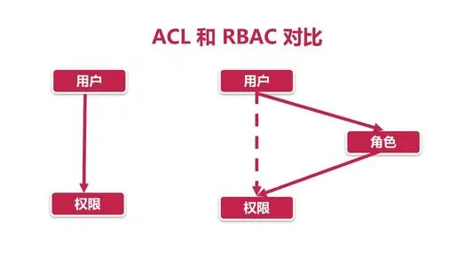
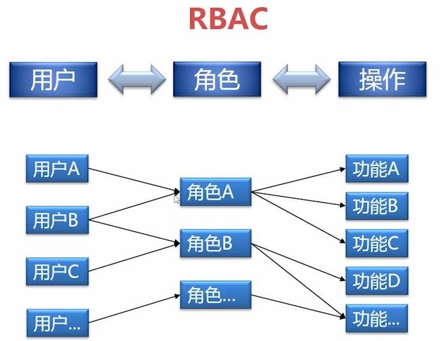

# 权限判定

常见的2种权限方案:
+ ABAC: Attribute-based Access Control, 基于属性的访问控制
+ RBAC: Role-based Access Control，基于角色的访问控制

keyauth支持2种权限判断方式:
+ 基于用户属性的权限控制, 用于 keyauth本身的权限控制
+ 基于Policy RBAC的权限控制, 基于 对其他子系统的权限控制, 避免子系统权限设计不好, 被提权, 破坏整个权限系统

## keyauth本身权限判定

### 用户分类

首先我们看下用户分类:
```go
// 为了防止越权, 用户可以调整的权限范围只有10已下的权限
type UserType int32

const (
	// 子账号, 无用户中心后台管理权限
	UserType_SUB UserType = 0
	// 组织管理严, 管理该域的组织结构
	UserType_ORG_ADMIN UserType = 5
	// 审计管理员, 可以查看用户中心相关配置, 相当于用户中心只读权限
	UserType_AUDIT_ADMIN UserType = 6
	// 权限管理员, 管理用户的授权策略, 比如空间管理，资源访问策略的配置
	UserType_PERM_ADMIN UserType = 7
	// 域管理员, 有该域的所有管理权限, 协作主账号进行管理
	UserType_DOMAIN_ADMIN UserType = 8
	// 主账号, 具有本域的所有权限
	UserType_PRIMARY UserType = 10
	// 超级管理员, 系统管理员, 万能的人, 不受权限系统约束
	UserType_SUPPER UserType = 15
)
```

### 权限设置

keyauth会和框架集成, 在路由上打上对应的标识, 最终由权限拦截器负责判定

下面是user模块的权限设定
```go
// Registry 注册HTTP服务路由
func (h *handler) Registry(router router.SubRouter) {
	prmary := router.ResourceRouter("primary_account")
	prmary.Allow(types.UserType_SUPPER)
	prmary.BasePath("users")
	prmary.Handle("POST", "/", h.CreatePrimayAccount)
	prmary.Handle("DELETE", "/", h.DestroyPrimaryAccount)

	ram := router.ResourceRouter("ram_account")
	ram.Allow(types.UserType_ORG_ADMIN)
	ram.BasePath("sub_users")
	ram.Handle("POST", "/", h.CreateSubAccount)
	ram.Handle("GET", "/", h.QuerySubAccount)
	ram.Handle("GET", "/:account", h.DescribeSubAccount)
	ram.Handle("PATCH", "/:account", h.PatchSubAccount)
	ram.Handle("DELETE", "/:account", h.DestroySubAccount)
	ram.BasePath("manage")
	ram.Handle("POST", "/block", h.BlockSubAccount)

	portal := router.ResourceRouter("profile")
	portal.BasePath("profile")
	portal.Handle("GET", "/", h.QueryProfile)
	portal.Handle("GET", "/domain", h.QueryDomain)
	portal.Handle("PUT", "/", h.PutProfile)
	portal.Handle("PATCH", "/", h.PatchProfile)

	dom := router.ResourceRouter("domain")
	dom.Allow(types.UserType_DOMAIN_ADMIN)
	dom.BasePath("settings/domain")
	dom.Handle("PUT", "/info", h.UpdateDomainInfo)
	dom.Handle("PUT", "/security", h.UpdateDomainSecurity)

	pass := router.ResourceRouter("password")
	pass.BasePath("password")
	pass.Handle("POST", "/", h.GeneratePassword)
	pass.Handle("PUT", "/", h.UpdatePassword)
}
```

下面是部门管理的权限设定:
```go
	r.BasePath("departments")
	r.Handle("POST", "/", h.Create).SetAllow(types.UserType_ORG_ADMIN)
	r.Handle("GET", "/", h.List)
	r.Handle("GET", "/:id", h.Get)
	r.Handle("PUT", "/:id", h.Put)
	r.Handle("PATCH", "/:id", h.Patch)
	r.Handle("GET", "/:id/subs", h.GetSub)
	r.Handle("DELETE", "/:id", h.Delete).SetAllow(types.UserType_ORG_ADMIN)
```

### 权限判定

用户认证过后, Token信息里面包含当前用户的类型, 只需要拦截, 和权限条目进行匹配就可以判定

```go
func (a *HTTPAuther) ValidatePermission(ctx context.Context, tk *token.Token, e httpb.Entry) error {
	if tk == nil {
		return exception.NewUnauthorized("validate permission need token")
	}

	// 如果是超级管理员不做权限校验, 直接放行
	if tk.UserType.IsIn(types.UserType_SUPPER) {
		a.l.Debugf("[%s] supper admin skip permission check!", tk.Account)
		return nil
	}

	// 检查是否是允许的类型
	if len(e.Allow) > 0 {
		a.l.Debugf("[%s] start check permission to keyauth ...", tk.Account)
		if !e.IsAllow(tk.UserType) {
			return exception.NewPermissionDeny("no permission, allow: %s, but current: %s", e.Allow, tk.UserType)
		}
		a.l.Debugf("[%s] permission check passed", tk.Account)
	}

	return nil
}
```

### 测试

+ 我们先使用超级管理员换取一个token
+ 使用超级管理员创建一个普通用户和一个组织管理员用户
    + 子用户01 ^K%0SFpivmUq
    + 组织管理员01 ^K%0SFpivmUq

然后测试子用户和组织管理员 能否创建用户

## 其他服务权限判定

非keyauth本身的服务, 比如cmdb, 要判断用户是否有权限可以调用怎么办喃?

+ 基于用户类型来判断, 如果这时候新增了一种类型怎么办?

 这种适用于场景固定的服务, 因为我们只使用了一个用户属性做判断


### RBAC权限模型

我们之前的基于用户属性的控制，更偏向于ACL, 而RBAC, 通过角色解绑了 用户直接和权限的关联:




+ 权限由角色定义, 一个角色拥有多个功能的操作权限
+ 一个人可以有多个角色, 从而获取几个角色的一个功能集合




### 功能注册

我们的Keyauth就是这样一套中心化的权限系统, 现在用户和角色 都可以在Keyauth定义, 但是怎么知道 服务的功能喃?

这就需要服务把 功能注册到 权限中心

cmdb 添加endpoint注册逻辑:
```go
// registryEndpoints 注册条目
func (s *HTTPService) registryEndpoints() {
	// 注册服务权限条目
	s.l.Info("start registry endpoints ...")

	req := endpoint.NewRegistryRequest(version.Short(), s.r.GetEndpoints().UniquePathEntry())
	_, err := s.kc.Endpoint().RegistryEndpoint(context.Background(), req)
	if err != nil {
		s.l.Warnf("registry endpoints error, %s", err)
	} else {
		s.l.Debug("service endpoints registry success")
	}
}
```


注册的时候我们补充了Resource 和 Lables, 我们看看我们何时定义的:
```go
func (h *handler) Registry(r router.SubRouter) {
	hr := r.ResourceRouter("host")
	hr.Handle("GET", "/hosts", h.QueryHost).AddLabel(label.List)
	hr.Handle("POST", "/hosts", h.CreateHost).AddLabel(label.Create)
	hr.Handle("GET", "/hosts/:id", h.DescribeHost).AddLabel(label.Get)
	hr.Handle("DELETE", "/hosts/:id", h.DeleteHost).AddLabel(label.Delete)
	hr.Handle("PUT", "/hosts/:id", h.PutHost).AddLabel(label.Update)
	hr.Handle("PATCH", "/hosts/:id", h.PatchHost).AddLabel(label.Update)
}
```

我们特意添加了Label, 这样我们定义角色的时候，就不用和 具体的功能耦合, 不然功能一变，我们的角色就要重新定义

基于我们注册的Endpoint，我们定义角色:
```
role:          A    
resource:     [host]   
match label:  action: [list, get, create],
```

### 定义角色

创建一个cmdb-reader的角色, 允许访问cmdb所有资源的list和get方法

调用 POST: /keyauth/api/v1/roles 
```json
{
    "name": "cmdb-reader",
    "description": "cmdb 接口只读权限",
    "permissions": [
        {
            "effect": "allow",
            "service_id": "c687sgma0brlmo1a1cag",
            "resource_name": "*",
            "label_key": "action",
            "label_values": [
                "list", "get"
            ]
        }
    ]
}
```

创建一个cmdb-admin的角色, 允许访问cmdb所有资源的所有标签

调用 POST: /keyauth/api/v1/roles 
```json
{
    "name": "cmdb-admin",
    "description": "cmdb 管理员",
    "permissions": [
        {
            "effect": "allow",
            "service_id": "c687sgma0brlmo1a1cag",
            "resource_name": "*",
            "label_key": "*",
            "label_values": [
                "*"
            ]
        }
    ]
}
```

### 策略引擎


## Namespace


## Filter


## 权限对接