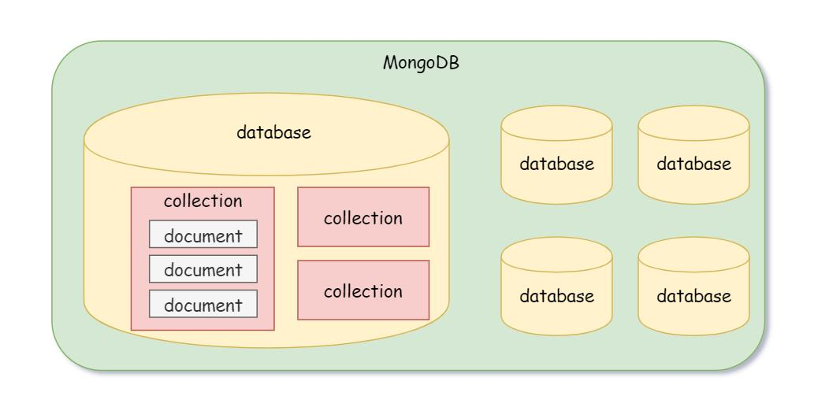

# 用户管理


## 环境搭建

在开发keyauth之前 需要先准备环境

### 安装MongoDB

下面是mongo的基础概念:



1. 采用docker安装
```
docker pull mongo
docker run -itd -p 27017:27017 mongo
```

2. 编辑 /etc/mongod.conf 开启认证访问(可选), 开启后要重启下服务
```
security:
  authorization: enabled
```

3. 创建管理员账号
```
use admin
db.createUser({user:"admin",pwd:"123456",roles:["root"]})
db.auth("admin", "123456")
```

4. 添加库用户
```
use keyauth
db.createUser({user: "keyauth", pwd: "xxx", roles: [{ role: "dbOwner", db: "keyauth" }]})
```

### 安装protobuf

1. 下载protoc 版本1.39.1, 注意版本一定要对上 [protoc下载地址](https://github.com/protocolbuffers/protobuf/releases)
```
# 1.安装protoc编译器,  项目使用版本: v3.19.1
# 下载预编译包安装: https://github.com/protocolbuffers/protobuf/releases
```

2. 将需要的文件手动copy到对于地方
```sh
cp protoc-3.19.1-osx-x86_64/bin/protoc /usr/local/bin
cp protoc-3.19.1-osx-x86_64/include/*  /usr/local/include
```

3. 安装gprc相关插件
```sh
# 1.protoc-gen-go go语言查询, 项目使用版本: v1.27.1   
go install google.golang.org/protobuf/cmd/protoc-gen-go@latest

# 2.安装protoc-gen-go-grpc插件, 项目使用版本: 1.1.0
go install google.golang.org/grpc/cmd/protoc-gen-go-grpc@latest
```

4. 安装自定义Tag插件
```
# 1.安装自定义proto tag插件
go install github.com/favadi/protoc-go-inject-tag@latest
```

5. 安装项目依赖的protobuf
```
cp -r docs/include/github.com /usr/local/include
```


## 项目初始化

### 配置Keyauth

配置下keyauth, 主要是数据库Mongodb的配置
```toml
[app]
name = "keyauth"
host = "0.0.0.0"
http_port = "8050"
grpc_prot = "18050"
key  = "this is your app key"

[mongodb]
endpoints = ["xxx:xxx"]
username = "xxx"
password = "xxxx"
database = "keyauth"

[log]
level = "debug"
path = "logs"
format = "text"
to = "stdout"
```


### 初始化项目

由于我们使用的MongoDB, 无需建表(No Schema), 因此直接初始化项目

```sh
make init
```

初始化有一组关键信息需要记录下:
+ client_id
+ client_secret

这是为我们初始化的一个web端的凭证


