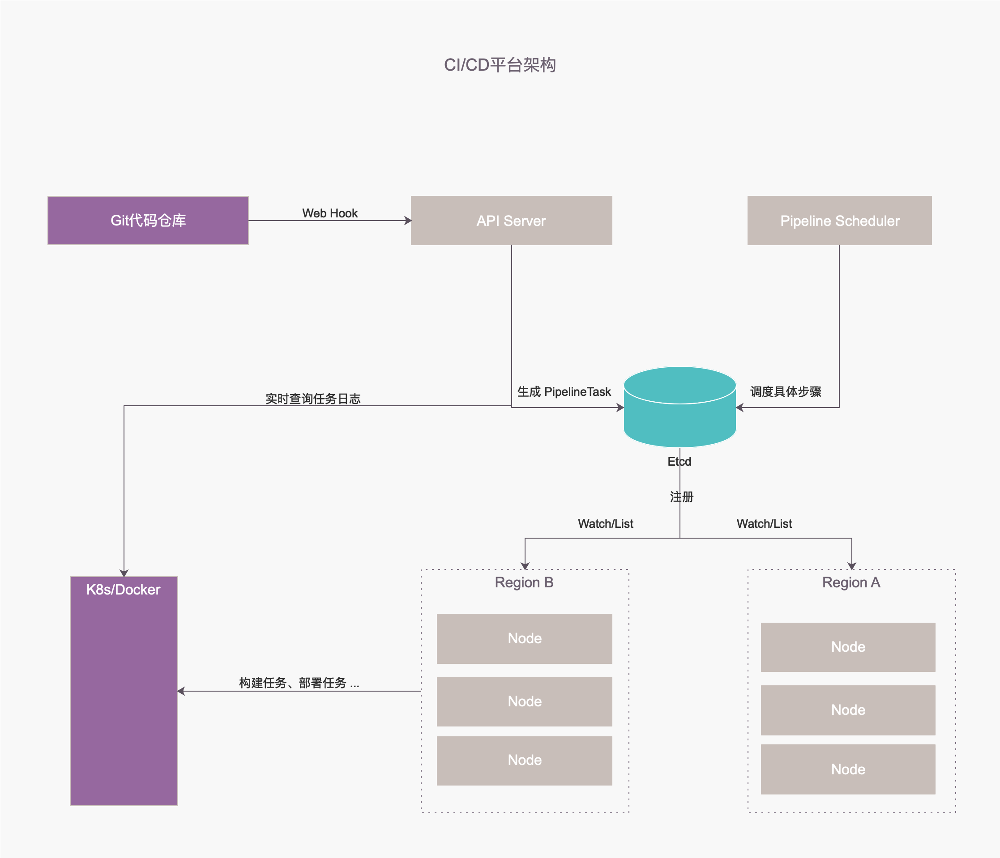
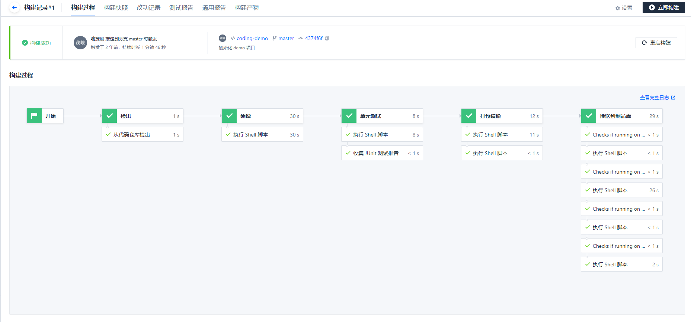
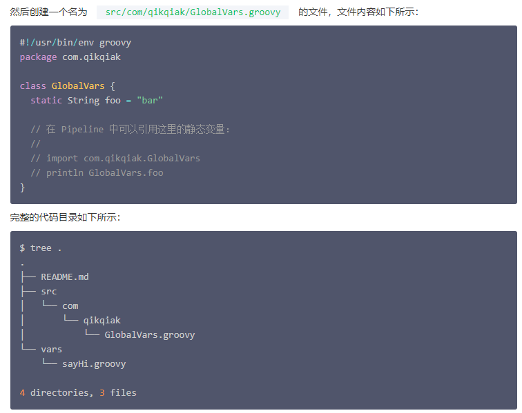
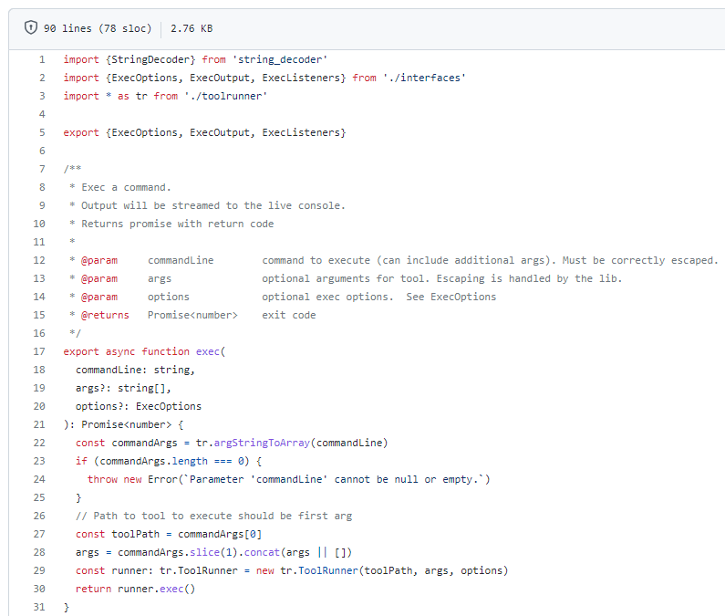
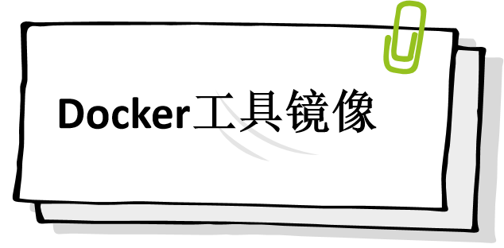
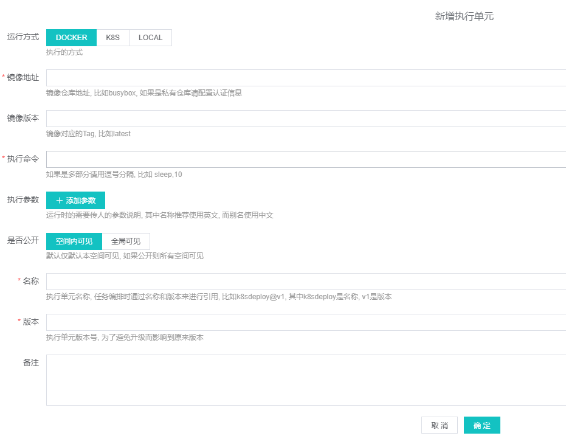

# workflow项目介绍



API Server的核心职责比较简单: 就是往etcd里面写数据, 写什么数据，怎么写, 这就是我们的业务逻辑


## workflow 组件与流程

+ API Server: 负责将Pipeline对象写入Etcd
+ Scheduler: 负责调度Pipeline定义的任务到具体的Node节点执行
+ Node: Watch做任务, 发现有任务调度给自己后, 执行任务

因此我们的项目骨架如下:

+ api: api server 项目
    + app: app模块层
    + client: api server grpc 客户端
    + cmd: api server cli
    + protocol: api server 暴露的API服务,包含 grpc和http
+ scheduler: scheduler项目
    + algorithm: 调度算法包
    + cmd: 调度器 cli
    + controller: 调度器的控制器, watch list 对象变化
        + cronjob: 赋值cronjob类型任务的调度，预留未实现
        + node: node对象的控制器, watch 注册上的Node节点, 方便调度器选择执行的node
        + pipeline: watch pipeline对象变化, 赋值控制pipeline状态变化, 负责pipeline 中 task任务的创建, 创建后由 task调度器负责调度
        + step: 负责watch step对象的变化, 将具体的step 调度给对应的node节点执行
+ node: node项目
    + cmd: node cli
    + controller: node节点控制器, 负责watch 对象变化
        + step: 服务watch step 状态变化
            + engine: 控制调用runner来执行任务, 并管理所有任务
            + runner: 负责执行具体的认为
                + docker: 负责调用docker来执行任务
                + k8s: 负责调用k8s来执行任务
                + local: 负责在本地执行任务
            + store: 负责记录task 执行日志
+ conf: 整个项目的配置文件
+ version: 整个项目的版本 
+ common: 项目通用工具包

## Pipeline 概念介绍

下面是coding 的构建流水线:



下面是github的流水线:


简而言之, 流水线 就是允许用户自己编排任务, 具有很强的灵活性

下面是github workflow流水线定义文件:

```yaml
name: Build and Test

# This workflow will run on master branch and on any pull requests targeting master
on:
  push:
    branches:
      - master
  pull_request:
  
jobs:
  lint:
    name: Lint
    runs-on: ubuntu-latest
    steps:
      - name: Set up Go
        uses: actions/setup-go@v1
        with:
          go-version: 1.13

      - name: Check out code
        uses: actions/checkout@v1

      - name: Lint Go Code
        run: |
          export PATH=$PATH:$(go env GOPATH)/bin # temporary fix. See https://github.com/actions/setup-go/issues/14
          go get -u golang.org/x/lint/golint 
          make lint
          
  test:
    name: Test
    runs-on: ubuntu-latest
    steps:
      - name: Set up Go
        uses: actions/setup-go@v1
        with:
          go-version: 1.13

      - name: Check out code
        uses: actions/checkout@v1

      - name: Run Unit tests.
        run: make test-coverage
      
      - name: Upload Coverage report to CodeCov
        uses: codecov/codecov-action@v1.0.0
        with:
          token: ${{secrets.CODECOV_TOKEN}}
          file: ./coverage.txt

  build:
    name: Build
    runs-on: ubuntu-latest 
    needs: [lint,test]
    steps:
      - name: Set up Go
        uses: actions/setup-go@v1
        with:
          go-version: 1.13

      - name: Check out code
        uses: actions/checkout@v1

      - name: Build
        run: make build
```

## 集成Or开发

商业选择上面已经介绍了:
+ coding: 底层基于jenkins, 共享库开发友好, 界面设计得不错
+ github: 已文件定义pipeline, 整体还可以，但是定义 自定义任务开发依然门槛高

下面是jenkins share lib开发: 依赖groovy 并且熟悉他框架



下面是 github action得开发, 依赖javascript, 并且熟悉他框架



开源的还有:
+ jenkins: 老牌ci cd平台
    + 大规模使用 master节点有调度性能问题
+ dronci: 基于容器的ci cd平台
    + 看起来还不错, 也在开始商业收费了
+ Tekton: 谷歌开源了一个 Kubernetes 原生 CI/CD 构建框架
    + 设计理念和本项目很像, 但是没有界面，上手难度高


一直没有一个上手难道低，界面友好得产品, 也许是个机会

## 目标



我们使用工具镜像这个概念, 将任务定义2部分:
+ 工具: 可以调用得工具镜像
+ 参数: 通过环境变量将参数传递给工具

刚才我们操作etcd 就是使用容器里面得etcd客户端作为工具 直接操作的
```sh
docker exec -it -e "ETCDCTL_API=3" etcd  etcdctl get  /registry/configs/default/cmdb
```



## Pipeline对象设计

我们的pipeline对象
```yaml
name: test44
stages:
  - name: stage1
    steps:
      - name: step1.1
        action: action01@v1
        with:
          ENV1: env1
          ENV2: env2
        with_audit: false
        is_parallel: true
        webhooks:
          - url: >-
              https://open.feishu.cn/open-apis/bot/v2/hook/83bde95c-00b2-4df1-91e4-705f66102479
            events:
              - SUCCEEDED
      - name: step1.2
        action: action01@v1
        with_audit: false
        is_parallel: true
        with:
          ENV1: env1
          ENV2: env2
        webhooks:
          - url: >-
              https://open.feishu.cn/open-apis/bot/v2/hook/83bde95c-00b2-4df1-91e4-705f66102479
            events:
              - SUCCEEDED
      - name: step1.3
        action: action01@v1
        with_audit: true
        with:
          ENV1: env1
          ENV2: env2
        webhooks:
          - url: >-
              https://open.feishu.cn/open-apis/bot/v2/hook/83bde95c-00b2-4df1-91e4-705f66102479
            events:
              - SUCCEEDED
  - name: stage2
    steps:
      - name: step2.1
        action: action01@v1
        with:
          ENV1: env3
          ENV2: env4
        webhooks:
          - url: >-
              https://open.feishu.cn/open-apis/bot/v2/hook/83bde95c-00b2-4df1-91e4-705f66102479
            events:
              - SUCCEEDED
      - name: step2.2
        action: action01@v1
        with:
          ENV1: env1
          ENV2: env2
        webhooks:
          - url: >-
              https://open.feishu.cn/open-apis/bot/v2/hook/83bde95c-00b2-4df1-91e4-705f66102479
            events:
              - SUCCEEDED
```

下面是我们定义的Pipeline对象
```protobuf
// Pipeline todo
message Pipeline {
  ...  ...
  // 名称
	// @gotags: bson:"name" json:"name"
    string name = 7;
	// 全局参数, step执行时合并处理
	// @gotags: bson:"with" json:"with"
	map<string, string> with = 13;
	// 需要挂载的文件
	// @gotags: bson:"mount" json:"mount"
	MountData mount = 14;
	// 标签
	// @gotags: bson:"tags" json:"tags"
	map<string, string> tags = 8;
	// 描述
	// @gotags: bson:"description" json:"description"
	string description = 9;
	// 触发条件
	// @gotags: bson:"on" json:"on"
	Trigger on = 10;
	// 触发事件
	// @gotags: bson:"hook_event" json:"hook_event"
	infraboard.workflow.pipeline.scm.WebHookEvent hook_event = 15;
	// 当前状态
	// @gotags: bson:"status" json:"status"
	PipelineStatus status = 11;
	// 具体编排阶段
	// @gotags: bson:"stages" json:"stages"
	repeated Stage stages = 12;
}
```

stage 对象
```protobuf
// Stage todo
message Stage {
	// 阶段ID
	// @gotags: bson:"id" json:"id"
	int32 id = 1;
    // 名称
	// @gotags: bson:"name" json:"name" validate:"required"
    string name = 2;
	// 依赖其他stage执行成功
	// @gotags: bson:"needs" json:"needs"
	repeated string needs = 3;
	// 具体步骤
	// @gotags: bson:"steps" json:"steps"
	repeated Step steps = 4;
}
```

step 对象
```protobuf
message CreateStepRequest {
    // 名称
	// @gotags: json:"name" validate:"required"
    string name = 1;
	// 具体动作
	// @gotags: json:"action" validate:"required"
	string action = 2;
	// 是否需要审批, 审批通过后才能执行
	// @gotags: json:"with_audit"
	bool with_audit =3;
	// 审批参数, 有审批模块做具体实现
	// @gotags: json:"audit_params"
	map<string, string> audit_params = 4;
	// 参数
	// @gotags: json:"with"
	map<string, string> with = 5;	
	// step执行完成后, 是否需要通知
	// @gotags: json:"with_notify"
	bool with_notify = 6;
	// 通知参数, 由通知模块做具体实现
	// @gotags: json:"notify_params"
	map<string, string> notify_params = 7;
	// WebHook配置, 用于和其他系统联动, 比如各种机器人
	// @gotags: json:"webhooks"
	repeated WebHook webhooks = 8;
	// 调度标签
	// @gotags: json:"node_selector"
	map<string, string> node_selector = 9;
	// 空间
	// @gotags: json:"namespace"
	string namespace = 10;
}
```
