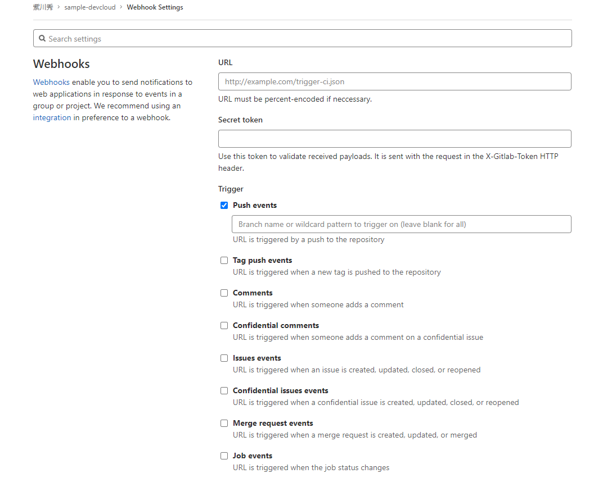
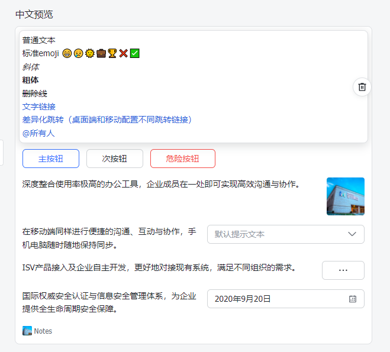
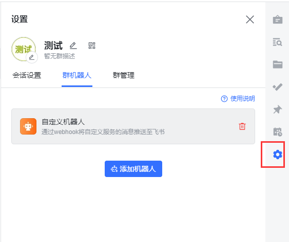
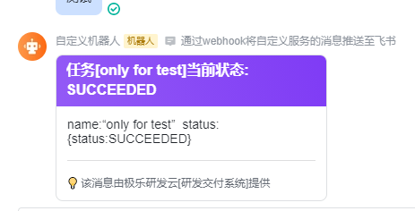

# Step Hook 开发

为了和其他系统更好的继承, 这里专门添加了webhook机制, 我们可以参考下 gitlab的webhook界面



## WebHook 结构定义

首先，何为WebHook, 为啥 不直接叫Hook?

因为Hook通知的方式可以有多种实现，基于Http协议的 通常叫做WebHook, 除了Http的你也可以设计其他的Hook实现，比如基于RPC或者基于Broker(kafka)

这里我们以实现Webhook为样例, 参考gitlab 的hook为例，我们配置一个基于Http协议的webhook需要哪些数据喃?

我们以Http协议为例先简单概况:
+ URL:  接收数据的URL地址, 有接收方设置
+ Method: POST, 因为我们要推送数据给Hook设置方, 需要可以携带数据, 这里以POST比较常见，因此定位POST推送
+ Header: 用于有可能有自定义认证的需求, 比如基于keyauth的子系统, 因此我们预留一个 自定义Header的口子
+ Body: 默认JSON格式, 只支持JSON数据格式的数据推送

那我们要推送哪些数据给用户喃? 无脑推送肯定不太合适, 我们可以让用户选择订阅自己关心的事件, 和Gitlab钩子一样
```protobuf
// STEP_STATUS Step任务状态
enum STEP_STATUS {
    // 任务等待被执行
    PENDDING = 0;
	// 任务调度失败
	SCHEDULE_FAILED = 10;
	// 正在执行
	RUNNING = 1;
    // 执行成功
    SUCCEEDED = 3;
	// 执行失败
	FAILED = 4;
    // 取消中
    CANCELING = 5;
    // 取消完成
    CANCELED = 6;
	// 忽略执行
	SKIP = 7;
	// 审批中, 确认过后才能继续执行
	AUDITING = 8;
	// 审批拒绝
	REFUSE = 9;
}
```

最后我们的WebHook设置应该就是这样的:
```protobuf
message WebHook {
	// POST URL
	// @gotags: bson:"url" json:"url" validate:"required,url"
	string url = 1;
	// 需要自定义添加的头, 用于身份认证
	// @gotags: bson:"header" json:"header"
	map<string, string> header = 2;
	// 那些状态下触发
	// @gotags: bson:"events" json:"events"
	repeated STEP_STATUS events = 3;
	// 简单的描述信息
	// @gotags: bson:"description" json:"description"
	string description = 4;
	// 推送结果
	// @gotags: bson:"status" json:"status"
	WebHookStatus status = 5;
}
```

我们推送过去了, 对方到底有没有接收, 你到底有没有推送出去, 这些都需要记录, 不然要扯皮的。
```protobuf
message WebHookStatus {
	// 开始时间
	// @gotags: bson:"start_at" json:"start_at"
	int64 start_at = 1;
	// 耗时多久，单位毫秒
	// @gotags: bson:"cost" json:"cost"
	int64 cost = 2;
	// 是否推送成功
	// @gotags: bson:"success" json:"success"
	bool success = 3;
	// 异常时的错误信息
	// @gotags: bson:"message" json:"message"
	string message = 4;
}
```

## 钩子作用点

Webhook的参数我们设置了,  那么在程序里面 哪里推送给对方喃?

Step Controller 处理这所有Step状态变更事件, 因此我们在 Step Controller 把对象放入work queue之前 就可以进行通知

```go
// 如果step有状态更新, 回调通知pipeline controller
func (c *Controller) enqueueForUpdate(oldObj, newObj *pipeline.Step) {
	c.log.Debugf("enqueue update old[%d], new[%d] ...", oldObj.ResourceVersion, newObj.ResourceVersion)

	// 判断事件状态, 调用webhook
	if err := c.webhook.Send(context.Background(), newObj.MatchedHooks(), newObj); err != nil {
		c.log.Errorf("send web hook error, %s", err)
	}

	switch newObj.CreateType {
	case pipeline.STEP_CREATE_BY_PIPELINE:
		// 如果是pipeline创建的，将事件传递给pipeline
		if c.cb != nil {
			c.cb(oldObj, newObj)
		}
	}

	key := newObj.MakeObjectKey()
	c.workqueue.AddRateLimited(key)
}
```

哪些时间需要发送喃?, 通过比对当前Step的状态和Webhook里面定义的订阅状态，来决定当前状态的事件是否应该被推送
```go
func (s *Step) MatchedHooks() []*WebHook {
	target := []*WebHook{}
	for i := range s.Webhooks {
		hook := s.Webhooks[i]
		if hook.IsMatch(s.Status.Status) {
			target = append(target, hook)
		}
	}
	return target
}
```

为了更好的解构我们Hook的实现，解耦推送逻辑，因此我们专门定义了推送接口: StepWebHookPusher

## Hook接口定义

```go
type StepNotifyEvent struct {
	StepKey      string            `json:"step_key"`
	NotifyParams map[string]string `json:"notify_params"`
	*pipeline.StepStatus
}

// StepWebHooker step状态变化时，通知其他系统
type StepWebHookPusher interface {
	Send(context.Context, []*pipeline.WebHook, *pipeline.Step) error
}

func NewDefaultStepWebHookPusher() StepWebHookPusher {
	return webhook.NewWebHook()
}
```

## Hook的实现

Hook的基础实现 其实就是一个http客户端推送数据

### WebHook对象

因此我们定义一个WebHook对象, 由该对象负责发送WebHook通知:
+ 他讲Step当前状态 推送给 对应的WebHook设置
+ 这里为了防止用户设置过多的Hook导致, 一次推送的Hook要做下个数限制，毕竟你系统资源不是无限的。

```go
func NewWebHook() *WebHook {
	return &WebHook{
		log: zap.L().Named("WebHook"),
	}
}

type WebHook struct {
	log logger.Logger
}

func (h *WebHook) Send(ctx context.Context, hooks []*pipeline.WebHook, step *pipeline.Step) error {
	if step == nil {
		return fmt.Errorf("step is nil")
	}

	if err := h.validate(hooks); err != nil {
		return err
	}

	h.log.Debugf("start send step[%s] webhook, total %d", step.Key, len(hooks))
	for i := range hooks {
		req := newRequest(hooks[i], step)
		req.Push()
	}

	return nil
}

func (h *WebHook) validate(hooks []*pipeline.WebHook) error {
	if len(hooks) == 0 {
		return nil
	}

	if len(hooks) > MAX_WEBHOOKS_PER_SEND {
		return fmt.Errorf("too many webhooks configs current: %d, max: %d", len(hooks), MAX_WEBHOOKS_PER_SEND)
	}

	return nil
}
```

### 多渠道适配

如果你既想可以推送给用户自定义Hook又想适配飞书/钉钉/企业微信 这些IM工具 应该如何设计?

首先我们抽象下他们的差异:
+ 自定义Hook: 用户自己设置的URL, 无规律, 由用户处理我们推送过去的数据，我们不做数据上的适配
+ IM通知: URL前缀固定, 需要我们按照他们的格式进行数据推送

因此我们可以设计一个请求对象, 让他根据各IM的前缀进行匹配, 然后动态转换推送的数据结构
```go
func (r *request) BotType() string {
	// 	URL_PREFIX = "https://open.feishu.cn/open-apis/bot"
	if strings.HasPrefix(r.hook.Url, feishu.URL_PREFIX) {
		return feishuBot
	}
	// 	URL_PREFIX = "https://oapi.dingtalk.com/robot/send"
	if strings.HasPrefix(r.hook.Url, dingding.URL_PREFIX) {
		return dingdingBot
	}
	// URL_PREFIX = "https://qyapi.weixin.qq.com/cgi-bin/webhook/send"
	if strings.HasPrefix(r.hook.Url, wechat.URL_PREFIX) {
		return wechatBot
	}

	return ""
}
```

数据结构转换
```go
	// 准备请求,适配主流机器人
	var messageObj interface{}
	switch r.BotType() {
	case feishuBot:
		messageObj = feishu.NewStepCardMessage(r.step)
		r.matchRes = `"StatusCode":0,`
	case dingdingBot:
		messageObj = dingding.NewStepCardMessage(r.step)
		r.matchRes = `"errcode":0,`
	case wechatBot:
		messageObj = wechat.NewStepMarkdownMessage(r.step)
		r.matchRes = `"errcode":0,`
	default:
		messageObj = r.step
	}
```

最后我们调用HTTP客户端将数据发送出去, 并判断是否发送成功, 如何判断喃?
+ 如果是标准Hook 通过 HTTP Status Code判断
+ 如果是适配IM, 根据对方返回的数据进行简单匹配, 因为他们无论成功还是失败都是返回200
```go
func (r *request) Push() {
	r.hook.StartSend()

	// 准备请求,适配主流机器人
	var messageObj interface{}
	switch r.BotType() {
	case feishuBot:
		messageObj = feishu.NewStepCardMessage(r.step)
		r.matchRes = `"StatusCode":0,`
	case dingdingBot:
		messageObj = dingding.NewStepCardMessage(r.step)
		r.matchRes = `"errcode":0,`
	case wechatBot:
		messageObj = wechat.NewStepMarkdownMessage(r.step)
		r.matchRes = `"errcode":0,`
	default:
		messageObj = r.step
	}

	body, err := json.Marshal(messageObj)
	if err != nil {
		r.hook.SendFailed("marshal step to json error, %s", err)
		return
	}

	req, err := http.NewRequest("POST", r.hook.Url, bytes.NewReader(body))
	if err != nil {
		r.hook.SendFailed("new post request error, %s", err)
		return
	}

	req.Header.Set("Content-Type", "application/json")
	for k, v := range r.hook.Header {
		req.Header.Add(k, v)
	}

	// 发起请求
	resp, err := client.Do(req)
	if err != nil {
		r.hook.SendFailed("send request error, %s", err)
		return
	}
	defer resp.Body.Close()

	// 读取body
	bytesB, err := io.ReadAll(resp.Body)
	if err != nil {
		r.hook.SendFailed("read response error, %s", err)
		return
	}
	respString := string(bytesB)

	// 通过Status Code判断
	if (resp.StatusCode / 100) != 2 {
		r.hook.SendFailed("status code[%d] is not 200, response %s", resp.StatusCode, respString)
		return
	}

	// 通过返回匹配字符串来判断通知是否成功
	if r.matchRes != "" {
		if !strings.Contains(respString, r.matchRes) {
			r.hook.SendFailed("reponse not match string %s, response: %s",
				r.matchRes, respString)
			return
		}
	}

	r.hook.Success(respString)
}
```

### 飞书IM

我们以飞书通知为例进行讲解,  为啥？ 因为飞书通知最花里胡哨

我们采用飞书的卡片消息进行推送，因为这种格式很好看



下面是我封装后得消息格式(具体看hook里面飞书模块, 代码比较多):
```go
func (r *request) NewFeishuMessage() *feishu.Message {
	s := r.step
	msg := &feishu.NotifyMessage{
		Title:    s.ShowTitle(),
		Content:  s.String(),
		RobotURL: r.hook.Url,
		Note:     []string{"💡 该消息由极乐研发云[研发交付系统]提供"},
		Color:    feishu.COLOR_PURPLE,
	}
	return feishu.NewCardMessage(msg)
}
```

编写测试用例:
```go
var (
	feishuBotURL = "https://open.feishu.cn/open-apis/bot/v2/hook/461ead7b-d856-472c-babc-2d3d0ec9fabb"
)

func TestFeishuWebHook(t *testing.T) {
	should := assert.New(t)

	hooks := testPipelineWebHook(feishuBotURL)
	sender := webhook.NewWebHook()
	err := sender.Send(
		context.Background(),
		hooks,
		testPipelineStep(),
	)
	should.NoError(err)

	
	t.Log(hooks[0])
}
```


### 测试飞书通知

接下面我们添加一个飞书机器人:



测试下发生通知:




##  全链路测试

我们之前跑Pipeline已经进行了全链路的测试了, 我们可以再次梳理下 流程逻辑


