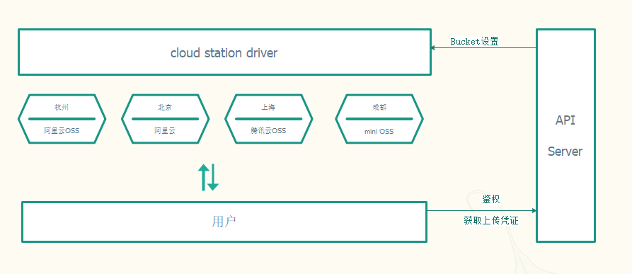

# 系统方式开发



+ 每个区域一个bucket, 用于内网访问加速
+ API server控制用户是否可以上传和下载
+ API server保存oss ak 和 sk, 避免泄露风险
+ 和其他系统集成

因此我们需要开发的系统组件有:
+ 客户端工具(CLI)
+ API Server控制器 (HTTP服务学习后实践)

不同于工具开发, 系统开发的思维访问 更偏向于系统设计与业务抽象, 基于系统模式我们来重构刚才的简单版

## 初始化工程: cloudstation

```go
go mod init gitee.com/infraboard/go-course/day8/cloudstation
```

## 客户端核心组件模块: store

### 抽象业务模型
为了屏蔽多个云厂商OSS操作的差异，我们抽象出一个store组件, 他用于解决 文件的上传和下载问题, 
因此我们为定义一个Uploader接口

```go
type Uploader interface {
	// 上传文件到后端存储
	UploadFile(bucketName, objectKey, localFilePath string) error
}
```

### 插件规划

如果想要作为cloud station的存储插件，就必须实现这个uploader接口, 我们有多少种插件
+ 腾讯云: qcloud
+ 阿里云: aliyun
+ 自己搭建的oss: mini

我们创建一个文件夹来存储我们即将开发的插件
```
$ ls provider/
aliyun  mini  qclouds
```

### 阿里云插件开发(初识TDD)

1. 编写插件骨架

迁移我们之前开发阿里云的上传函数为一个插件实现: provider/aliyun/store.go

插件作为uploader的一个实现方，必须实现uploader定义的函数, 因此我们定义对象来实现它

```go
// 构造函数
func NewUploader() store.Uploader {
	return &aliyun{}
}

type aliyun struct{}

func (p *aliyun) UploadFile(bucketName, objectKey, localFilePath string) error {
    return fmt.Errorf("not impl")
}
```
这样我们就实现了一个阿里云的uploader实例, 但是这个实例能不能正常工作喃? 对我们需要写测试用例,
也就是我们常说的DDD的开发流程

2. 为插件编写测试用例

编写实例的测试用例: provider/aliyun/store_test.go
```go
var (
	bucketName    = ""
	objectKey     = ""
	localFilePath = ""
)

func TestUploadFile(t *testing.T) {
	should := assert.New(t)

	uploader := aliyun.NewUploader()
	err := uploader.UploadFile(bucketName, objectKey, localFilePath)
	should.NoError(err)
}
```

我们尝试运行:
```
=== RUN   TestUploadFile
    e:\Projects\Golang\go-course\day8\cloudstation\store\provider\aliyun\store_test.go:21:
        	Error Trace:	store_test.go:21
        	Error:      	Received unexpected error:
        	            	not impl
        	Test:       	TestUploadFile
--- FAIL: TestUploadFile (0.00s)
FAIL
FAIL	gitee.com/infraboard/go-course/day8/cloudstation/store/provider/aliyun	0.045s
```

3. 完善插件逻辑, 直到测试用例通过

3.1 迁移主体函数

```go
// 构造函数
func NewUploader(endpoint, accessID, accessKey string) store.Uploader {
	p := &aliyun{
		Endpoint:  endpoint,
		AccessID:  accessID,
		AccessKey: accessKey,
	}

	return p
}

type aliyun struct {
	Endpoint  string 
	AccessID  string 
	AccessKey string 
}

func (p *aliyun) UploadFile(bucketName, objectKey, localFilePath string) error {
	bucket, err := p.GetBucket(bucketName)
	if err != nil {
		return err
	}

	err = bucket.PutObjectFromFile(objectKey, localFilePath)
	if err != nil {
		return fmt.Errorf("upload file to bucket: %s error, %s", bucketName, err)
	}
	signedURL, err := bucket.SignURL(objectKey, oss.HTTPGet, 60*60*24)
	if err != nil {
		return fmt.Errorf("SignURL error, %s", err)
	}
	fmt.Printf("下载链接: %s\n", signedURL)
	fmt.Println("\n注意: 文件下载有效期为1天, 中转站保存时间为3天, 请及时下载")
	return nil
}

func (p *aliyun) GetBucket(bucketName string) (*oss.Bucket, error) {
	if bucketName == "" {
		return nil, fmt.Errorf("upload bucket name required")
	}

	// New client
	client, err := oss.New(p.Endpoint, p.AccessID, p.AccessKey)
	if err != nil {
		return nil, err
	}
	// Get bucket
	bucket, err := client.Bucket(bucketName)
	if err != nil {
		return nil, err
	}
	return bucket, nil
}
```

3.2 现在迁移参数校验逻辑

之前手动编写的校验函数，其实有个不错的第三库，可以帮我们完成校验: github.com/go-playground/validator

我们改造下我们的struct:
```go
type aliyun struct {
	Endpoint  string `validate:"required"`
	AccessID  string `validate:"required"`
	AccessKey string `validate:"required"`
}
```

然后为我们实体编写校验逻辑
```go
// use a single instance of Validate, it caches struct info
var (
	validate = validator.New()
)

func (p *aliyun) validate() error {
	return validate.Struct(p)
}
```

最后再New构建实体的时候执行参数校验
```go
// 构造函数
func NewUploader(endpoint, accessID, accessKey string) (store.Uploader, error) {
	p := &aliyun{
		Endpoint:  endpoint,
		AccessID:  accessID,
		AccessKey: accessKey,
	}

	if err := p.validate(); err != nil {
		return nil, err
	}

	return p, nil
}
```

修正我们的测试用例
```go
func TestUploadFile(t *testing.T) {
	should := assert.New(t)

	uploader, err := aliyun.NewUploader("", "", "")
	if should.NoError(err) {
		err = uploader.UploadFile(bucketName, objectKey, localFilePath)
		should.NoError(err)
	}
}
```

再次测试 我们的验证逻辑已经生效
```
=== RUN   TestUploadFile
    e:\Projects\Golang\go-course\day8\cloudstation\store\provider\aliyun\store_test.go:20:
        	Error Trace:	store_test.go:20
        	Error:      	Received unexpected error:
        	            	Key: 'aliyun.Endpoint' Error:Field validation for 'Endpoint' failed on the 'required' tag
        	            	Key: 'aliyun.AccessID' Error:Field validation for 'AccessID' failed on the 'required' tag
        	            	Key: 'aliyun.AccessKey' Error:Field validation for 'AccessKey' failed on the 'required' tag
        	Test:       	TestUploadFile
--- FAIL: TestUploadFile (0.00s)
FAIL
FAIL	gitee.com/infraboard/go-course/day8/cloudstation/store/provider/aliyun	0.251s
```

然后我们调整参数, 由于Endpoint 是一个URL, 不是非空就可的， 我们可以添加Endpoint的URL校验, 比如
```go
type aliyun struct {
	Endpoint  string `validate:"required,url"`
	AccessID  string `validate:"required"`
	AccessKey string `validate:"required"`
}
```

最后我们测试用例如下:
```go
var (
	bucketName    = "cloud-station"
	objectKey     = "store.go"
	localFilePath = "store.go"

	endpoint = "http://oss-cn-chengdu.aliyuncs.com"
	ak       = os.Getenv("ALI_AK")
	sk       = os.Getenv("ALI_SK")
)

func TestUploadFile(t *testing.T) {
	should := assert.New(t)

	uploader, err := aliyun.NewUploader(endpoint, ak, sk)
	if should.NoError(err) {
		err = uploader.UploadFile(bucketName, objectKey, localFilePath)
		should.NoError(err)
	}
}
```

到此 我们的aliyun的uploader插件就开发完成, 并且有一个基本的测试用例保证其质量