# 数据结构之栈

生活中我们常常会遇到这样的问题:

+ 邮件处理: 收到很多的邮件(实体的), 从上往下依次处理这些邮件. (最新到的邮件, 最先处理)
+ 比如我们的浏览器前进、倒退功能(最近访问的站点, 优先倒退)
+ 编辑器/IDE 中的撤销、取消撤销功能(最近变更, 优先撤销)

更真实的场景: 获取我们最近看的书, 最近看过的 优先获取


像生活中的这些场景，我们都可以抽象成这样一种数据结构: FILO（First In Last Out）,先进后出

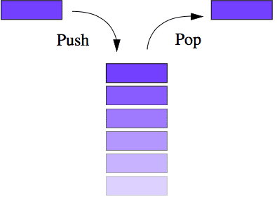

这种结构在数据结构中被叫做栈

栈stack，它是一种运算受限的线性表。限定仅在表尾进行插入和删除操作的线性表，这一端被称为栈顶, 另一端是封死的.


## 如何来设计栈?

栈有2个核心方法:
+ Push
+ Pop

并且要满足先进后出这个条件, 这种有序的元素存储我们可以选择数组或者slice, 因此slice支持更多操作，我们选择slice作为存储数据的容器

那我们就可以定义栈这种结构结构了:
```go

// 定义需要存入的元素对象
// 这里Item是范型, 指代任意类型, 如果你把它变成Book, 或者Email
// 就和上面的业务场景对接上了 
type Item interface{}

// 构建函数
func NewStack() *Stack {
	return &Stack{
		items: []Item{},
	}
}

type Stack struct {
	items []Item
}

// Push adds an Item to the top of the stack
func (s *Stack) Push(item Item) {
	s.items = append(s.items, item)
}

func (s *Stack) Pop() Item
```

然后我们先实现Push, 我们把slice append的那边作为栈顶, 就可以直接放进去
```go
// Push adds an Item to the top of the stack
func (s *Stack) Push(item Item) {
	s.items = append(s.items, item)
}
```

实现Pop, 我们把栈顶的元素弹出来, 对于slice来说 就是删除最后一个元素, 并把删除的那个元素返回
```go
// Pop removes an Item from the top of the stack
func (s *ItemStack) Pop() Item {
	item := s.items[len(s.items)-1]
	s.items = s.items[0 : len(s.items)-1]
	return item
}
```

然后我们写一个测试用例测试一下:

```go
func TestStack(t *testing.T) {
	s := stack.NewStack()
	s.Push(1)
	t.Log(s.Pop())
}
```

## 完善栈数据结构

有没有发现上面的程序有那些问题:
+ 如果栈到底了 使用Pop会出现指针 (边界问题处理)
+ 改数据结构不是线程安全 (并发资源竞争问题)
+ slice共用底层数组的的问题，Pop并不能真正的删除元素, 其占用的内存并不会减少当Pop时

为了让我们的栈更丰满，我们需要补充一些辅助方法:

- 栈大小 Len
- 栈的容量 Size
- 判断是否为空 IsEmpty
- 判断是否已满 IsFull
- 获取栈顶元素的值 Peek
- 清空栈 Clear
- 查询某个值==最近==距离栈顶的距离 Search
- 遍历栈 ForEach

```go
func (s *Stack) Len() int {
	return len(s.items)
}

func (s *Stack) IsEmpty() bool {
	return len(s.items) == 0
}

func (s *Stack) Peek() Item {
	return s.items[len(s.items)-1]
}

func (s *Stack) Clear() {
	s.items = []Item{}
}

func (s *Stack) Search(item Item) (pos int, err error) {
	for i := range s.items {
		if item == s.items[i] {
			return i, nil
		}
	}
	return 0, fmt.Errorf("item %s not found", item)
}

func (s *Stack) ForEach(fn func(Item)) {
	for i := range s.items {
		fn(i)
	}
}
```

并发问题暂时不做处理, slice 我们暂时无法处理, 最后修复下边界问题:
```go
// Pop removes an Item from the top of the stack
func (s *Stack) Pop() Item {
	if s.IsEmpty() {
		return nil
	}
	item := s.items[len(s.items)-1]
	s.items = s.items[0 : len(s.items)-1]
	return item
}

func (s *Stack) Peek() Item {
	if s.IsEmpty() {
		return nil
	}
	return s.items[len(s.items)-1]
}
```

最后就是测试我们Stack结构能否正常工作


## 遗留问题说明

由于我们没有控制栈的容量, 在使用上是存在未知的风险的, 同学们可以自己添加(Stack Overflow问题)

## 应用: 使用栈来进行排序(插入排序)

1. 完成一个组数组比如[2 0 1 9], 完成从大到小的排序, 期望的排序结果 [9 2 1 0]

如图:

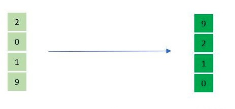

比如这是一堆书, 你人工整理排序应该如果排序?

```
1. 我们把书往另一边罗, 大的放下面, 小的放上面 (找大数)
2. 如果发现右边的没左边的大, 就把右边的罗去左边, 直到右边最大
3. 持续这个循环, 直到左边为空(没书了)
4. 将右边的书 倒过来, 就完成了 大的在顶部 小的在底部 大->小 排序完成 
```

我们来走一遍流程:

1. 我们取出顶上的书, 放到另一边 

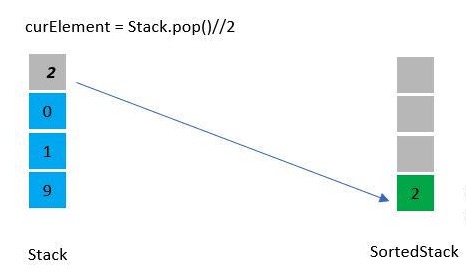

2. 我们再取出一本, 放过来时做比较, 如果比第一本小就放上面(小 --> 大 的排序)

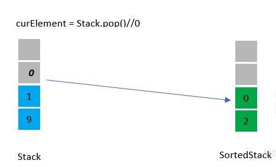

3. 我们取第3本书, 放过来继续比对, 1 > 0, 需要调整这2本书的位置

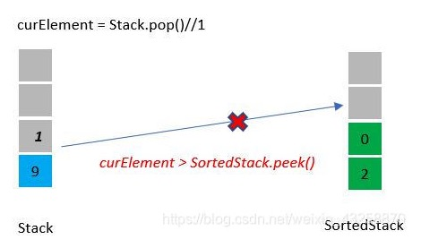

4. 怎么调整? 把不满足要求的0 放左边, 再次比较 1 > 2, 这次满足条件

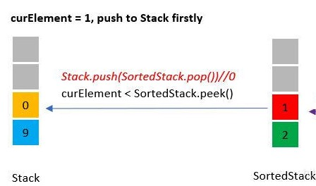

5. 重复上面的动作, 取出左边的到右边取判断

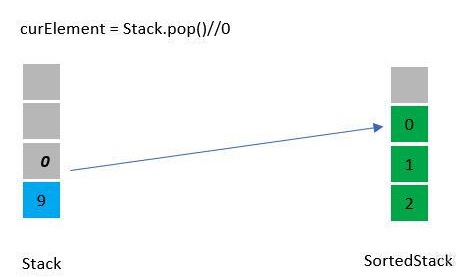

6. 同理继续

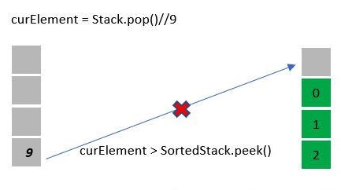

9不满足条件, 重复刚才的比较

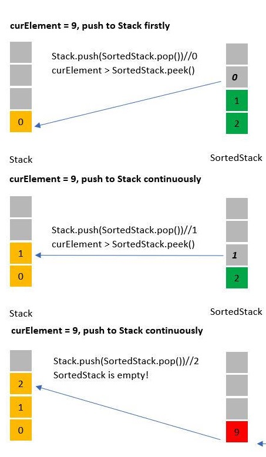

7. 最后我们的排序完成, 但是这个排序是从小到大的，怎么办？

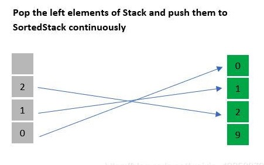

8. 倒过去

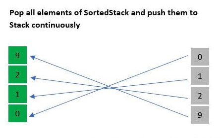


到处我们的排序完成, 接下来我们把这个过程抽象成算法:

> 分析结果

左边的书堆命名为原始Stack, 右边的书堆命名为OrderStack, 我们算法的核心逻辑是什么?

+ `取出左边到右边比较然后排序, 不满足条件落到右边, 重复直到左边为空`
+ 上面这种思路其实有专门的命名: 插入排序, 在要排序的一组数中，假定前n-1个数已经排好序，现在将第n个数插到前面的有序数列中，使得这n个数也是排好顺序的。如此反复循环，直到全部排号顺序
  
接下来我们用一代码来实现这个逻辑

```go
// 把stack的自己完成排序 (思考5分钟, 看看自己能写出来不)
func (s *Stack) Sort() {

}
```

对! 已经写完成, 我负责写测试用例
```go
func TestStackOrder(t *testing.T) {
	should := assert.New(t)

	s := stack.NewStack()
	s.Push(9)
	s.Push(1)
	s.Push(0)
	s.Push(2)

	s.Sort()
	should.Equal(s.Pop(), 9)
	should.Equal(s.Pop(), 2)
	should.Equal(s.Pop(), 1)
	should.Equal(s.Pop(), 0)
}
```


最终的排序实现:
```go
// 把stack的自己完成排序
func (s *Stack) Sort() {
	// 准备一个辅助的stack, 另一个书堆容器
	orderdStack := NewStack()

	for !s.IsEmpty() {
		// 然后开始我们的排序流程
		current := s.Pop()

		// 当前元素大于右边, 应该把右边的罗过左边, 直到右边再无小于左边的元素
		for !orderdStack.IsEmpty() && current.(int) > orderdStack.Peek().(int) {
			s.Push(orderdStack.Pop())
		}

		// 此时 当前值 一定是 <= 右边的
		orderdStack.Push(current)
	}

	// 倒过来
	for !orderdStack.IsEmpty() {
		s.Push(orderdStack.Pop())
	}
}
```

## 总结

+ 场景: 由于获取最近操作的数据, 特点: FILO（First In Last Out）,先进后出
+ 实现: 我们使用数组(底层), 实现了一个 顺序栈, 学习完链表后，可以使用链表实现链式栈
+ 应用: stack使用的地方很多, 以典型的排序问题为例，讲解了栈的一种用法, 衍生到 很多需要排序的场景，比如分页