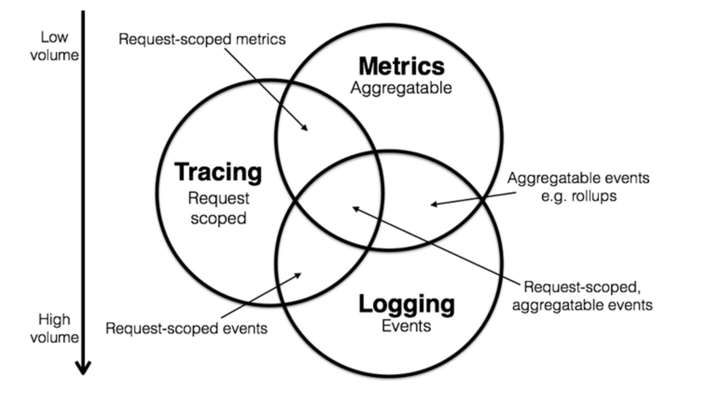

# Elastic APM

Kubernetes让微服务的部署变得容易, 但随着微服务规模的扩大，服务治理带来的挑战也会越来越大, 比如你的应用上线后, 某个客户反应有一个按钮点击后反应时快时慢, VIP客户哦？老板要你马上解决, 而此时线上有几百个微服务，至于服务间的调用关系，呵呵，你很有可能不清楚, 就问你慌不慌

这个问题该如何做手处理喃?
+ 首先，想到肯定是查看服务的日志(Logging), 如果有日志分析或者告警, 可以减少你的搜索范围
+ 如果有Trace系统, 可能快速定位到 找出服务调用链, 甚至直接找出问题, 如果没有，就只有基于日志大海捞针了
+ 为了观察当前应用的性能, 比如当前这个服务的接口响应速率, 你还需要查看监控(Metric)

向上面提到的看日志，看监控，以及Trace 有一个统一高大上的专业名词: 服务可观测性(observability)



在分布式系统里，系统的故障可能出现在任何节点，怎么能在出了故障的时候快速定位问题和解决问题，甚至是在故障出现之前就能感知到服务系统的异常，把故障扼杀在摇篮里。这就是可观测性的意义所在

有没工具能整合以上所有功能, 很好的实现服务的可观测性喃? 这就是我们今天主角: Elastic APM


## 凭啥选择Elastic APM


## 安装

我们采用Docker安装, 通过查看官方的镜像使用说明来获取最新的版本:
+ [elasticsearch](https://hub.docker.com/_/elasticsearch)
+ [kibana](https://hub.docker.com/_/kibana)
+ [apm-server](https://hub.docker.com/r/elastic/apm-server)

```
```


## 参考

+ [微服务应用性能如何](https://segmentfault.com/a/1190000037701422)
+ [Elastic APM 补齐服务监控](https://lxkaka.wang/golang-apm/)
+ [Kibana Guide](https://www.elastic.co/guide/en/kibana/current/index.html)
+ [Elasticsearch Guide](https://www.elastic.co/guide/en/elasticsearch/reference/current/index.html)