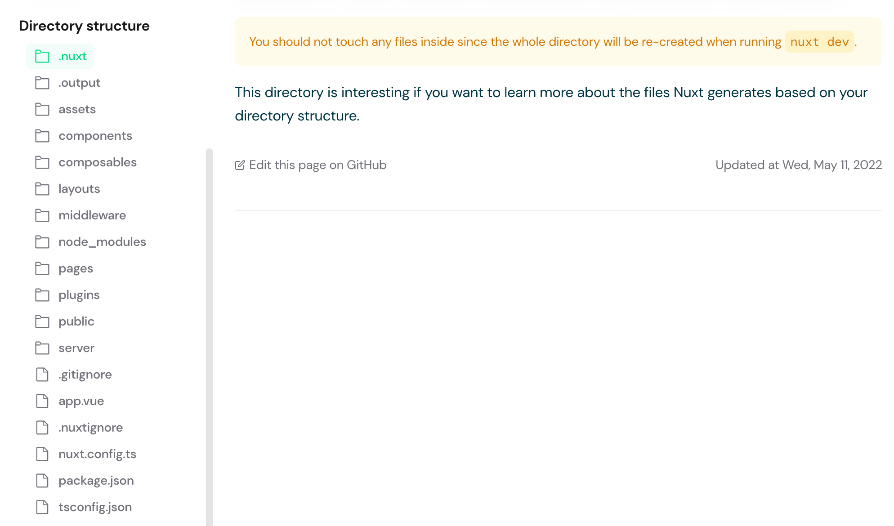

# 项目开发准备

## 安装NodeJs

到[NodeJs官网](https://nodejs.org/)下载最新的稳定版, 并安装
1. NodeJs 安装  
```sh
# NodeJs版本
> node -v
v16.15.0
# npm包管理工具版本
> npm -v 
8.5.5
```
## 安装Yarn
你可以认为Yarn是npm的增强版, 具体对比可以参考: [Yarn vs npm](https://www.cnblogs.com/ypppt/p/13050845.html)

```sh
# 安装Yarn
> npm install --global yarn
# 查看当前安装的版本
> yarn -v
1.22.18
```

## Yarn 源的管理

默认Yarn使用的是国外的源, 这对于国内开放者而言的体验是很差的(由于网速经常拉去不下来包), 因此我们需要切换源, 而yrm 就是专门用于管理yarn源配置的工具, YARN registry manager(yrm):
```sh
# 安装yrm
> npm install -g yrm
# 查看yrm的版本
> yrm -V    
1.0.6
```

处理这样查看我们可以通过npm来查看当前系统上已经安装的全局工具:
```sh
> npm -g ls
/usr/local/lib
├── corepack@0.10.0
├── npm@8.5.5
├── yarn@1.22.18
└── yrm@1.0.6
```

查看当前有哪些可用的源
```sh
> yrm ls
* npm ---- https://registry.npmjs.org/
  cnpm --- http://r.cnpmjs.org/
  taobao - https://registry.npm.taobao.org/
  nj ----- https://registry.nodejitsu.com/
  rednpm - http://registry.mirror.cqupt.edu.cn/
  npmMirror  https://skimdb.npmjs.com/registry/
  edunpm - http://registry.enpmjs.org/
  yarn --- https://registry.yarnpkg.com
```

最后我们通过yrm来设置我们的源:
```sh
# 使用淘宝的源
> yrm use taobao
   YARN Registry has been set to: https://registry.npm.taobao.org/
   NPM Registry has been set to: https://registry.npm.taobao.org/

# 测试下淘宝源当前下载速度
> yrm test taobao
    * taobao - 273ms
```

## npx安装

npm 从5.2版开始，增加了 npx 命令, 如果没有安装请手动安装:
```sh
# 查看当前npx版本
> npx -v
8.5.5
# 如果没有手动安装到全局
> npm install -g npx
```

## IDE插件安装

以vscode为例:

vue3的一些语法需要IDE提供高亮支持, 语法插件叫: Volar, 所以需要在IDE的插件里面安装Volar语法插件

vscode Volar Extension插件名称: Vue Language Features (Volar)

## NuxtJs工程

### 初始化工程
使用nuxi 初始化工程: devcloud
```sh
> npx nuxi init devcloud
Nuxt CLI v3.0.0-rc.3 
ℹ cloned nuxt/starter#v3 to /Users/yumaojun/Workspace/Nodejs/devcloud
 ✨ Your legendary Nuxt project is just created! Next steps:
 📁  cd devcloud
 💿  Install dependencies with npm install or yarn install or pnpm install --shamefully-hoist
 🚀  Start development server with npm run dev or yarn dev or pnpm run dev 
```

### 下载工程依赖
```sh
> yarn install
yarn install v1.22.18
info No lockfile found.
[1/4] 🔍  Resolving packages...
warning nuxt > nitropack > @vercel/nft > node-pre-gyp@0.13.0: Please upgrade to @mapbox/node-pre-gyp: the non-scoped node-pre-gyp package is deprecated and only the @mapbox scoped package will recieve updates in the future
[2/4] 🚚  Fetching packages...
warning vscode-languageclient@7.0.0: The engine "vscode" appears to be invalid.
[3/4] 🔗  Linking dependencies...
[4/4] 🔨  Building fresh packages...
success Saved lockfile.
✨  Done in 20.06s.
```

### 解决warning问题

1. 解决node-pre-gyp版本过低问题
```sh
> yarn upgrade @mapbox/node-pre-gyp
# 可以看到gyp的版本已经升级上去了
> yarn list | grep gyp
├─ @mapbox/node-pre-gyp@1.0.9
│  ├─ @mapbox/node-pre-gyp@^1.0.5
│  ├─ node-gyp-build@^4.2.2
│  ├─ node-pre-gyp@^0.13.0
├─ node-gyp-build@4.4.0
├─ node-pre-gyp@0.13.0
```

第二个问题等待nuxtjs官方升级, 展示对项目没影响

### 启动工程 

```sh
> yarn dev -o
```

启动完成后我们会看到这样一个页面:


接下来了解Nuxt这个脚手架，并编写Vue代码页面

## NuxtJs工程介绍

Nuxt的工程结构如下:



### 入口文件

收入我们需要找到工程的入口文件:
```
The app.vue file is the main component in your Nuxt 3 applications.
```

修改app.vue文件
```vue
<template>
  <div>
    <!-- <NuxtWelcome /> -->
    <h1>Hello World!</h1>
  </div>
</template>
```

### 业务页面

我们不可能把所有的页面逻辑都写在入口文件里面, 因此Nuxt为我们准备了一个


### 安装UI组件

通过插件的方式安装UI组件: plugins/element-plus.ts
```ts
import ElementPlus from 'element-plus'

export default defineNuxtPlugin(nuxtApp => {
    nuxtApp.vueApp.use(ElementPlus)
})
```


### 全局样式管理

修改Nuxt配置, 添加全局样式表

nuxt.config.ts
```ts
import { defineNuxtConfig } from 'nuxt'

// https://v3.nuxtjs.org/api/configuration/nuxt.config
export default defineNuxtConfig({
    // css
    css: ['~/assets/css/index.css'],
})
```


# 参考

+ [npx 使用教程](https://www.ruanyifeng.com/blog/2019/02/npx.html)
+ [node-pre-gyp官方介绍](https://www.npmjs.com/package/@mapbox/node-pre-gyp)
+ [vue3官方文档](https://vuejs.org/guide/introduction.html)
+ [nuxtjs官网](https://v3.nuxtjs.org/getting-started/quick-start)
+ [nuxt项目启动时跳过Are you interested in participation](http://www.flydream.cc/article/nuxt-bootstrap-skip-participation/)
+ [element-plus-nuxt-starter](https://github.com/element-plus/element-plus-nuxt-starter)