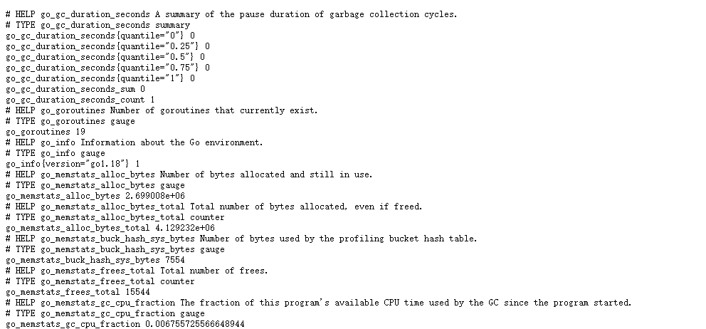
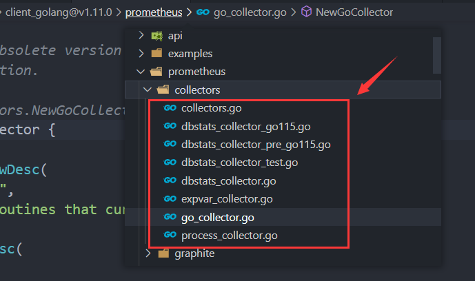

# Exporter 开发

我们将要开发的本机的: 8050:/metrics

我们提前配置到prometheus, 等下我们exporter启动后就能直接拉取数据


## 数据格式

prometheus是拉取数据的监控模型, 它对客户端暴露的数据格式要求如下:
```
# HELP go_goroutines Number of goroutines that currently exist.
# TYPE go_goroutines gauge
go_goroutines 19
```

## 简单粗暴

我们直接开发一个满足prometheus格式的API接口即可

```go
package main

import (
    "fmt"
    "net/http"
)

func HelloHandler(w http.ResponseWriter, r *http.Request) {
    fmt.Fprintf(w, "lexporter_request_count{user=\"admin\"} 1000" )
}

func main () {
    http.HandleFunc("/metrics", HelloHandler)
    http.ListenAndServe(":8050", nil)
}
```

## 使用SDK

大多数场景下，我们都没必要自己这样写, 可以利用Prometheus为我们提供的SDK快速完成Metric数据的暴露

### 默认指标

并不是所有的代码都需要我们自己去实现, Prometheus为我们准备了一个客户端, 我们可以基于客户端快速添加监控

```go
package main

import (
 "net/http"

 "github.com/prometheus/client_golang/prometheus/promhttp"
)

func main() {
    // Serve the default Prometheus metrics registry over HTTP on /metrics.
 http.Handle("/metrics", promhttp.Handler())
 http.ListenAndServe(":8050", nil)
}
```

然后我们可以在浏览器中访问 http://127.0.0.1:8050/metrics 来获得默认的监控指标数据: 



我们并没有在代码中添加什么业务逻辑，但是可以看到依然有一些指标数据输出，这是因为 Go 客户端库默认在我们暴露的全局默认指标注册表中注册了一些关于 promhttp 处理器和运行时间相关的默认指标，根据不同指标名称的前缀可以看出：

+ go_*：以 go_ 为前缀的指标是关于 Go 运行时相关的指标，比如垃圾回收时间、goroutine 数量等，这些都是 Go 客户端库特有的，其他语言的客户端库可能会暴露各自语言的其他运行时指标。
+ promhttp_*：来自 promhttp 工具包的相关指标，用于跟踪对指标请求的处理。

这些默认的指标是非常有用，但是更多的时候我们需要自己控制，来暴露一些自定义指标。这就需要我们去实现自定义的指标了。

### 自定义指标

Prometheus的Server端, 只认如下数据格式:
```
# HELP go_goroutines Number of goroutines that currently exist.
# TYPE go_goroutines gauge
go_goroutines 19
```

但是Prometheus客户端本身也提供一些简单数据二次加工的能力, 他把这种能力描述为4种指标类型: 
+ Gauges（仪表盘）：Gauge类型代表一种样本数据可以任意变化的指标，即可增可减。
+ Counters（计数器）：counter类型代表一种样本数据单调递增的指标，即只增不减，除非监控系统发生了重置。
+ Histograms（直方图）：创建直方图指标比 counter 和 gauge 都要复杂，因为需要配置把观测值归入的 bucket 的数量，以及每个 bucket 的上边界。Prometheus 中的直方图是累积的，所以每一个后续的 bucket 都包含前一个 bucket 的观察计数，所有 bucket 的下限都从 0 开始的，所以我们不需要明确配置每个 bucket 的下限，只需要配置上限即可。
+ Summaries（摘要）：与Histogram类似类型，用于表示一段时间内的数据采样结果（通常是请求持续时间或响应大小等），但它直接存储了分位数（通过客户端计算，然后展示出来），而不是通过区间计算

#### 指标采集

下面以SDK的方式演示4种指标的采集方式

##### Gauges

SDK提供了该指标的构造函数: NewGauge
```go
queueLength := prometheus.NewGauge(prometheus.GaugeOpts{
    // Namespace, Subsystem, Name 会拼接成指标的名称: magedu_mcube_demo_queue_length
    // 其中Name是必填参数
    Namespace: "magedu",
    Subsystem: "mcube_demo",
    Name:      "queue_length",
    // 指标的描信息
    Help:      "The number of items in the queue.",
    // 指标的标签
    ConstLabels: map[string]string{
        "module": "http-server",
    },
})
```

Gauge对象提供了如下方法用来设置他的值:
```go
// 使用 Set() 设置指定的值
queueLength.Set(0)

// 增加或减少
queueLength.Inc()   // +1：gauge增加1.
queueLength.Dec()   // -1：gauge减少1.
queueLength.Add(23) // 增加23个增量.
queueLength.Sub(42) // 减少42个.
```

下面是编写的一个测试用例:
```go
package metric_test

import (
	"fmt"
	"os"
	"testing"

	"github.com/prometheus/client_golang/prometheus"
	"github.com/prometheus/common/expfmt"
)

func TestGauge(t *testing.T) {
	queueLength := prometheus.NewGauge(prometheus.GaugeOpts{
		// Namespace, Subsystem, Name 会拼接成指标的名称: magedu_mcube_demo_queue_length
		// 其中Name是必填参数
		Namespace: "magedu",
		Subsystem: "mcube_demo",
		Name:      "queue_length",
		// 指标的描信息
		Help: "The number of items in the queue.",
		// 指标的标签
		ConstLabels: map[string]string{
			"module": "http-server",
		},
	})

	queueLength.Set(100)

	// 创建一个自定义的注册表
	registry := prometheus.NewRegistry()
	registry.MustRegister(queueLength)

	// 获取注册所有数据
	data, err := registry.Gather()
	if err != nil {
		panic(err)
	}

	// 编码输出
	enc := expfmt.NewEncoder(os.Stdout, expfmt.FmtText)
	fmt.Println(enc.Encode(data[0]))
}
```
执行后他的输出
```
# HELP magedu_mcube_demo_queue_length The number of items in the queue.
# TYPE magedu_mcube_demo_queue_length gauge
magedu_mcube_demo_queue_length{module="http-server"} 100
```

##### Counters

Counters是计算器指标, 用于统计次数使用, 通过 prometheus.NewCounter() 函数来初始化指标对象
```go
totalRequests := prometheus.NewCounter(prometheus.CounterOpts{
 Name: "http_requests_total",
 Help: "The total number of handled HTTP requests.",
})
```


##### Histograms


##### Summaries


#### 指标注册

我们把指标采集完成后 需要注册给Prometheus的Http Handler这样才能暴露出去, 好在Prometheus的客户端给我们提供了对于的接口

Prometheus 定义了一个注册表的接口:
```go
// 指标注册接口
type Registerer interface {
	// 注册采集器, 有异常会报错
	Register(Collector) error
	// 注册采集器, 有异常会panic
	MustRegister(...Collector)
	// 注销该采集器
	Unregister(Collector) bool
}
```

##### 默认注册表

Prometheus 实现了一个默认的Registerer对象, 也就是默认注册表
```go
var (
	defaultRegistry              = NewRegistry()
	DefaultRegisterer Registerer = defaultRegistry
	DefaultGatherer   Gatherer   = defaultRegistry
)
```

我们通过prometheus提供的MustRegister可以将我们自定义指标注册进去
```go
// 在默认的注册表中注册该指标
prometheus.MustRegister(temp)
prometheus.Register()
prometheus.Unregister()
```

下面时一个完整的例子
```go
package main

import (
 "net/http"

 "github.com/prometheus/client_golang/prometheus"
 "github.com/prometheus/client_golang/prometheus/promhttp"
)

func main() {
    // 创建一个 gauge 类型的指标
    queueLength := prometheus.NewGauge(prometheus.GaugeOpts{
        // Namespace, Subsystem, Name 会拼接成指标的名称: magedu_mcube-demo_queue_length
        // 其中Name是必填参数
        Namespace: "magedu",
        Subsystem: "mcube_demo",
        Name:      "queue_length",
        // 指标的描信息
        Help:      "The number of items in the queue.",
        // 指标的标签
        ConstLabels: map[string]string{
            "module": "http-server",
        },
    })

 // 在默认的注册表中注册该指标
 prometheus.MustRegister(queueLength)

 // 设置 gauge 的值为 100
 queueLength.Set(100)

 // 暴露指标
 http.Handle("/metrics", promhttp.Handler())
 http.ListenAndServe(":8050", nil)
}
```

启动后重新访问指标接口 http://localhost:8050/metrics，仔细对比我们会发现多了一个名为magedu_mcube_demo_queue_length 的指标:
```
...
# HELP magedu_mcube_demo_queue_length The number of items in the queue.
# TYPE magedu_mcube_demo_queue_length gauge
magedu_mcube_demo_queue_length{module="http-server"} 100
...
```

##### 自定义注册表

Prometheus 默认的Registerer, 会添加一些默认指标的采集, 比如上面的看到的go运行时和当前process相关信息, 如果不想采集指标, 那么最好的方式是 使用自定义的注册表

```go
package main

import (
 "net/http"

 "github.com/prometheus/client_golang/prometheus"
 "github.com/prometheus/client_golang/prometheus/promhttp"
)

func main() {
	// 创建一个自定义的注册表
	registry := prometheus.NewRegistry()

	queueLength := prometheus.NewGauge(prometheus.GaugeOpts{
		// Namespace, Subsystem, Name 会拼接成指标的名称: magedu_mcube-demo_queue_length
		// 其中Name是必填参数
		Namespace: "magedu",
		Subsystem: "mcube_demo",
		Name:      "queue_length",
		// 指标的描信息
		Help: "The number of items in the queue.",
		// 指标的标签
		ConstLabels: map[string]string{
			"module": "http-server",
		},
	})

	// 设置 gauge 的值为 100
	queueLength.Set(100)

	// 在自定义的注册表中注册该指标
	registry.MustRegister(queueLength)
}
```

+ 使用NewRegistry()创建一个全新的注册表
+ 通过注册表对象的MustRegister把指标注册到自定义的注册表中

暴露指标的时候必须通过调用 promhttp.HandleFor() 函数来创建一个专门针对我们自定义注册表的 HTTP 处理器，我们还需要在 promhttp.HandlerOpts 配置对象的 Registry 字段中传递我们的注册表对象
```go
...
// 暴露指标
http.Handle("/metrics", promhttp.HandlerFor(registry, promhttp.HandlerOpts{Registry: registry}))
http.ListenAndServe(":8050", nil)
```

最后我们看到我们的指标少了很多, 除了promhttp_metric_handler就只有我们自定义的指标了
```
# HELP magedu_mcube_demo_queue_length The number of items in the queue.
# TYPE magedu_mcube_demo_queue_length gauge
magedu_mcube_demo_queue_length{module="http-server"} 100
# HELP promhttp_metric_handler_errors_total Total number of internal errors encountered by the promhttp metric handler.
# TYPE promhttp_metric_handler_errors_total counter
promhttp_metric_handler_errors_total{cause="encoding"} 0
promhttp_metric_handler_errors_total{cause="gathering"} 0
```

那如果后面又想把go运行时和当前process相关加入到注册表中暴露出去怎么办?

其实Prometheus在客户端中默认有如下Collector供我们选择



只需把我们需要的添加到我们自定义的注册表中即可
```go
 // 添加 process 和 Go 运行时指标到我们自定义的注册表中
 registry.MustRegister(prometheus.NewProcessCollector(prometheus.ProcessCollectorOpts{}))
 registry.MustRegister(prometheus.NewGoCollector())
```

然后我们再次访问http://localhost:8050/metrics, 是不是发现之前少的指标又回来了

通过查看prometheus提供的Collectors我们发现, 直接把指标注册到registry中的方式不太优雅, 为了能更好的模块化, 我们需要把指标采集封装为一个Collector对象, 这也是很多第三方Collecotor的标准写法

### 采集器

下面是Collector接口声明:
```go
type Collector interface {
	// 指标的一些描述信息, 就是# 标识的那部分
	// 注意这里使用的是指针, 因为描述信息 全局存储一份就可以了
	Describe(chan<- *Desc)
	// 指标的数据, 比如 promhttp_metric_handler_errors_total{cause="gathering"} 0
	// 这里没有使用指针, 因为每次采集的值都是独立的
	Collect(chan<- Metric)
}
```
下面我们就把之前的单个指标的采集, 改造成使用采集器的方式编写

#### demo采集器

实现demo采集器
```go
func NewDemoCollector() *DemoCollector {
	return &DemoCollector{
		// 使用prometheus.NewDesc来创建一个指标描述
		queueLengthDesc: prometheus.NewDesc(
			"magedu_mcube_demo_queue_length",
			"The number of items in the queue.",
			nil,
			prometheus.Labels{"module": "http-server"},
		),
	}
}

type DemoCollector struct {
	queueLengthDesc *prometheus.Desc
}

func (c *DemoCollector) Describe(ch chan<- *prometheus.Desc) {
	ch <- c.queueLengthDesc
}

func (c *DemoCollector) Collect(ch chan<- prometheus.Metric) {
	ch <- prometheus.MustNewConstMetric(c.queueLengthDesc, prometheus.GaugeValue, 100)
}
```

重构后我们的代码将变得简洁优雅:
```go
package main

import (
 "net/http"

 "github.com/prometheus/client_golang/prometheus"
 "github.com/prometheus/client_golang/prometheus/promhttp"
)

func main() {
	// 创建一个自定义的注册表
	registry := prometheus.NewRegistry()

	// 可选: 添加 process 和 Go 运行时指标到我们自定义的注册表中
	registry.MustRegister(prometheus.NewProcessCollector(prometheus.ProcessCollectorOpts{}))
	registry.MustRegister(prometheus.NewGoCollector())

	// 注册自定义采集器
	registry.MustRegister(NewDemoCollector())

	// 暴露指标
	http.Handle("/metrics", promhttp.HandlerFor(registry, promhttp.HandlerOpts{Registry: registry}))
	http.ListenAndServe(":8050", nil)
 }
```