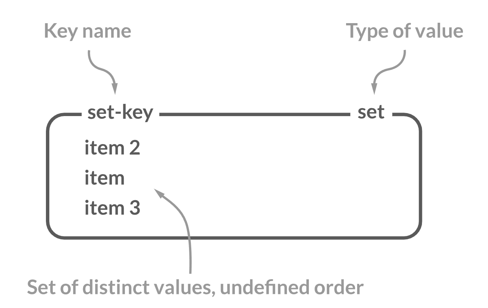
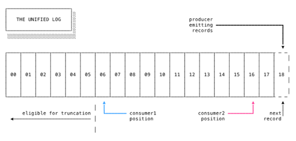

# Redis数据结构


## 环境准备

```sh
# 使用Docker启动一个Redis服务
docker run -p 6379:6379 -itd --name redis  redis
# 进入Redis的命令交互界面
docker exec -it redis redis-cli
```

## 关于Key


## Value类型


### Strings


Strings 数据结构是简单的key-value类型，value其实不仅是String，也可以是数字

#### 基本操作

+ set
+ mset
+ get
+ mget
+ type
+ exists
+ del

单值操作:
```
127.0.0.1:6379> set mykey somevalue
OK
127.0.0.1:6379> get mykey
"somevalue"
```

多值操作:
```
127.0.0.1:6379> mset a 10 b 20 c 30
OK
127.0.0.1:6379> mget a b c
1) "10"
2) "20"
3) "30"
```

判断key是否存在与删除key
```
127.0.0.1:6379> set mykey hello
OK

# 获取值得长度
127.0.0.1:6379> STRLEN mykey
(integer) 5

# 判断key的类型
127.0.0.1:6379> type mykey
string

# 判断key是否存在
127.0.0.1:6379> exists mykey
(integer) 1

# 删除key
127.0.0.1:6379> del mykey
(integer) 0
127.0.0.1:6379> exists mykey
(integer) 0
```

#### 设置过期

在添加key的时候, 我们可以为其添加参数, 其中最常用的就是 ex参数, 控制过期时长

```
127.0.0.1:6379> set key 100 ex 10
OK
127.0.0.1:6379> ttl key
(integer) 8
127.0.0.1:6379> get key
"100"
127.0.0.1:6379> ttl key
(integer) 2
127.0.0.1:6379> get key
"100"
127.0.0.1:6379> ttl key
(integer) -2
127.0.0.1:6379> get key
(nil)
```

其实 set 还支持很多参数
```
set key value [EX seconds|PX milliseconds|EXAT timestamp|PXAT milliseconds-timestamp|KEEPTTL] [NX|XX] [GET]
```

更多操作请参考 [commands for strings](https://redis.io/commands/?group=string)


#### 应用场景


##### 缓存系统

使用Strings类型，完全实现目前 Memcached 的功能，并且效率更高。还可以享受Redis的定时持久化，操作日志及 Replication等功能


##### 分布式锁

针对 set 还有2个参数: 
+ NX – Only set the key if it does not already exist.
+ XX – Only set the key if it already exist.

应该redis是并发安全的, 所以我们可以基于此来实现分布式锁

```
# set 如果不存在 就添加了一个 5秒过期的key
# 如果key存在就不会有任何操作
127.0.0.1:6379> set lock_key 1 ex 5 nx
OK
127.0.0.1:6379> set lock_key 1 ex 5 nx
(nil)

# 5秒过后
127.0.0.1:6379> set lock_key 1 ex 5 nx
OK
127.0.0.1:6379> set lock_key 1 ex 5 nx
(nil)

# set 添加
127.0.0.1:6379> set lock_key 1 ex 5 nx
OK
127.0.0.1:6379> del lock_key
(integer) 1
```

存在问题:
+ 任务超时, 锁自动释放, 但是任务并没有处理完成
+ 加锁和释放锁不在同一个线程
+ redis集群(异步复制延迟，造成锁丢失)
+ 使用Redlock 基于Redis多实例实现, [Redlock源码详解](https://baijiahao.baidu.com/s?id=1716738811409438138&wfr=spider&for=pc)

建议使用Etcd实现分布式锁

##### 计算器

除了有简单的SET,GET操作, Redis为了解决分布式系统的计数问题, 专门支持了一些Counter操作:

+ incr:  +1
+ incrby:+n
+ decr:  -1
+ decrby:-n

```
127.0.0.1:6379> set counter 100
OK
127.0.0.1:6379> incr counter
(integer) 101   
127.0.0.1:6379> incr counter
(integer) 102   
127.0.0.1:6379> decr counter
(integer) 101   
127.0.0.1:6379> incrby counter 100
(integer) 201   
127.0.0.1:6379> decrby counter 100
(integer) 101   
127.0.0.1:6379>
```

### Sets




### Sorted Sets


### Lists


#### 基本操作

+ rpush：right push(at the tail), 从右边往list里面添加元素, 也就是append操作 
+ lpush: left push(at the head), 从左边往list里面添加元素, 也就是从头添加
+ lrange: 通过索引访问列表中的元素

```
# 添加一个或者多个元素到 mylist中
127.0.0.1:6379> rpush mylist A
(integer) 1
127.0.0.1:6379> rpush mylist B
(integer) 2
127.0.0.1:6379> rpush mylist C D
(integer) 4

# 查看mylist中 一个或者多个元素
127.0.0.1:6379> lrange mylist 0 0
1) "A"
127.0.0.1:6379> lrange mylist 0 4
1) "A"
2) "B"
3) "C"
4) "D"
```


### Hashes


### Bitmaps


### Bitfields


### HyperLogLog


### Geospatial indexes


### Streams




## 参考

+ [Data Structures](https://redis.com/redis-enterprise/data-structures/)
+ [Data types tutorial](https://redis.io/docs/manual/data-types/data-types-tutorial/)
+ [Redis data types](https://redis.io/docs/manual/data-types/)