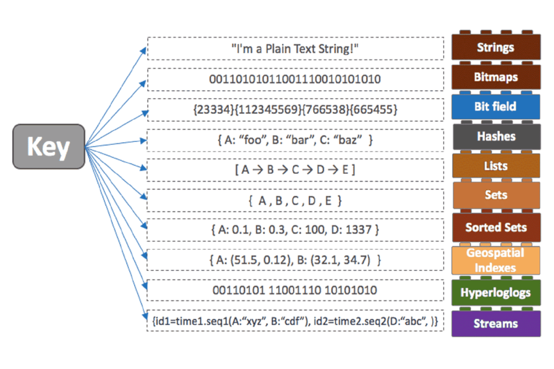
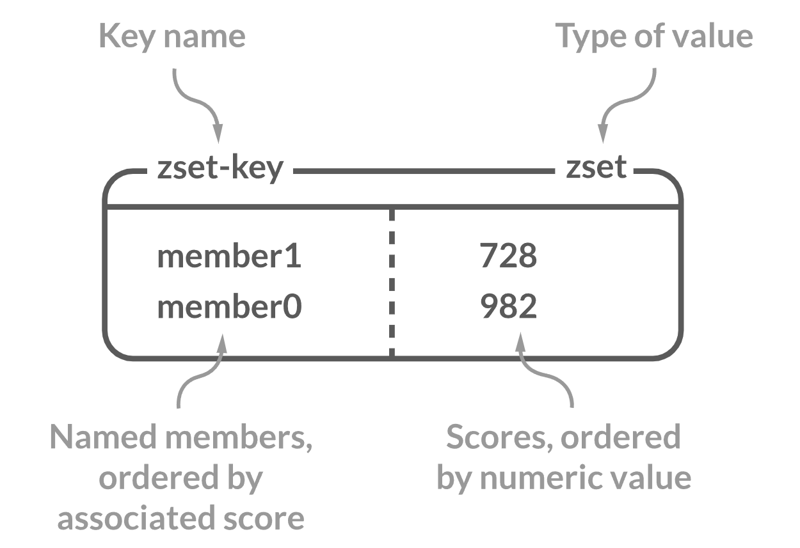
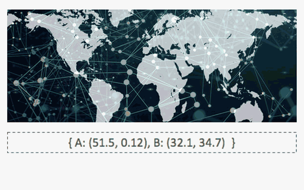

# 数据结构



```sh
# 使用Docker启动一个Redis服务
docker run -p 6379:6379 -itd --name redis  redis
# 进入Redis的命令交互界面
docker exec -it redis redis-cli
```

## Strings


### 基本操作

单值操作:
```
127.0.0.1:6379> set mykey somevalue
OK
127.0.0.1:6379> get mykey
"somevalue"
```

多值操作:
```
127.0.0.1:6379> mset a 10 b 20 c 30
OK
127.0.0.1:6379> mget a b c
1) "10"
2) "20"
3) "30"
```

更多操作请参考 [commands for strings](https://redis.io/commands/?group=string)

## Sets


## Sorted Sets



## Lists


## Hashes


## Bitmaps


## Bitfields


## HyperLogLog


## Geospatial indexes



## Streams


## 参考

+ [Data Structures](https://redis.com/redis-enterprise/data-structures/)
+ [Data types tutorial](https://redis.io/docs/manual/data-types/data-types-tutorial/)
+ [Redis data types](https://redis.io/docs/manual/data-types/)