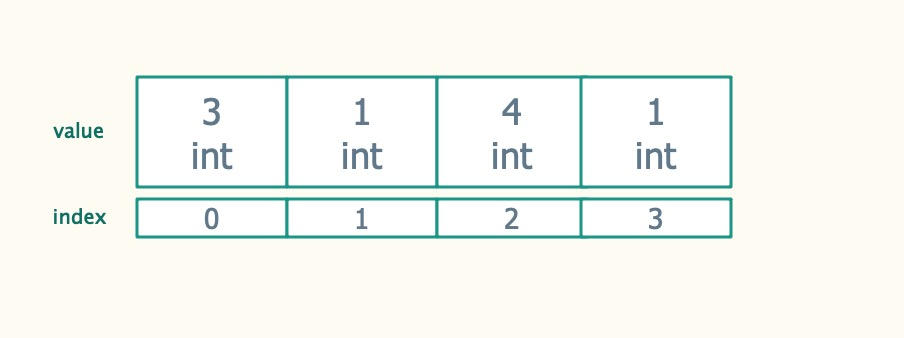
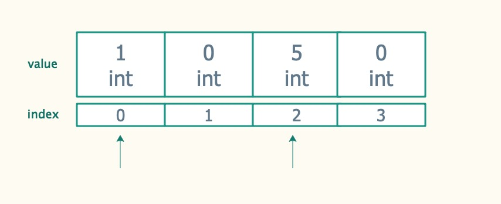
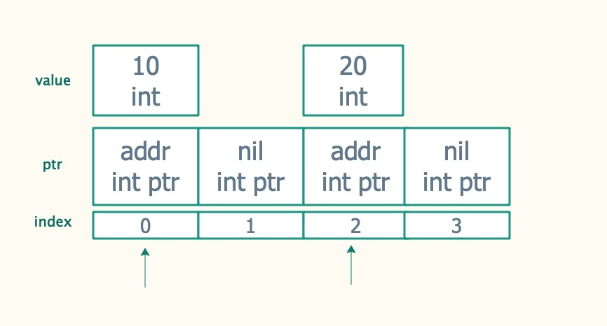
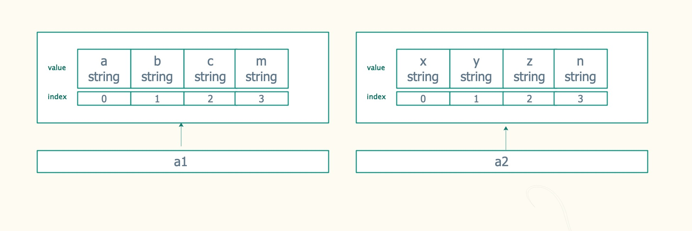
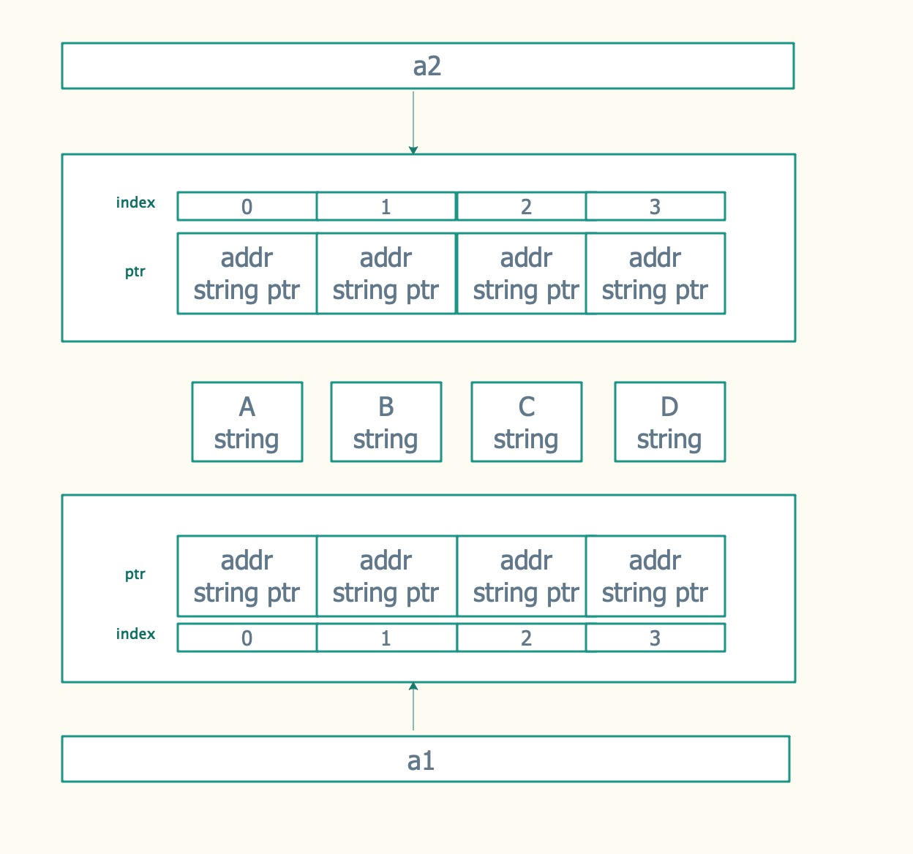

# Go语言数组

有过Python、JavaScript编程经验的人都知道它们的数组是动态的, 可以随需求自动增大数组长度, Go里面的数组长度却是固定的，无法扩大或者缩小,
但Go中也有类似的动态"数组"，称为slice，会下下节课讲到

Go中的数组是slice和map两种数据类型的基础，这两种数据类型的底层都是通过数组实现的, 因此我们先详解讲解Go数组的使用

## 存储方式

当在Go中声明一个数组之后，会在内存中开辟一段固定长度的、连续的空间存放数组中的各个元素，这些元素的数据类型完全相同，可以是内置的简单数据类型(int、string等)，也可以是自定义的struct类型。

+ 固定长度：这意味着数组不可增长、不可缩减。想要扩展数组，只能创建新数组，将原数组的元素复制到新数组
+ 连续空间：这意味可以在缓存中保留的时间更长，搜索速度更快，是一种非常高效的数据结构，同时还意味着可以通过数值index的方式访问数组中的某个元素
+ 数据类型：意味着限制了每个block中可以存放什么样的数据，以及每个block可以存放多少字节的数据

例如，使用下面的语句声明一个长度为4的int类型的数组，那么这个数组最多只能存放4个元素，且所有元素都只能是int类型。同时，还为这个数组做了初始化

```go
array := [4]int{3, 1, 4,1 }
```

这个数组的结构如下图所示:



最下面一排是这个数组值的存放位置, 也就是index, index是从0开始计算

## 声明与初始化

1.声明语法

Go 语言数组声明需要指定元素类型及元素个数，语法格式如下

```go
var variable_name [SIZE] variable_type
```

比如我们声明一个长度为5, 类型是float64的数组

```go
var arrayf [5]float64
```

2.数组类型

必须注意，虽然我们称呼数组为int类型的数组，但数组的数据类型是两部分组成的[n]TYPE，这个整体才是数组的数据类型。所以，[4]int和[5]int是两种不同的数组类型。

```go
var (
    a1 [4]int
    a2 [5]int
)
fmt.Println(reflect.TypeOf(a1))
fmt.Println(reflect.TypeOf(a2))
```

3.数组默认值

当一个变量被声明之后, 都会立即赋予一个默认值, 数组的默认值和数组的数据类型有关

```go
var a1 [5]int
fmt.Println(a1) // [0 0 0 0 0]
var a2 [4]string
fmt.Println(a2) // [   ]
```

4.声明并初始化
如果我们不想填充默认值, 可以声明时就赋值

```go
a1 := [3]int{1, 2, 3}
fmt.Println(a1)
// 如果将元素个数指定为特殊符号...，则表示通过初始化时的给定的值个数来推断数组长度
a2 := [...]int{1, 2, 3, 4}
fmt.Println(a2)
a3 := [...]int{1, 1, 1}
fmt.Println(a3)
// 如果声明数组时，只想给其中某几个元素初始化赋值，则使用索引号
a4 := [4]int{0: 1, 3: 5}
fmt.Println(a4)
```



## 访问与修改

我们可以通过数组的索引访问数组的值:

```go
a := [4]int{0: 1, 3: 5}
fmt.Println(a[0])
fmt.Println(a[3])
```

同理我们可通过数组的索引修改数组的值:

```go
a[0] = 10
a[3] = 20
fmt.Println(a[0])
fmt.Println(a[3])
```

## 指针数组

可以声明一个指针类型的数组，这样数组中就可以存放指针。注意，指针的默认初始化值为nil

例如，创建int类型指针的数组：

```go
a := [4]*int{0: new(int), 3: new(int)}
fmt.Println(a)

// 如果指针地址为空, 是会报空指针错误的, 比如
// *a[1] = 3

*a[0] = 10
*a[3] = 20
fmt.Println(a)
fmt.Println(*a[0], *a[3])

// 为1赋值
a[1] = new(int)
*a[1] = 30
fmt.Println(a, *a[1])
```



## 数组拷贝

在Go中，由于数组算是一个值类型，所以可以将它赋值给其它数组
因为数组类型的完整定义为[n]TYPE，所以数组赋值给其它数组的时候，n和TYPE必须相同

例如:

```go
a1 := [4]string{"a", "b", "c", "m"}
a2 := [4]string{"x", "y", "z", "n"}
a1 = a2
fmt.Println(a1, a2)
```



数组赋值给其它数组时，实际上是完整地拷贝一个数组。所以，如果数组是一个指针型的数组，那么拷贝的将是指针数组，而不会拷贝指针所指向的对象

```go
a1 := [4]*string{new(string), new(string), new(string), new(string)}
a2 := a1
fmt.Println(a1, a2)

*a1[0] = "A"
*a1[1] = "B"
*a1[2] = "C"
*a1[3] = "D"
fmt.Println(*a1[0], *a2[0])
```



## 数组遍历

range关键字可以对array进行迭代，每次返回一个index和对应的元素值。可以将range的迭代结合for循环对array进行遍历

```go
a := [4]int{1, 2, 3, 4}
for i, v := range a {
    fmt.Println(i, v)
}
```

## 多维数组

可以通过组合两个一维数组的方式构成二维数组, 二维数据还是比较常用，

比如定义坐标, 表示4个坐标 (1,1) (2,2) (3,3) (4,4)

```go
pos := [4][2]int{{1, 1}, {2, 2}, {3, 3}, {4, 4}}
fmt.Println(pos)

// 修改第一点的坐标
pos[0] = [2]int{10, 10}
fmt.Println(pos)
```

## 数组作为函数参数

Go中的传值方式是按值传递，这意味着给变量赋值、给函数传参时，都是直接拷贝一个副本然后将副本赋值给对方的。这样的拷贝方式意味着：

+ 如果数据结构体积庞大，则要完整拷贝一个数据结构副本时效率会很低
+ 函数内部修改数据结构时，只能在函数内部生效，函数一退出就失效了，因为它修改的是副本对象

1.值拷贝

2.传递指针
