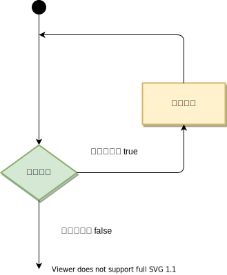

# 循环语句

## 循环语句



### for循环

语法

完整写法:

```go
for init; condition; post { }
```

+ init： 一般为赋值表达式，给控制变量赋初值；
+ condition： 关系表达式或逻辑表达式，循环控制条件；
+ post： 一般为赋值表达式，给控制变量增量或减量。

实例: 计算 1 到 10 的数字之和：

```go
package main

import "fmt"

func main() {
        sum := 0
        for i := 0; i <= 10; i++ {
                sum += i
        }
        fmt.Println(sum)
}
```

简短写法
init 和 post 参数是可选的，我们可以直接省略它，类似 While 语句

```go
for condition { }
```

实例:

```go
package main

import "fmt"

func main() {
        sum := 1
        for ; sum <= 10; {
                sum += sum
        }
        fmt.Println(sum)

        // 这样写也可以，更像 While 语句形式
        for sum <= 10{
                sum += sum
        }
        fmt.Println(sum)
}
```

无限循环 : for { }

实例:

```go
package main

import "fmt"

func main() {
        sum := 0
        for {
            sum++ // 无限循环下去
        }
        fmt.Println(sum) // 无法输出
}
```

嵌套循环:

```go
for [condition |  ( init; condition; increment ) | Range]
{
   for [condition |  ( init; condition; increment ) | Range]
   {
      statement(s);
   }
   statement(s);
}
```

实例1: 九九乘法表

```go
package main 

import "fmt"

func main() {
    for m := 1; m < 10; m++ {
    /*    fmt.Printf("第%d次：\n",m) */
        for n := 1; n <= m; n++ {
            fmt.Printf("%dx%d=%d ",n,m,m*n)
        }
        fmt.Println("")
    }
}
```

实例2:  2 到 100 间的素数

素数：除了能被一和本身整除不能被其它正数整除
所以判断一个数是不是素数只需要将比它小的数进行一个求余的计算
先把2-100都列出来,再把2的倍数划掉,接着是三,同理向下推,把素数的倍数都划掉,最后剩下的就都是素数了

```go
package main

import "fmt"

func main() {
   /* 定义局部变量 */
   var i, j int
   var isP bool
   for i=2; i < 100; i++ {
      isP = true 
      for j=2; j <= (i/j); j++ {
         fmt.Println(i, j)
         if(i%j==0) {
            isP = false
            break; // 如果发现因子，则不是素数
         }
      }
      if isP {
         fmt.Printf("%d  是素数\n", i);
      }
   }  
}
```

循环中断

> break: 经常用于中断当前 for 循环或跳出 switch 语句

break 语法格式如下:

```go
break;
```

实例: 在变量 a 大于 15 的时候跳出循环

```go
package main

import "fmt"

func main() {
   /* 定义局部变量 */
   var a int = 10

   /* for 循环 */
   for a < 20 {
      fmt.Printf("a 的值为 : %d\n", a);
      a++;
      if a > 15 {
         /* 使用 break 语句跳出循环 */
         break;
      }
   }
}
```

以下实例有多重循环，演示了使用标记和不使用标记的区别：

```go
package main

import "fmt"

func main() {

    // 不使用标记
    fmt.Println("---- break ----")
    for i := 1; i <= 3; i++ {
        fmt.Printf("i: %d\n", i)
                for i2 := 11; i2 <= 13; i2++ {
                        fmt.Printf("i2: %d\n", i2)
                        break
                }
        }

    // 使用标记
    fmt.Println("---- break label ----")
    re:
        for i := 1; i <= 3; i++ {
            fmt.Printf("i: %d\n", i)
            for i2 := 11; i2 <= 13; i2++ {
                fmt.Printf("i2: %d\n", i2)
                break re
            }
        }
}
```

## 跳转语句

Go 语言的 goto 语句可以无条件地转移到过程中指定的行。
goto 语句通常与条件语句配合使用。可用来实现条件转移， 构成循环，跳出循环体等功能。
但是，在结构化程序设计中一般不主张使用 goto 语句， 以免造成程序流程的混乱，使理解和调试程序都产生困难

语法

goto 语法格式如下：

```go
goto label;
..
.
label: statement;
```

实例: 在变量 a 等于 15 的时候跳过本次循环并回到循环的开始语句 LOOP 处

```go
package main

import "fmt"

func main() {
   /* 定义局部变量 */
   var a int = 10

   /* 循环 */
   LOOP: for a < 20 {
      if a == 15 {
         /* 跳过迭代 */
         a = a + 1
         goto LOOP
      }
      fmt.Printf("a的值为 : %d\n", a)
      a++    
   }  
}
```