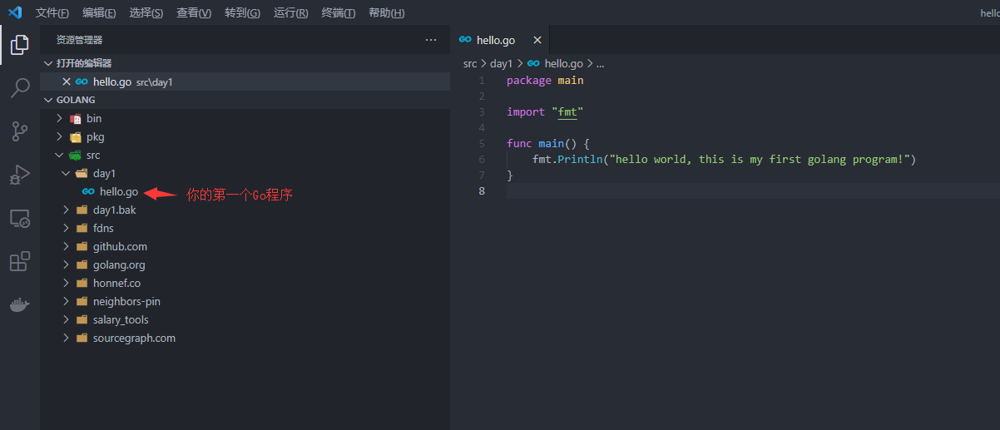

# 第一个Go程序

编写一个hello world程序, 并可以运行它

## 工作目录

go语言有2种工程结构:
+ GOPATH工程结构
+ GO MODULE工程结构

我们这里先讲解GOPATH工程结构, 等后面引入包的概念后再开始使用GO MODULE工程结构, 而Go1.16默认使用的GO MODULE工程结构, 因此我们需要修改下设置
```
go env -w GO111MODULE=auto
```

工作目录是一个工程开发的相对参考目录, GOPATH工程结构中的工作目录就是GOPATH变量指向的目录 我们可以通过GOPATH这个变量查看当前设置的工作目录
```sh
$ go env GOPATH // 通过go env 可以查看go语言设置相关的所有变量
E:\Golang       // 这是我的工作目录
```

Go语言规定了工作目录的目录结构:


以上 $GOPATH 目录约定有三个子目录：
+ src 存放源代码（比如：.go .c .h .s等）
+ pkg 编译后生成的静态库（比如：.a）, 多个静态库文件通过连接器连接 最终构成我们要得目标文件
+ bin 编译后生成的可执行文件（为了方便，可以把此目录加入到 $PATH 变量中，如果有多个gopath，那么使用${GOPATH//://bin:}/bin添加所有的bin目录）

如果你的这3个目录不存在请提前创建
```sh
mkdir bin pkg src
```

## 编写程序

使用vscode打开你的工作目录



我们在src下编写我们的第一个Go程序: hello.go
```golang
package main

import "fmt"

func main() {
        fmt.Println("hello world, this is my first golang program!")
}
```

解读:
+ package: Go源文件开头必须使用 package 声明代码所属包，包是 Go 代码分发的最基本单位。若程序需要运行包名必须为 main。
+ import: 用于导入程序依赖的所有的包。此程序依赖于 fmt 包。
+ func: 用于定义函数。main 函数是程序的入口,若程序需要运行必须声明 main 函数,main
函数无参数也无返回值
+ fmt.Println 调用 fmt.Println 函数将参数信息打印到控制台

## 运行程序

### 快速运行

```sh
$ go run src/day1/hello.go 
hello world, this is my first golang program!
```
go run：用于直接运行程序, 编译和运行一个Go的main包

### 编译运行

```
go build -o day1/hello.exe day1/hello.go   // 编译hello.go, 输出二进制目标文件hello.exe
./day1/hello.exe     // 运行编译好的hello.exe
hello world, this is my first golang program!
```

go build: 用于编译&链接程序或包

常用参数说明：
+ -x: 打印编译过程执行的命令，并完成编译或运行
+ -n: 只打印编译过程执行命令
+ -work：打印编译过程的临时目录
+ -o: 指定编译结果文件

## 扩展知识

### go env

我们可以通过go env 打印当前Go运行的所有环境变量配置
```sh
$ go env
set GO111MODULE=auto
set GOARCH=amd64
set GOBIN=
set GOCACHE=C:\Users\yumaojun\AppData\Local\go-build    
set GOENV=C:\Users\yumaojun\AppData\Roaming\go\env      
set GOEXE=.exe
set GOFLAGS=
set GOHOSTARCH=amd64
set GOHOSTOS=windows
set GOINSECURE=
set GOMODCACHE=E:\Golang\pkg\mod
set GONOPROXY=
set GONOSUMDB=
set GOOS=windows
set GOPATH=E:\Golang
set GOPRIVATE=
set GOPROXY=https://goproxy.cn
set GOROOT=C:\Program Files\Go
set GOSUMDB=sum.golang.org
set GOTMPDIR=
set GOTOOLDIR=C:\Program Files\Go\pkg\tool\windows_amd64
set GOVCS=
set GOVERSION=go1.16.4
set GCCGO=gccgo
set AR=ar
set CC=gcc
set CXX=g++
set CGO_ENABLED=1
set GOMOD=
set CGO_CFLAGS=-g -O2
set CGO_CPPFLAGS=
set CGO_CXXFLAGS=-g -O2
set CGO_FFLAGS=-g -O2
set CGO_LDFLAGS=-g -O2
set PKG_CONFIG=pkg-config
set GOGCCFLAGS=-m64 -mthreads -fmessage-length=0 -fdebug-prefix-map=C:\Users\yumaojun\AppData\Local\Temp\go-build483455790=/tmp/go-build -gno-record-gcc-switches
```

读取环境变量的值： go env <ENV_NAME>
```sh
go env GO111MODULE
```

设置环境变量的值: go env -w <ENV_NAME>=<ENV_VALUE>
```sh
go env -w GO111MODULE=auto
```

### go tool

go tool 是一组工具集, 支持很多子命令:
```sh
$ go tool
addr2line
api
asm
buildid
cgo
compile   // 编译源代码, 生成静态库或者目标文件
cover
dist
doc
fix
go_bootstrap
link     // 链接目标文件和目标文件依赖的静态库 生成最终的可执行二进制文件
nm
objdump
pack
pprof
test2json
trace   
vet
```

我们使用go tool 提供的 compile 和 link 来手动编译一个程序, 这有助于你更好的理解编译的过程

1. 首先我们需要写一个这样一个样例程序


我们在day1下面创建一个compile目录, 用于存放我们这次演示的项目代码
```sh
mkdir day1/compile
```
然后我们先编写pkg包: day1/compile/pkg/demo.go
```golang
package pkg

import "fmt"

func Demo() {
        fmt.Println("This is demo for go install")
}
```

接下来我们需要编写我们的mian包(程序入口): day1/compile/main.go
```go
package main

import "day1/compile/pkg"

func main() {
        pkg.Demo()
}
```


2. 编译并安装我们的pkg包

```sh
go env -w GO111MODULE=auto // 为了让go install 命令能正常生成静态库到pkg目录下, 我们首先需要关闭go mod
go install day1/compile/pkg  // 使用go install 安装依赖包, 安装过后静态库会放置到 GOPATH下的pkg/<platform>下
```

3. 编译main.go

```sh
cd /day1/compile  // 切换到compile目录下 进行编译与链接
go tool compile -I /e/Golang/pkg/windows_amd64 main.go // 编译原文件, 指定静态库搜索目录
```

4. 链接main.o

```sh
go tool link -o main.exe -L /e/Golang/pkg/windows_amd64/  main.o // 将目标文件和静态库链接成一个二进制可执行文件
```

4. 运行我们连接生成的二进制可执行文件
```sh
./main.exe
```

## go clean

这个命令是用来移除当前源码包和关联源码包里面编译生成的文件

```sh
ls /e/Golang/pkg/windows_amd64/demo
```

```sh
go clean -i -n
```


## go fmt

代码格式化


## go get

下载源码包并执行go install

## go vet

语法静态检查
