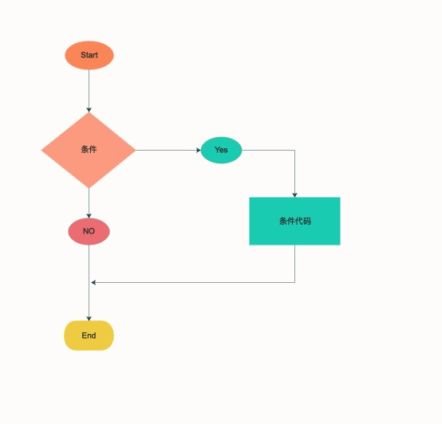

# 条件语句



## 单条件模型

if 语句 由一个布尔表达式后紧跟一个或多个语句组成

语法: Go 编程语言中 if 语句的语法如下：

```go
if 布尔表达式 {
   /* 在布尔表达式为 true 时执行 */
} else {
  /* 在布尔表达式为 false 时执行 */
}
```

实例

```go
package main

import "fmt"

func main() {
   /* 局部变量定义 */
   var a int = 100;
 
   /* 判断布尔表达式 */
   if a < 20 {
       /* 如果条件为 true 则执行以下语句 */
       fmt.Printf("a 小于 20\n" );
   } else {
       /* 如果条件为 false 则执行以下语句 */
       fmt.Printf("a 不小于 20\n" );
   }
   fmt.Printf("a 的值为 : %d\n", a);

}
```

## 多条件模型(单选)

语法: Go 编程语言中 if...else 语句的语法如下:

```go
if 布尔表达式 1 {
   /* 在布尔表达式 1 为 true 时执行 */
   if 布尔表达式 2 {
      /* 在布尔表达式 2 为 true 时执行 */
   }
}
```

实例

```go
package main

import "fmt"

func main() {
   /* 定义局部变量 */
   var a int = 100
   var b int = 200
 
   /* 判断条件 */
   if a == 100 {
       /* if 条件语句为 true 执行 */
       if b == 200 {
          /* if 条件语句为 true 执行 */
          fmt.Printf("a 的值为 100 ， b 的值为 200\n" );
       }
   }
   fmt.Printf("a 值为 : %d\n", a );
   fmt.Printf("b 值为 : %d\n", b );
}
```

## 多条件模型(多选)


语法: Go 编程语言中 switch 语句的语法如下:

```go
switch var1 {
    case val1:
        ...
    case val2:
        ...
    default:
        ...
}
```

实例:

```go
package main

import "fmt"

func main() {
   /* 定义局部变量 */
   var grade string = "B"
   var marks int = 90

   switch marks {
      case 90: grade = "A"
      case 80: grade = "B"
      case 50,60,70 : grade = "C"
      default: grade = "D"  
   }

   switch {
      case grade == "A" :
         fmt.Printf("优秀!\n" )    
      case grade == "B", grade == "C" :
         fmt.Printf("良好\n" )      
      case grade == "D" :
         fmt.Printf("及格\n" )      
      case grade == "F":
         fmt.Printf("不及格\n" )
      default:
         fmt.Printf("差\n" );
   }
   fmt.Printf("你的等级是 %s\n", grade );      
}
```

switch 默认情况下 case 最后自带 break 语句，匹配成功后就不会执行其他 case，如果我们需要执行后面的 case，可以使用 fallthrough

实例:

```go
package main

import "fmt"

func main() {

    switch {
    case false:
            fmt.Println("1、case 条件语句为 false")
            fallthrough
    case true:
            fmt.Println("2、case 条件语句为 true")
            fallthrough
    case false:
            fmt.Println("3、case 条件语句为 false")
            fallthrough
    case true:
            fmt.Println("4、case 条件语句为 true")
    case false:
            fmt.Println("5、case 条件语句为 false")
            fallthrough
    default:
            fmt.Println("6、默认 case")
    }
}
```

支持多条件匹配

```go
switch{
    case 1,2,3,4:
    default:
}
```

如果想要执行多个 case，需要使用 fallthrough 关键字，也可用 break 终止

```go
switch{
    case 1:
    ...
    if(...){
        break
    }

    fallthrough // 此时switch(1)会执行case1和case2，但是如果满足if条件，则只执行case1

    case 2:
    ...
    case 3:
}
```