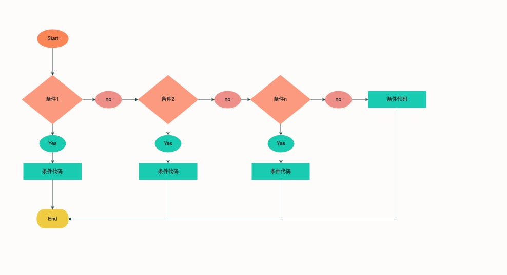

# 条件语句

条件语句需要开发者通过指定一个或多个条件，并通过测试条件是否为 true 来决定是否执行指定语句

下图展示了程序语言中条件语句的结构


## 单条件模型

if 语句 由一个布尔表达式后紧跟一个或多个语句组成

语法: Go 编程语言中 if 语句的语法如下：

```go
if 布尔表达式 {
   /* 在布尔表达式为 true 时执行 */
} else {
  /* 在布尔表达式为 false 时执行 */
}
```

实例

```go
package main

import "fmt"

func main() {
   /* 局部变量定义 */
   var a int = 100;
 
   /* 判断布尔表达式 */
   if a < 20 {
       /* 如果条件为 true 则执行以下语句 */
       fmt.Printf("a 小于 20\n" );
   } else {
       /* 如果条件为 false 则执行以下语句 */
       fmt.Printf("a 不小于 20\n" );
   }
   fmt.Printf("a 的值为 : %d\n", a);

}
```

## 多条件模型(else if)

如果我们有多个条件需要判断, 可以使用多条件语句


语法: Go 编程语言中 if...else if...else if...else 语句的语法如下:

```go
if 布尔表达式 1 {
   /* 在布尔表达式 1 为 true 时执行 */
} else if 布尔表达式 2 {
   /* 在布尔表达式 1 为 true 时执行 */
} else if 布尔表达式 n {
   /* 在布尔表达式 1 为 true 时执行 */
} else {
   /* 以上条件都不满足时执行 */
}
```

```go
var age int = 18
if age < 18 {
   fmt.Println("nice")
} else if age < 28 {
   fmt.Println("beauty")
} else if age < 38 {
   fmt.Println("sexy")
} else {
   fmt.Println("next")
}
```

## 条件嵌套

你可以在 if 或 else if 语句中嵌入一个或多个 if 或 else if 语句

实例

```go
package main

import "fmt"

func main() {
   /* 定义局部变量 */
   var a int = 100
   var b int = 200
 
   /* 判断条件 */
   if a == 100 {
       /* if 条件语句为 true 执行 */
       if b == 200 {
          /* if 条件语句为 true 执行 */
          fmt.Printf("a 的值为 100 ， b 的值为 200\n" );
       }
   }
   fmt.Printf("a 值为 : %d\n", a );
   fmt.Printf("b 值为 : %d\n", b );
}
```

多层嵌套不利于代码的阅读, 比如下面这个:

```go
// 身高1.8m以上, 25 ~ 35岁, 男
var (
   height float32
   age    uint
   gender string
   passed bool
)

height = 1.9
age = 30
gender = "male"

if height > 1.8 {
   if age > 25 && age <= 35 {
      if gender == "male" {
         passed = true
      }
   }
}

if passed {
   fmt.Println("congratulations! your successed")
} else {
   fmt.Println("not passed")
}
```

我们可以通过提前返回来优化这段代码

```go
```

## swith条件判断

我们经常会遇到值的比较判断, 常见与枚举比较:

```go
const (
   Unknown = iota
   Male
   Female
)

gender := 0

if gender == Unknown {
} else if gender == Male {
} else if gender == Female {
} else {
   fmt.Println()
}
```

如果遇到这种对值得比较，我们可以使用switch, 这样逻辑清晰.
我们switch 改造下:
```go
gender := 0
switch gender {
case Unknown:
case Male:
case Female:
default:
   fmt.Println()
}
```

### 基本用法
语法: Go 编程语言中 switch 语句的语法如下:

```go
switch var1 {
    case val1:
        ...
    case val2:
        ...
    default:
        ...
}
```


实例1: 给用分数评级, 并打印结果

```go
/* 定义局部变量 */
var grade string = "B"
var marks int = 90

switch marks {
   case 90: grade = "A"
   case 80: grade = "B"
   case 50,60,70 : grade = "C"
   default: grade = "D"  
}

switch {
   case grade == "A" :
      fmt.Printf("优秀!\n" )    
   case grade == "B", grade == "C" :
      fmt.Printf("良好\n" )      
   case grade == "D" :
      fmt.Printf("及格\n" )      
   case grade == "F":
      fmt.Printf("不及格\n" )
   default:
      fmt.Printf("差\n" );
}
fmt.Printf("你的等级是 %s\n", grade );  
```

### fallthrough 的用法

switch 默认情况下 case 最后自带 break 语句，匹配成功后就不会执行其他 case，如果我们需要执行后面的 case，可以使用 fallthrough

实例: 下面将打印那些语句? 

```go
switch {
case false:
      fmt.Println("1、case 条件语句为 false")
      fallthrough
case true:
      fmt.Println("2、case 条件语句为 true")
      fallthrough
case false:
      fmt.Println("3、case 条件语句为 false")
      fallthrough
case true:
      fmt.Println("4、case 条件语句为 true")
case false:
      fmt.Println("5、case 条件语句为 false")
      fallthrough
default:
      fmt.Println("6、默认 case")
}
```

### 多条件匹配

```go
switch{
    case 1,2,3,4:
    default:
}
```

比如我们第一名: 冠军, 第二名: 亚军， 第三名和第四名并列季军， 已经其他排不上号的
```go
```


### break

如果想要执行多个 case，需要使用 fallthrough 关键字，也可用 break 终止
```go
switch{
    case 1:
    ...
    if(...){
        break
    }

    fallthrough // 此时switch(1)会执行case1和case2，但是如果满足if条件，则只执行case1

    case 2:
    ...
    case 3:
}
```

比如一个审批流程
```go
```

### 练习1: 写一个单元转换的函数

```go
// HumanBytesLoaded 单位转换(B KB MB GB TB EB)
func HumanBytesLoaded(bytesLength int64) string {}
```

## 练习2: 写一个猜猜你职业的小工具

```go
```
