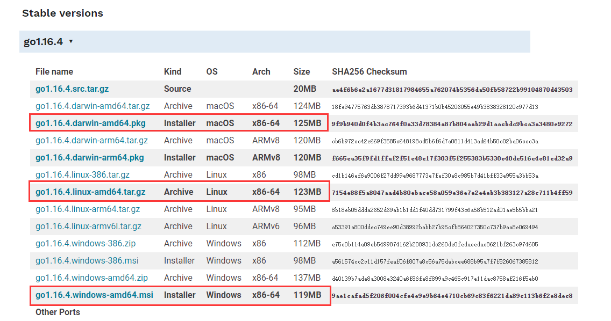
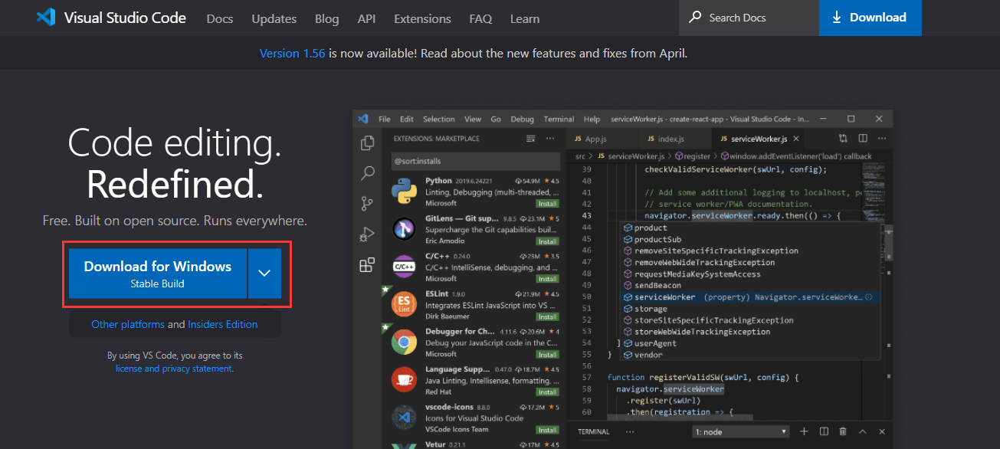
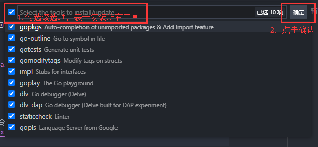
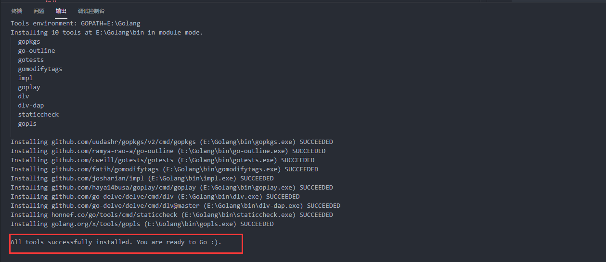
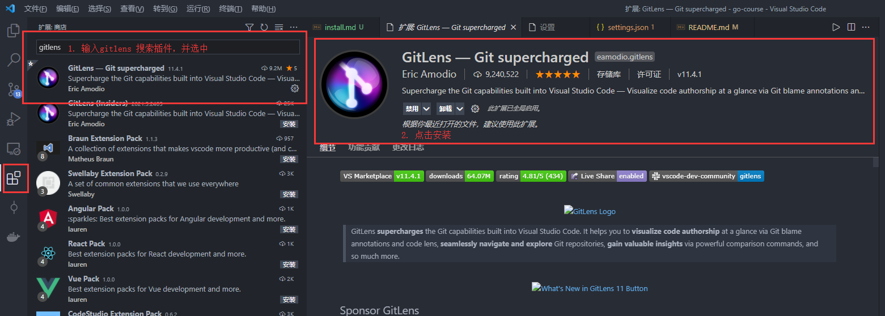
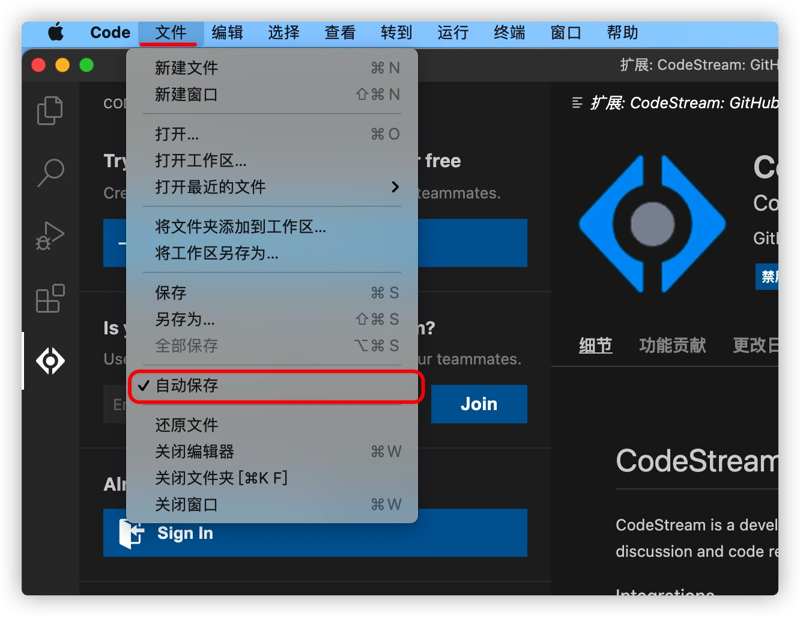
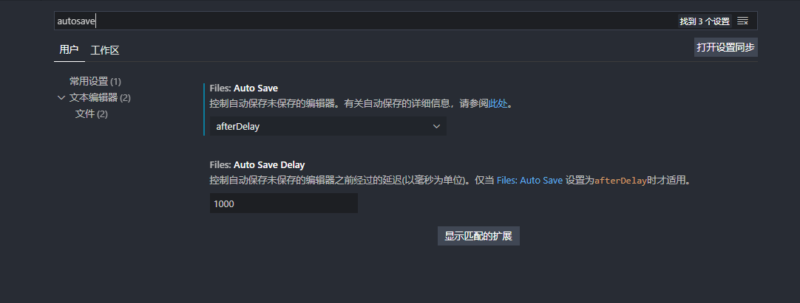

# 开发环境搭建

## 在线体验

在线演练地址: https://play.golang.org/

## 安装Go

参考官方文档: https://golang.org/doc/install

安装包下载地址:
  + https://golang.org/dl/
  + https://golang.google.cn/dl/



安装完成后执行命令, 能看到当前安装的go的版本，恭喜你，go安装成功:
```sh
go version
go version go1.16.4 windows/amd64
```


## 安装Git
先安装git, 准备好git shell 具体查看官方文档: https://git-scm.com/


## 开发工具

+ Visual Studio code
+ Sublime Text
+ Atom
+ Eclipse+GoClipse
+ LiteIDE
+ Goland
+ Vim
+ Emacs
+ ……

## vscode 开发环境搭建

vscode官网下载最新版: https://code.visualstudio.com/



### 安装Vscode Go语言扩展


### 安装Go 语言扩展需要的工具集

1. 打开命令面板: Shift + Ctrl + P

2. 输入: Install/Update 搜索 Go扩展依赖工具安装命令


3. 勾选所有选项, 点击确认，进行安装



安装成功后会看到如下信息:



`注意: 如果由于墙无法安装, 可以通过设置代理进行手动安装`

```sh
// 1. 设置代理
go env -w GOPROXY=https://goproxy.cn

// 2. 下载依赖工具
go install -v golang.org/x/tools/gopls@latest
go install -v honnef.co/go/tools/cmd/staticcheck@latest
go install -v github.com/go-delve/delve/cmd/dlv@master@latest
go install -v github.com/go-delve/delve/cmd/dlv@latest
go install -v github.com/haya14busa/goplay/cmd/goplay@latest
go install -v github.com/josharian/impl@latest
go install -v github.com/fatih/gomodifytags@latest
go install -v github.com/cweill/gotests/gotests@latest
go install -v github.com/ramya-rao-a/go-outline@latest
go install -v github.com/uudashr/gopkgs/v2/cmd/gopkgs@latest
```

### 设置终端使用Git Shell (Mac和Linux开发环境的同学忽略此步骤,该步骤仅针对Windows环境)

1. Shift + Ctrl + ` 打开终端

2. 打开终端的设置界面


3. 修改terminal.integrated.shell.windows和terminal.integrated.defaultProfile.windows 为如下值
```json
{
    "workbench.colorTheme": "One Dark Pro",
    "terminal.integrated.shell.windows": "C:\\Program Files\\Git\\bin\\bash.exe",
    "go.useLanguageServer": true,
    "explorer.confirmDelete": false,
    "explorer.confirmDragAndDrop": false,
    "workbench.iconTheme": "vscode-icons",
    "vsicons.dontShowNewVersionMessage": true,
    "http.proxySupport": "off",
    "go.toolsManagement.autoUpdate": true,
    "terminal.integrated.tabs.enabled": true,
    "terminal.integrated.defaultProfile.windows": "Git Bash",
    "git.autofetch": true,
}
```

4. 重启vscode, 可以看到默认打开Git Bash终端、也可选择其他终端


如果你还不会，可以看看我们勤奋的学员的博客: [VS Code 终端设置为Git Bash](https://www.cnblogs.com/remixnameless/p/14826532.html?tdsourcetag=s_pcqq_aiomsg)

### 插件安装

+ 快捷运行代码的插件: Code Runner


+ 最好用Git工具没有之一: Gitlens



### 配置自动保存


如果要配置自动保存的时间, 打开vscode的设置按钮, 搜索auto save

