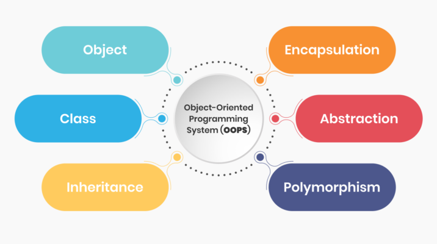
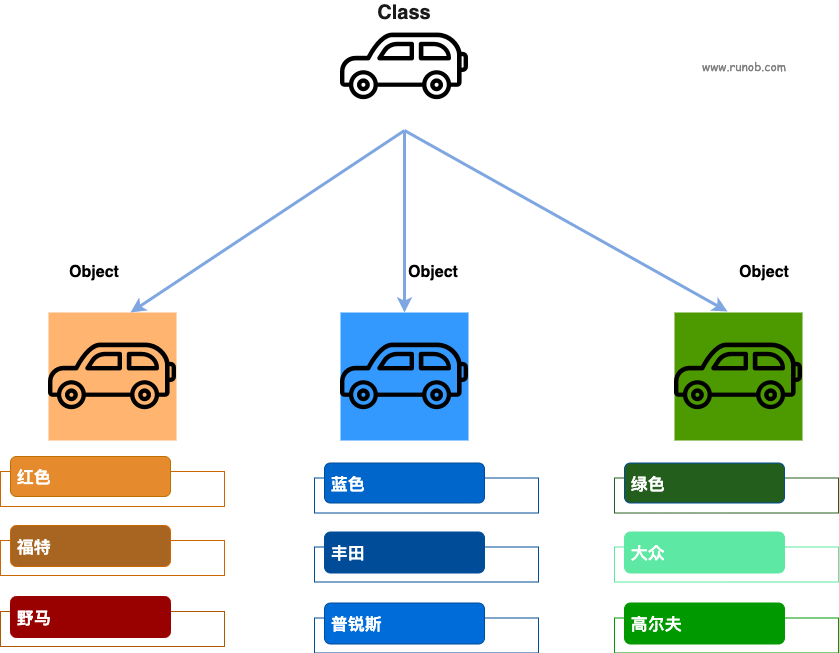

# 面向对象



面向对象编程——Object Oriented Programming，简称OOP，是一种程序设计思想。OOP把对象作为程序的基本单元，一个对象包含了数据和操作数据的函数

## 面向过程与面向对象

面向过程的程序设计把计算机程序视为一系列的命令集合，即一组函数的顺序执行。为了简化程序设计，面向过程把函数继续切分为子函数，即把大块函数通过切割成小块函数来降低系统的复杂度。


而面向对象的程序设计把计算机程序视为一组对象的集合，而每个对象都可以接收其他对象发过来的消息，并处理这些消息，计算机程序的执行就是一系列消息在各个对象之间传递


我们以一个例子来说明面向过程和面向对象在程序流程上的不同之处: 求年级学科平均分
```go
type Student struct {
	Name     string   // 名称
	Number   uint16   // 学号  2 ^ 16
	Subjects []string // 数学  语文  英语
	Score    []int    //  88   99   77
}
```

1.面向过程

我们处理逻辑核心部分是函数, 比如会这样写:
```go
func GradeAvg([]*Student) []int {}
```

2.面向对象

如果采用面向对象的程序设计思想，我们首选思考的不是程序的执行流程, 而是年级这种数据类型应该被视为一个对象,
这个对象拥有Students和一些其他属性（Property）, 如果要求年级的平均分, 首先是创建一个年级对应的对象,比如:

```go
// Class 保存的是班级的信息
type Grade struct {
	Number   uint8      // 年级编号
	Subjects []string   // 数学  语文  英语
	Students []*Student // 班级学员, []int --> [10, 20, 30]  []*int ---> [0xaabb, 0xccc, oxddd]
}
```

然后，给对象发一个GradeAvg消息，让对象自己把自己把年级的学科平均值告诉你, 比如:

```go
g := &Grade{}
g.GradeAvg()
```

给对象发消息实际上就是调用对象对应的关联函数，我们称之为对象的方法（Method）。比如:
```go
func (g *Grade) GradeAvg() []int {}
```

面向对象的程序写出来就像这样:
```go
g := &Grade{}
g.GradeAvg()
```

## 类和实例

面向对象的设计思想是从自然界中来的，因为在自然界中, 每一个实体都是对象(Object/Instance), 而这种实体的抽象类别就是类(Class), 比如车就是一个类, 而从你面前路过的福特汽车就是一个实例(Object)


面向对象最重要的概念:

 + 类（Class）: 抽象的模板，比如Grade类, 比如 1年级和2年级
 + 实例（Instance），根据类创建出来的一个个具体的“对象”，每个对象都拥有相同的方法，但各自的数据可能不同

面向对象的设计思想是抽象出Class，根据Class创建Instance。
所以面向对象的抽象程度比函数要高，因为一个Class既包含数据，又包含操作数据的方法

## Go语言如何面向对象

其实 GO 并不是一个纯面向对象编程语言。它没有提供类（class）这个关键字，只提供了结构体（struct）类型

java 或者 C# 里面，结构体（struct）是不能有成员函数的。然而，Go 语言中的结构体（struct）可以有” 成员函数”。方法可以被添加到结构体中，类似于一个类的实现

因此Go语言面向对象大概模样就这样:
```go
type Class struct {
	Attr1 T
	Attr2 T
}

func (c *Class) MethodA() {

}

c := new(Class)
c.MethodA()
```

面向对象除了有类和实例之外, 还具有三个基本特征：封装、继承和多态

## 封装

面向对象编程的一个重要特点就是数据封装。在上面的Student类中，每个实例就拥有各自的name和score这些数据。我们可以通过函数来访问这些数据

打印Student的名称
```go
func PrintStudentName([]*Student) {}
```

但是，既然Student实例本身就拥有这些数据，要访问这些数据，就没有必要从外面的函数去访问，可以直接在Student类的内部定义访问数据的函数，这样，就把“数据”给封装起来了
这些封装数据的函数是和Student类本身是关联起来的，我们称之为类的方法
```go
func (s *Student) PrintName() {}
```

这样一来，我们从外部看Student类，就只需要知道，创建实例需要给出name和score，而如何打印，都是在Student类的内部定义的，这些数据和逻辑被“封装”起来了，调用很容易，但却不用知道内部实现的细节

## 继承

在OOP程序设计中，当我们定义一个class的时候，可以从某个现有的class继承，新的class称为子类（Subclass），而被继承的class称为基类、父类或超类（Base class、Super class)

Go语言如何实现继承: 结构体嵌套


## 多态


## 思考

+ 类和实例的关系是什么?, 实例拥有的数据会相互影响吗?
+ 方法就是与实例绑定的函数, 那么方法与普通函数有什么不同?
+ 什么是封装, 封装如何屏蔽掉内部的实现细节?