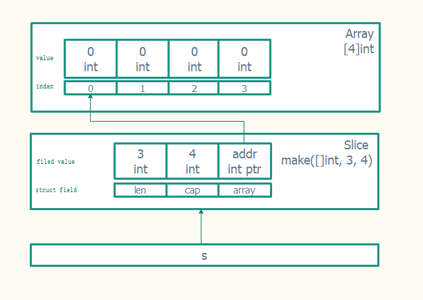
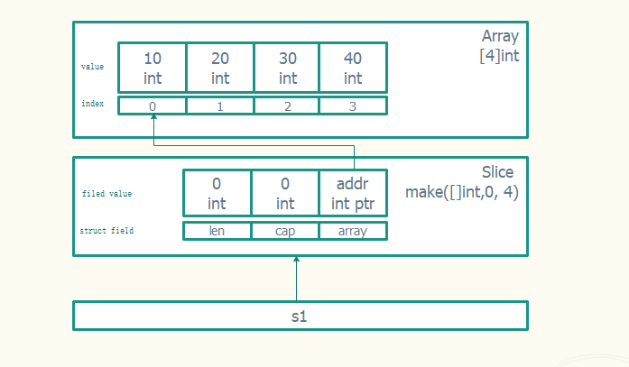
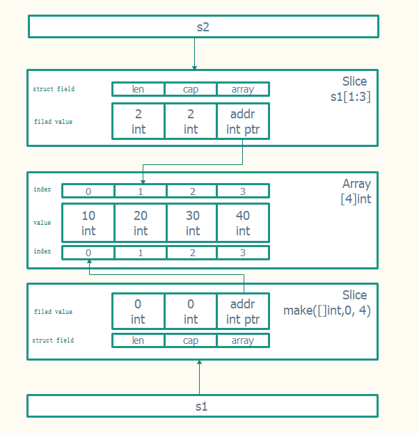

# Go语言切片

Go中的slice依赖于数组，它的底层就是数组，所以数组具有的优点, slice都有。 且slice支持可以通过append向slice中追加元素，长度不够时会动态扩展，通过再次slice切片，可以得到得到更小的slice结构，可以迭代、遍历等

```go
// runtime/slice.go
type slice struct {
    array unsafe.Pointer // 数组指针
    len   int // 长度 
    cap   int // 容量
}
```

每一个slice结构都由3部分组成：
+ 容量(capacity): 即底层数组的长度，表示这个slice目前最多能扩展到这么长
+ 长度(length)：表示slice当前的长度，即当前容纳的元素个数
+ 数组指针(array): 指向底层数组的指针

比如创建一个长度为3，容量为5，int类型的切片

```go
s := make([]int, 3, 4)
fmt.Println(a, len(s), cap(s)) // [0 0 0] 3 5
```



## 创建和初始化

在 Golang 中可以通过多种方式创建和初始化切片。是否提前知道切片所需的容量通常会决定如何创建切片

1.make创建


```go
// 创建一个整型切片, 其长度为 3 个元素，容量为 5 个元素
slice := make([]int, 3, 5)

// 我们也可以省略容量, 默认长度==容量
// 创建一个整型切片 其长度和容量都是 5 个元素
slice := make([]int, 5)

// 但是长度不能容量, 否则编译器过不了
// a := make([]int, 5, 3)
```

2.字面量创建


```go
// 这种方法和创建数组类似，只是不需要指定[]运算符里的值。初始的长度和容量会基于初始化时提供的元素的个数确定
slice := []int{1,2,3}

// 和数组一样也可以通过指定索引初始化, 比如index 4 值为100
slice := []int{3: 100}
```

3.注意数组和切片的区别

如果在 [] 运算符里指定了一个值，那么创建的就是数组而不是切片, 比如
```go
a := [3]int{1,2,3}
b := []int{1,2,3}
```

虽然他们声明时藐视只要1点区别，但是他们的数据结构区差别却很大，一个是引用类型 一个是值类型

4. 创建切片的本质
切片相关源码放置位置: src/runtime/slice.go, 我们使用make时, 实际上是调用的makeslice函数
```go
// 这里一波操作过后返回的是slice的pointer
func makeslice(et *_type, len, cap int) unsafe.Pointer {}
```

## 切片访问

对切片里某个索引指向的元素赋值和对数组里某个索引指向的元素赋值的方法完全一样。使
用 [] 操作符就可以改变某个元素的值，下面是使用切片字面量来声明切片

```go
s := []int{1,2,3}
s[0]

// 但是不能越界访问, 比如
s[3] // panic: runtime error: index out of range [3] with length 3
```

查看切片长度: len
```go
```


查看切片容量: cap
```go
```

## nil和空切片

声明未初始化的切片为nil
```go
var s []int
```


初始化一个空切片
```go
s := make([]int,0)
```


所以nil切片直接赋值是要报错的
```go
var s []int
s[0] = 1 // panic: runtime error: index out of range [0] with length 0
```

## 往切片中添加元素

我们通过append函数往切片中追加元素, 比如
```go
s := make([]int, 0, 4)
s = append(s, 10, 20, 30, 40)
```



现在底层数组已经满了，再往里面追加元素，会咋样?

```go
s = append(s,50)
```


函数 append() 会智能地处理底层数组的容量增长。在切片的容量小于 1000 个元素时，总是会成倍地增加容量。一旦元素个数超过 1000，容量的增长因子会设为 1.25，也就是会每次增加 25%的容量(随着语言的演化，这种增长算法可能会有所改变)

## 通过切片创建新的切片

切片之所以被称为切片，是因为创建一个新的切片，也就是把底层数组切出一部分。通过切片创建新切片的语法如下, 详情请参考: 

```go
slice[low : high]
slice[low : high : max]
```

+ low : 表示从 slice 的第几个元素开始切
+ high : 控制切片的长度(high-low)
+ max : 控制切片的容量(max-low)

比如
```go
s1 := []int{1, 2, 3, 4}
s2 := s1[2:4:4]  // [index2, index4) 左闭右开区间, 容量 4-2
fmt.Println(s2, len(s2), cap(s2))
```

如果high == max 你也可以省略 max，比如:
```go
s3 := s1[2:4]
```

再次基础上还要几种省略写法:
+ 省略low 表示从 index 0 开始
+ 省略high 表示到 结尾(len)
+ 省略max  表示到 结尾(len)
+ 都省略： 等于复制
```go
slice[i:]  // 从 i 切到最尾部
slice[:j]  // 从最开头切到 j(不包含 j)
slice[:]   // 从头切到尾，等价于复制整个 slice
```

例如:
```go
```

注意: 通过切片创建出来的切片是共享底层数据结构的(数组)



共享底层数组 会导致相互影响， 比如 修改原切片 会影响多所有复制出来的切片，这就是 为啥叫切片，而不是复制
```go
s1 := []int{10, 20, 30, 40}
s2 := s1[1:3]
fmt.Println(s2, len(s2), cap(s2))

fmt.Println(s1[1], s2[0])
s1[1] = 200
fmt.Println(s1[1], s2[0])
```

有扩容的原理 我们也可以知道, 当扩容后，就不共享底层数组了，比如:
```go
s1 := []int{10, 20, 30, 40}
s2 := s1[1:3:3]
fmt.Println(s2, len(s2), cap(s2))

fmt.Println(s1[1], s2[0])
s2 = append(s2, 30)   // s2 扩容
s1[1] = 200           // 修改s1
fmt.Println(s1[1], s2[0]) // s1修改并不会影响s2
```

整体建议: 不要修改切片, 如果要修改请使用后面的深拷贝复制一个全新的切片

## 遍历切片

切片是一个集合，可以迭代其中的元素。Golang 有个特殊的关键字 range，它可以配合关键字 for 来迭代切片里的元素

```go
```


当迭代切片时，关键字 range 会返回两个值。第一个值是当前迭代到的索引位置，第二个值是该位置对应元素值的一份副本。需要强调的是，range 创建了每个元素的副本，而不是直接返回对该元素的引用。要想获取每个元素的地址，可以使用切片变量和索引值
```go
```


## 切片拷贝

我们不能像数组一样 直接使用赋值语句 来拷贝一个切片, 因为数组是值，而切片是指针， 真正的数据 维护在底层数组里面
```go
a1 := [2]{1,2}
a2 := a1    // 值拷贝, a1, a2 互不影响

s1 := []{1, 2}
s2 := s1   // 指针拷贝 s1, s2 指向同一*slice结构体, 就是一个东西，等于没拷贝
```

Golang 内置的 copy() 函数可以将一个切片中的元素拷贝到另一个切片中，其函数声明为
```go
func copy(dst, src []Type) int
```
它表示把切片 src 中的元素拷贝到切片 dst 中，返回值为拷贝成功的元素个数。如果 src 比 dst 长，就截断；如果 src 比 dst 短，则只拷贝 src 那部分

```go
s1 := []int{10, 20, 30, 40}
s2 := make([]int, 5)
num := copy(s2, s1)   // 这时候s1 和 s2 就是2个切片，包含底层数据, 互不影响
fmt.Println(num)
fmt.Println(s1, s2)
```

## 切片作为函数参数


## 多维切片

切片的元素也可以是切片类型，此时称为多维切片


## 总结

切片是 Golang 中比较有特色的一种数据类型，既为我们操作集合类型的数据提供了便利的方式，是又能够高效的在函数间进行传递，因此在代码中切片类型被使用的相当广泛


## 参考


