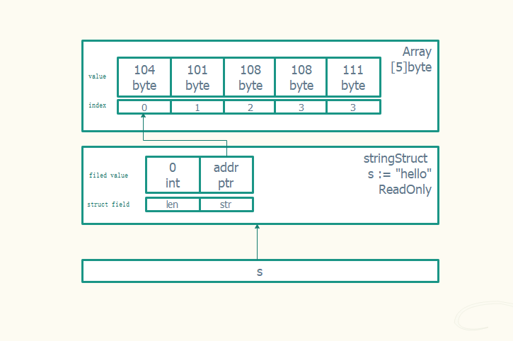

# 字符串

字符串是 Go 语言中的基础数据类型，虽然字符串往往被看做一个整体，但是它实际上是一片连续的内存空间，我们也可以将它理解成一个由字符组成的数组

```go
a := "hello"
fmt.Println([]byte(a)) // [104 101 108 108 111]
```

## 字符串的本质

字符串是由字符组成的数组。数组会占用一片连续的内存空间，而内存空间存储的字节共同组成了字符串，Go 语言中的字符串只是一个只读的字节数组

数据结构定义位置[runtime/string.go](https://golang.org/src/runtime/string.go)
```go
type stringStruct struct {
	str unsafe.Pointer
	len int
}
```


所以上面的该结构在内存中的存储结构为:


在Golang语言规范里面，string数据是禁止修改的，试图通过&s[0], &b[0]取得string和slice数据指针地址也是行不通的， 因为编译器读到字符串，会将其标记成只读数据 SRODATA，只读意味着字符串会分配到只读的内存空间, 这些值不能修改

我们可以通过汇编看到这个过程:
```sh
go tool compile -S ./day3/main/main.go 

...
go.string."hello" SRODATA dupok size=5
        0x0000 68 65 6c 6c 6f                                   hello
...
```

但是我们可以转换为byte数组，这个可以修改的
```go
a := "hello"
b := []byte(a)
b[0] = 'x'
fmt.Println(string(b)) // 但是这个过程涉及到3次数据拷贝
```

但是除了切片的修改操作，其他操作都可以用
```go
a := "hello"
fmt.Println(len(a), a[0], a[1:3])
```

但是仅仅这些操作也太捉襟见肘了, 因此Go标准库提供了strings包，用于实现字符串的一些常规操作

## 字符串比较

```go
// Compare 函数，用于比较两个字符串的大小，如果两个字符串相等，返回为 0。如果 a 小于 b ，返回 -1 ，反之返回 1 。不推荐使用这个函数，直接使用 == != > < >= <= 等一系列运算符更加直观。
func Compare(a, b string) int 
//   EqualFold 函数，计算 s 与 t 忽略字母大小写后是否相等。
func EqualFold(s, t string) bool
```

```go
fmt.Println(strings.Compare("ab", "cd"))
fmt.Println(strings.EqualFold("ab", "AB"))
```

## 是否存在某个字符或子串